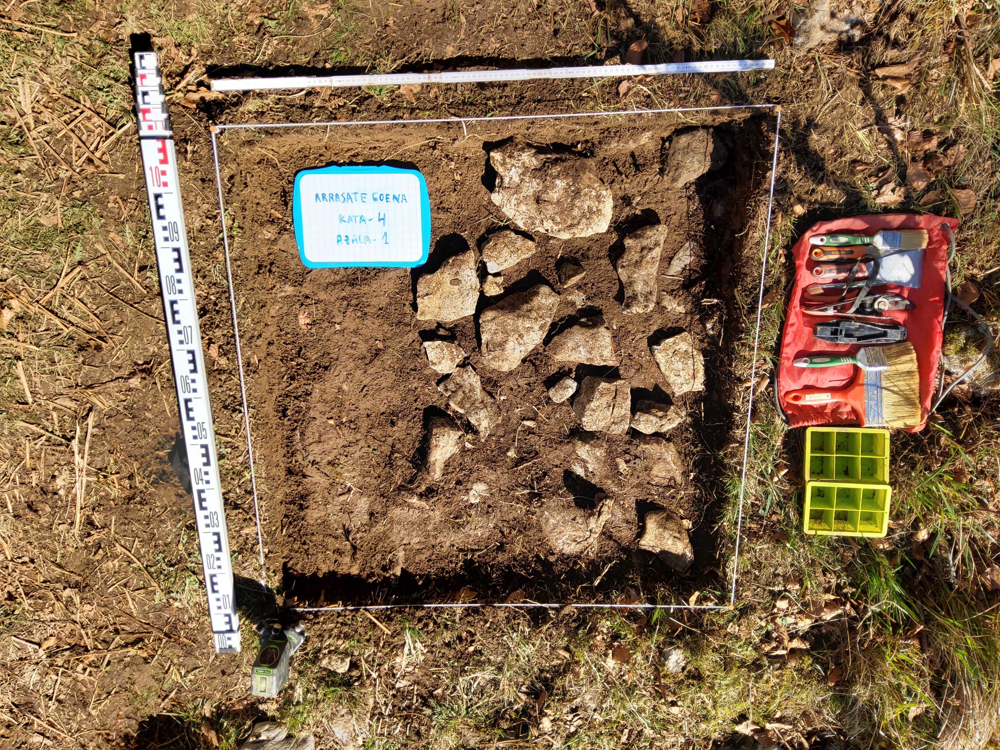

Larunbata, otsailak 26. Hotz egiten du oraindik 1.000 metrora.

Azpeitiko Izar Eizagirre EHUko Geologia ikaslea izan dugu gaur Arrasate Goenako 4. laugarren zundaketa aukeraketan eta hasieran.

Leku interesgarria ematen du eta ikusi egin behar zer informazio ematen duen.

