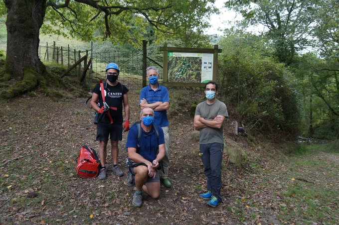
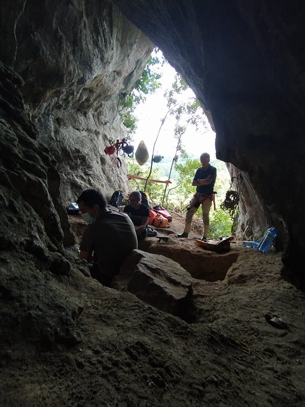
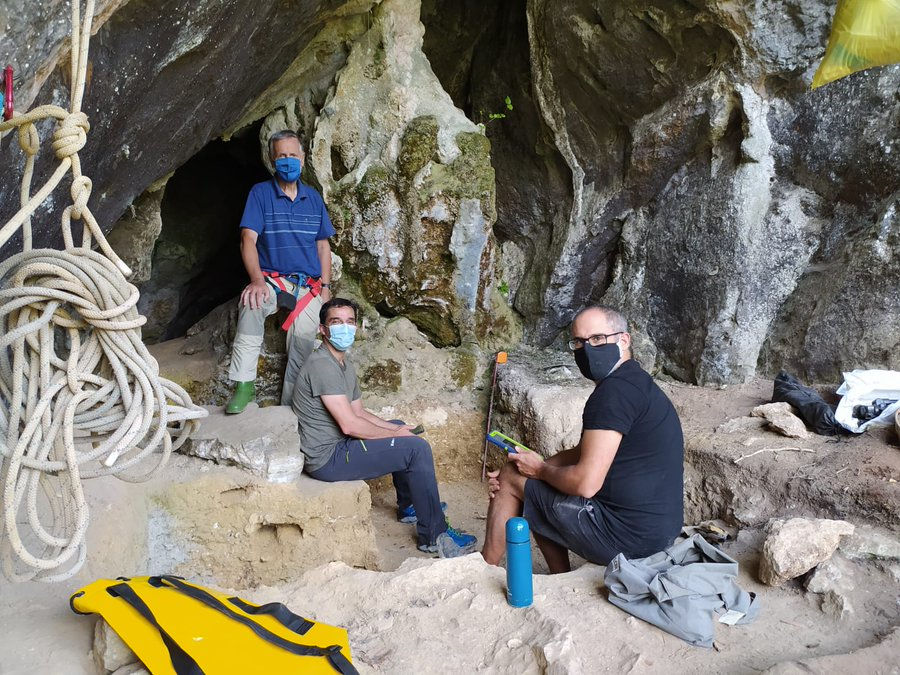

Antxieta arkeologia taldeko kideak Amalda III kobazuloan gordetako Neanderthal garaiko aztarnen bila jardun dira egunotan, Joseba Rios arkeologo taldearekin batera. Atzo, asteazkena, Burgosko CENIEH ikerketa zentroko Alfonso Benito geologoaren bisita izan zuten indusketan, bertako sedimentuen ikerketarekin laguntzeko. Astebete inguru lanean ibili ostean, Joseba Rios arkeologoak atzo bertan bukatutzat eman zuen aurtengo indusketa. Antxieta arkeologia taldeko kideek azaldu dute "mundiala" izan dela horiekin elkarlanean jardutea, Amalda III "aztarnategi bikain" horretan.

Zestoako Altzolarats bailaran dago Amalda III eta Antxietakoak izan ziren, hain zuzen ere, kobazulo hori aurkitu zutenak, 1983an. Hala ere, eta kobazulo horren irisgarritasun zailtasunak tarteko, ia 40 urtez ez da indusketarik egin Amalda III-n. 2017an, ordea, Burgosko CENIEH ikerketa zentroko Joseba Rios arkeologoaren laguntza eskaera jaso zuten Antxietakoek, Amalda III-n indusketa lanak egiteko. Azpeitiarren baiezkoa jasota, Gipuzkoako Foru Aldundiaren baimena eta aldundiaren beraren eta Zestoako eta Azpeitiko udalen dirulaguntza jasota, iaz ekin zioten berriro Altzolarats bailarako koba ikertzeari Riosek eta haren lantaldeak, Antxietakoen laguntzarekin.

