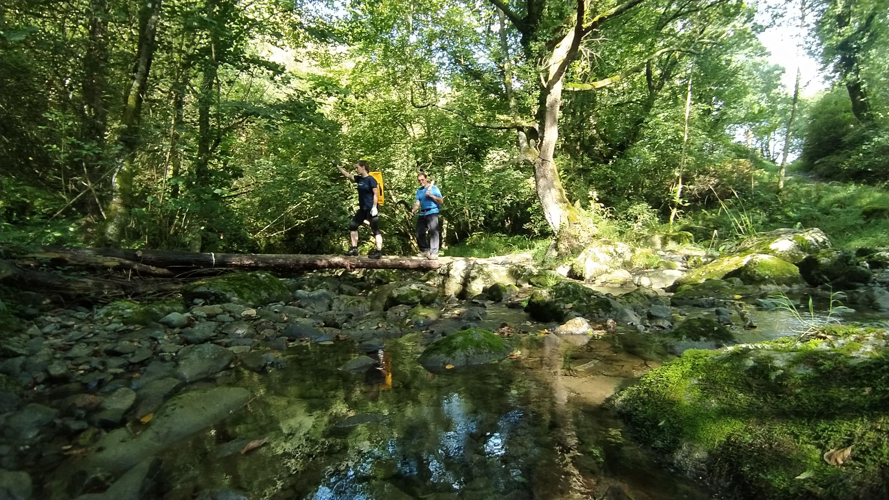
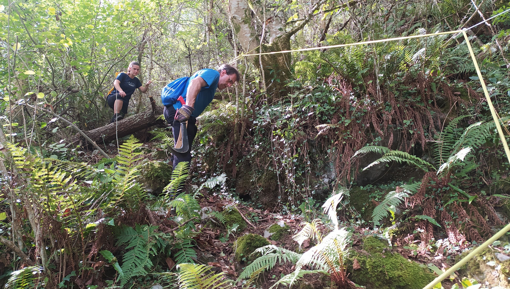

Iritsi da ametsak errealitate bihurtzeko eguna.

Irailak 3, Joseba Rios eta Laura Sanchez-en zuzendaritzapean, beraien taldekideekin eta Antxietakoen laguntzarekin, 2022ko indusketekin hasten gara.

Aste honetan bideko sasiak moztu eta sokarekin esku laguntzak ipini ditugu bidean kobara iristeko.   

Aldi berean Antxieta taldeko espeleologo trebeak kobara igotzeko dagoen 30 metroko pareta bertikala, azken urteetan bezala, aluminiozko eskailera finkoekin ekipatu dute, arkeologo eta teknikari ezberdinak kobara iristeko. 

Indusketarako dena prest!


