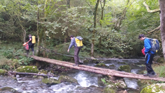
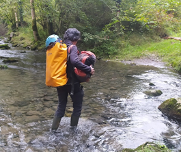
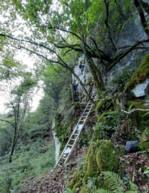
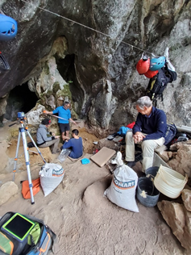
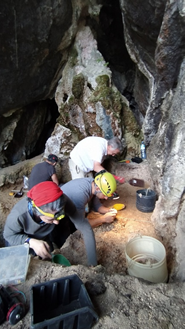
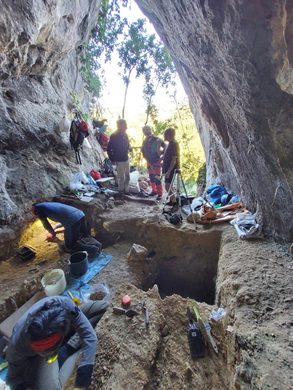
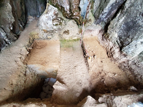
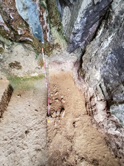
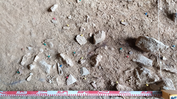
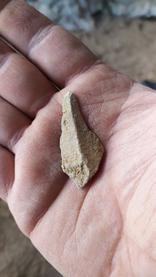

Iritsi da eguna eta bagoaz, ti-ta batean errekak eta zubiak zeharkatuz.

Motxiletan daramazkigun tresnek nahikoa pixatzen dute baina erraz daramazkigu, indarrez beteta.

Erdi Paleolitoko kobazulo hau naturan barneratuta dago.

  

  
  

  

  
  

  

  
  

  

  
  

Koba magiko honetara iristeko errekak eta zubiak gainditzea nahikoa ez balitz, lau hanketan igo beharreko baso aldapatsuak zeharkatu behar ditugu, eta bukaeran 30metroko haitz punta batera armiarmak bezala igo beharra dago.

  

  
  

  

  
  

  

  
  

  

  
  

Kobara iritsitakoan, lehenik eta behin arnasak ta bihotzaren taupadek bere onera etorri behar dute, eta apur bat deskantsatu ondoren, indusketan jo eta ke hasten gara.

Gaur ezusteko bisita bat ere eduki dugu. Mikel Arregi Zestoako alkatea azaldu zaigu, indusketak ondo al doazen ikustera.

  

  
  

  

  
  

  

  
  

  

  
  

Indusketa martxa onean doa, oraindik goreneko azaletan goaz, baina dagoeneko gure herrialdeko azken Neanderthalen arrastoak azaltzen zaizkigu.

Eskerrak eman beharrean gaude Joseba Rios eta Laura Sanchez arkeologoei, Antxietako lagunei ematen dizkiguten argipen tekniko guztiengatik.

  

  
  

  

  
  

  

  
  

  

  
  

