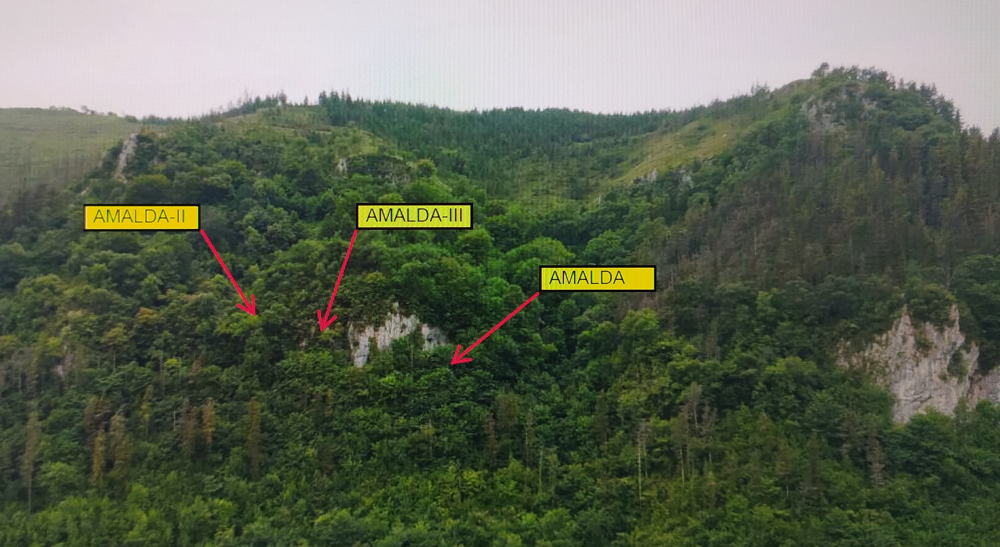
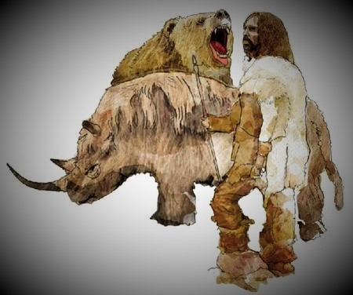
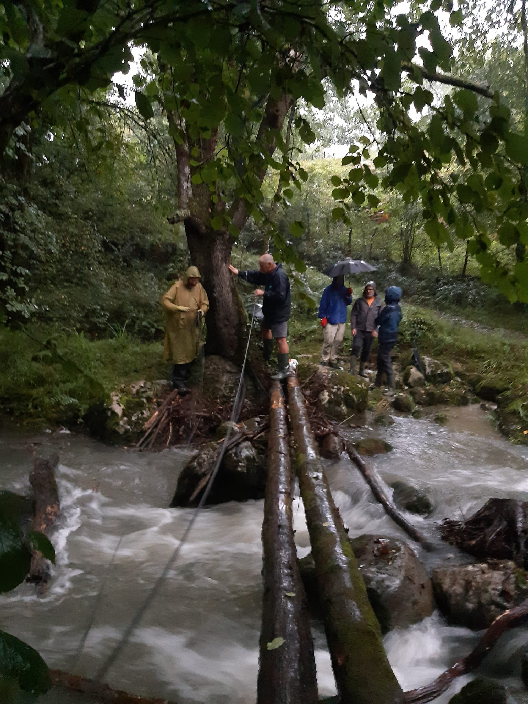

AMALDA-III-Zestoa–Erdi Paleolitoa: indusketa 2023. Neanderthalen ADNaren bila.
Iritxi da aurten ere berriro ametsak errealitate bihurtzeko eguna.
Joseba Rios eta Laura Sanchez-en zuzendaritzapean eta Antxietakoen laguntzarekin, 2023ko indusketarekin hasi gara.
Egon adi !!!!!!

