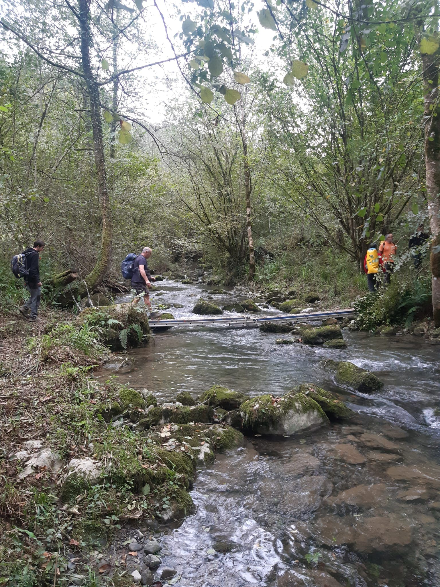
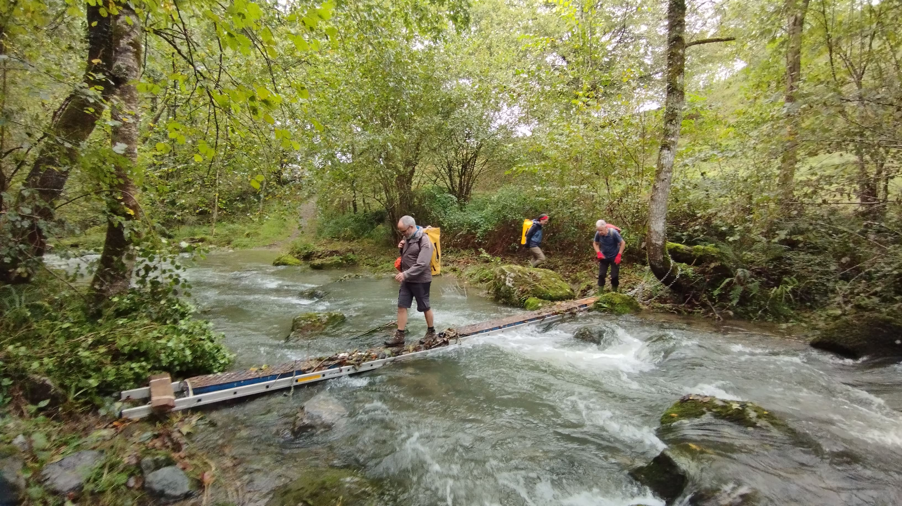
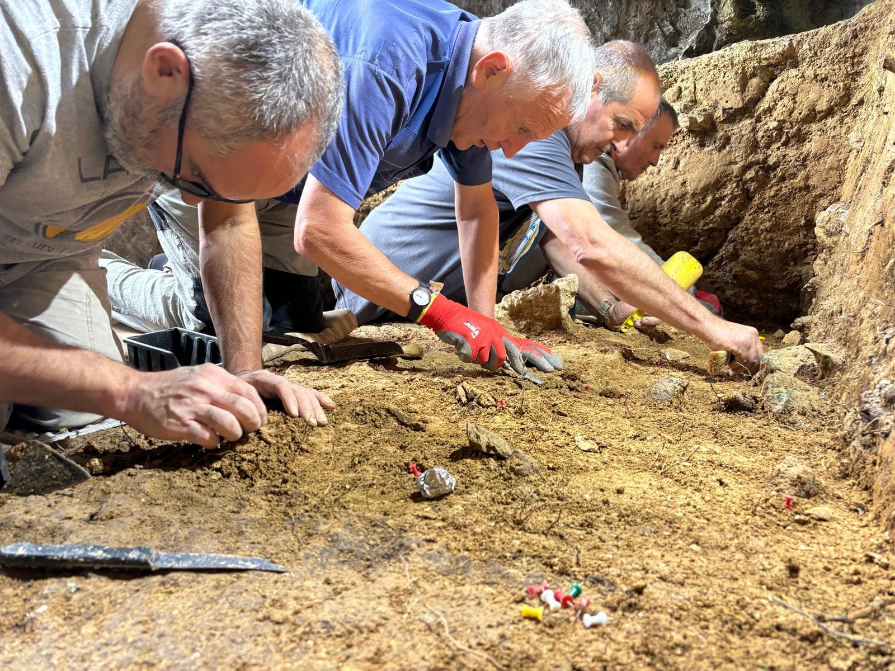
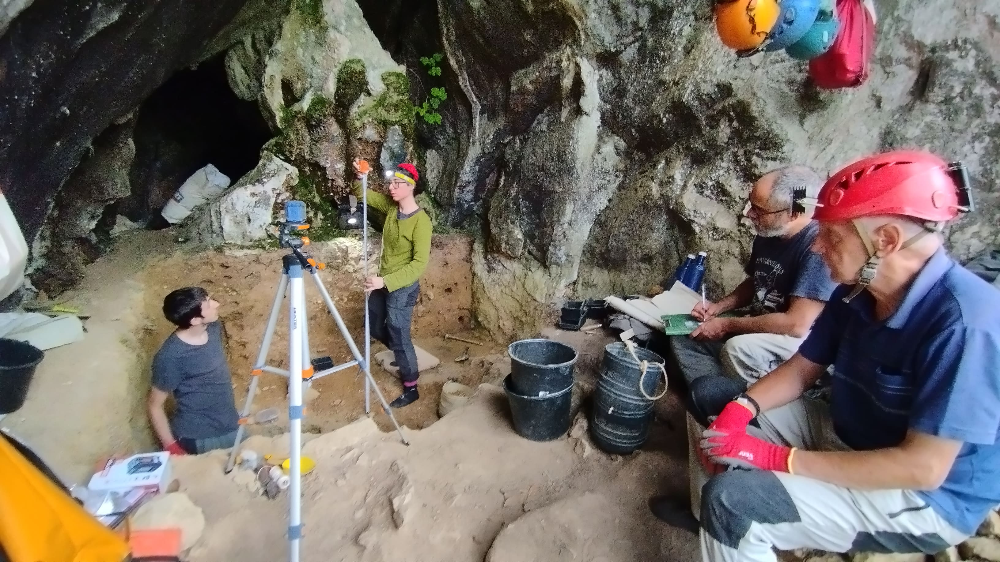
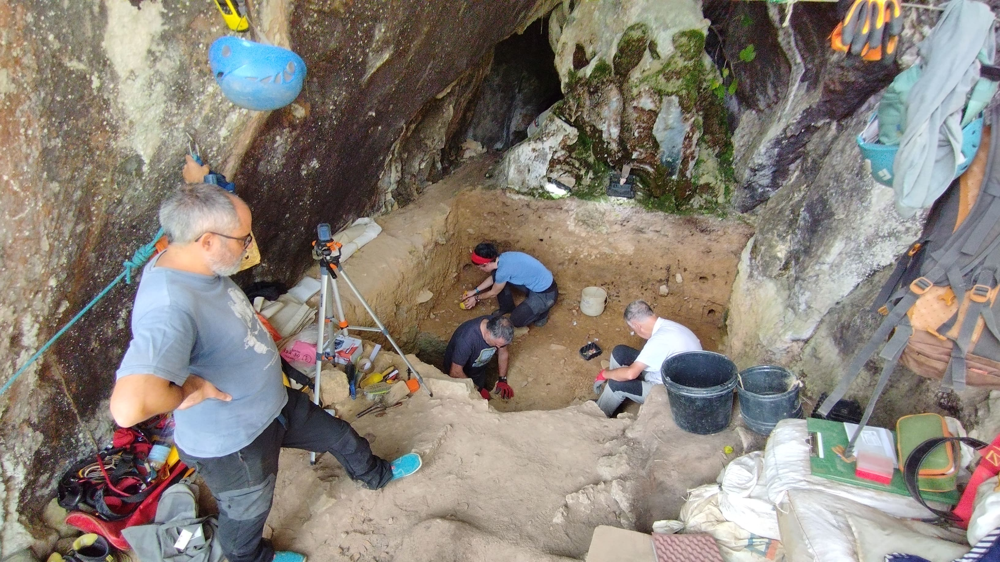
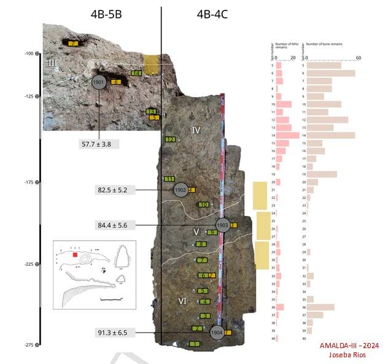
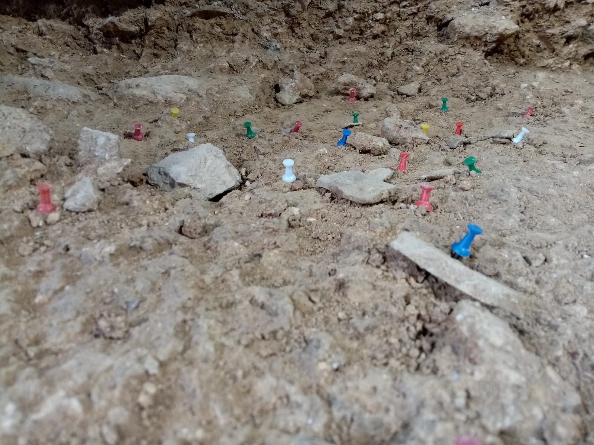
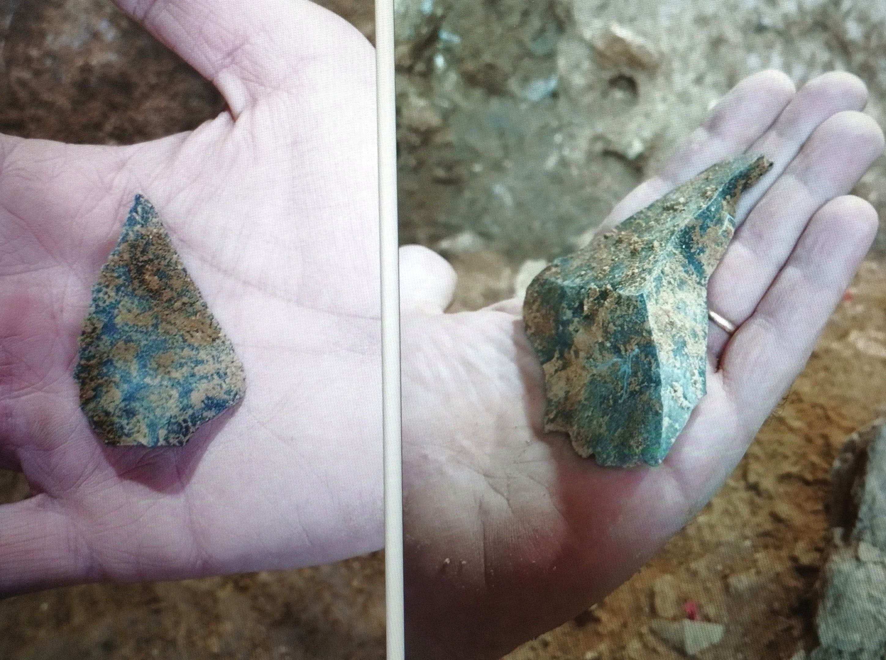
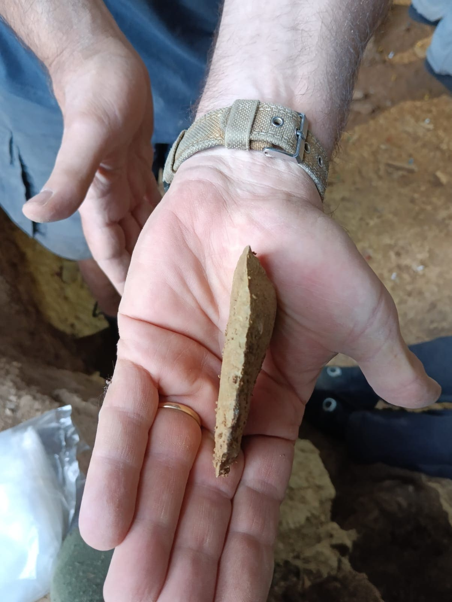

Urte berri on denoi!!!!

2024ko urrian jorratu genuen koba berezi honen 6. Indusketa kanpaina eta orduan ez genuen
albisterik atera, baina orain pentsatu dugu momentu ezin hobea dela urte berriaren lehen
taupada honetan ateratzea.

Aurten ere nahiko txilipurdika ibili gera Altsolaratz errekaren uholdearekin.

Lehengo zubi zaharra uholdeak eman du eta berria moldatu beharra eduki dugu.

Seigarren indusketa kanpaina honetan, IV nibel estratigrafikoaren bukaera iritsi gera lauki guztietan.

Aurreko urteetan bezala, material arkeologikoen dentsitate handia dago, bai litika aldetik eta
baita ere animalien hezur zatien aldetik ere.

Joseba Rios eta Laura Sanchez-en zuzendaritzapean gozatu ederra hartu dugu, bai material
berezi hauek industen eta baita zuzendarien argipenekin ere.

Baita ere, 6. indusketa kanpaina honetan, Joseba eta Laura-ren hipotesiak sendotzen joan dira:

Koba honetako Neandertal hauek lan zehatz batzuk egitera etortzen dira bertara eta erabiltzen
zituzten harrizko erramintak horrela adierazten dute. Gehien bat egurra lantzen zutela ematen du
erramintaren tipologiagatik.

Material litikoaren dentsitatea benetan oso handia da eta milaka urteetan jarraipena izaten duela
esan liteke, batez ere ikusita IV nibelaren potentzia eta azalera guztien koherentzia.

OSL datazioak adierazten dutenez, gutxienez 57.000 urtetik, 82.000 urtera doa IV nibela, hau
gutxieneko datuak dira eta sekuentzia zabal honetan dentsitatea oso homogeneoa da.

Joseba eta Laurak hasieratik proposatzen duten bezala, aktibitate zehatz honetarako erabiltzen
duten tekno-kultura “Vasconiense“ deritzaiona da eta ongi sendotua dago hipotesia hau ere,
ehunka ta ehunka harri tresnekin.

Gehien bat gertu dagoen Urola ibaitik lortu dituzte hain gogorrak diren harri bolkaniko hauek,
baina urrunetik ekarritako suharri materialak ere azaltzen dira noiz behinka.

Bulkanitak, Lutitak, Ofitak edo Basaltoak, gogorrak izateaz gain, lan berezi hauetako behar
dituzten formak eta zorrotzerak lortzeko oso egokiak dira.

Garbi dago baita ere, bertan kontsumitzen zituztela mota ezberdinetako animaliak, azaltzen
diran espezie ezberdinen zatitutako hezurrengatik.

2025 honetan, 7. Kanpaina egiteko prest !!

Aupa Amalda !!

