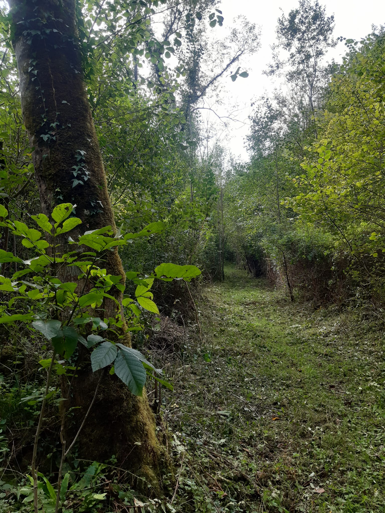
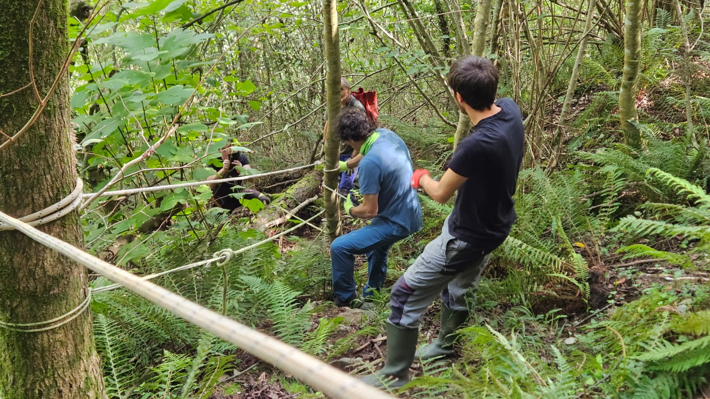
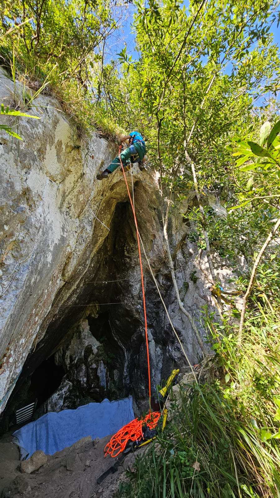
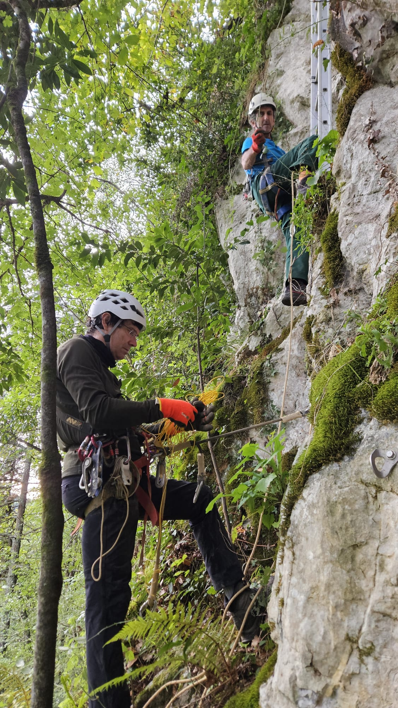

Zestoako Altzolaratz bailarako Neanderthaletaz gehiago jakin nahian, urriko lehen aste honetan indusketa lanetan ibiliko gera aztarnategi bikain honetan.

Joseba Rios eta Laura Sanchez, arkeologoek gidatuko dituzte aurtengo lanak ere.

Baina lehenago, Antxietako kideak ere egin behar izan ditugu gure logistika lantxoak.

Lehendabizi, Altzolaratz erreka igarotzeko zubia moldatu behar izan degu.

Jarraian kobara gerturatzeko bide nagusiaren desbrozaketa.

Izugarria da sasiak nola hazten diren urte batetik bestera.

Kobara gerturatzeko bakarrik, izugarrizko oihanean zehar aldapa latza igo beharra dago eta aldapa hau ere urte batetik bestera askoz handiagoa da.

Eta azkenik, kobara iristeko 30 m. bertikalak ekipatu behar dira, Neanderthal hauen bizilekura iristea nahi ba degu.

Dena den, gustura, merezi du pena aste honetan gozatuko dugunarekin. 

Aupa Amalda!!

