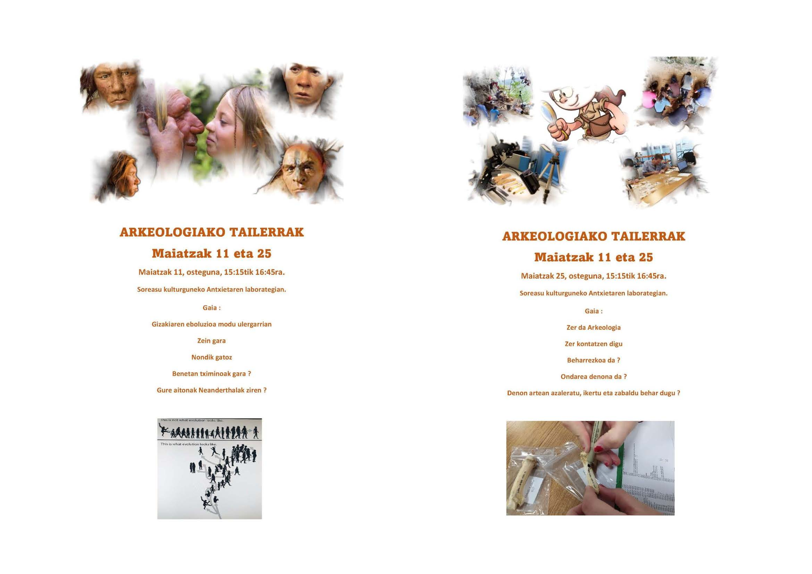
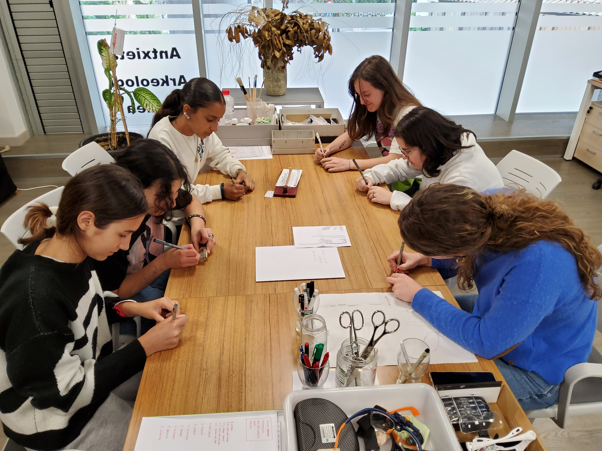
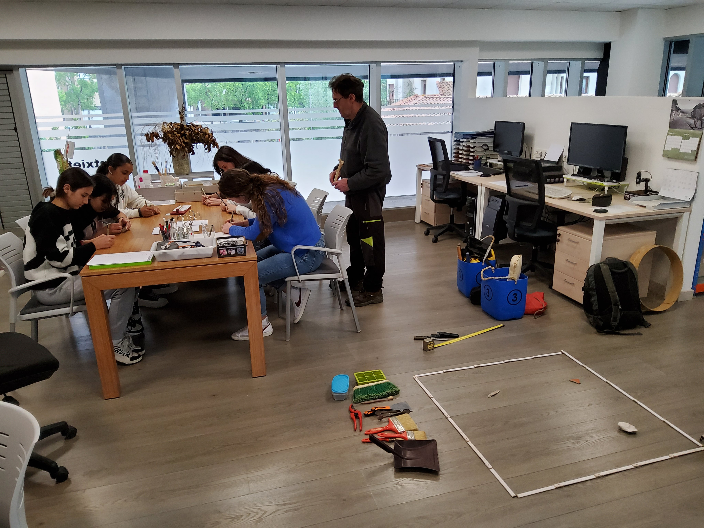

Maiatzaren 11n eta 25ean tailer oso atseginak izan ditugu Soreasu kulturguneko Antxietaren lan gelan. Lehenengo egunean gizakiaren eboluzioaz hitz egin zuten modu xumean, eta bigarrenean bertara joan direnek adibide praktiko batzuk eginez arkeologiaren teknikak eta prozesuak ezagutu zituzten modu ulergarrian.

Denok oso gustura egon gara.

