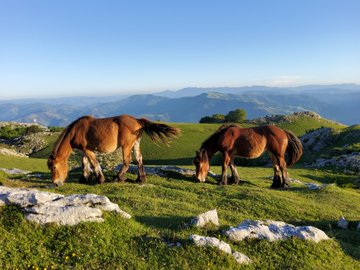
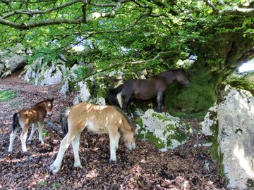
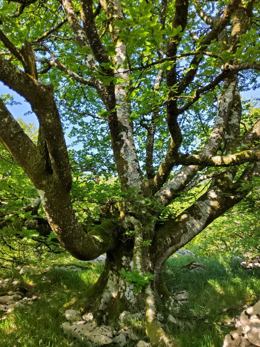
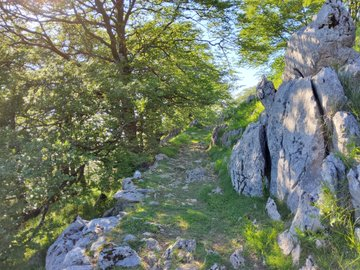

Mendira lehen irteerak prestatzen hasiak gera.

Naturak berean jarraitu du konfinamenduan.

Igandean, taldeko irteera egingo degu, aspaldiko partez.

Pagoak indartsu hostratu dira eta arantzak loretan daude.

Ehunka urteetan berdina egiten daramate gizakien belaunaldiak igarotzen ikusiaz.

Bide hauek berriz, ehunka belaunaldik erabili ditugu, mendiak alde batetik bestera zeharkatzeko.

Igandean berriro astinduko ditugu.

