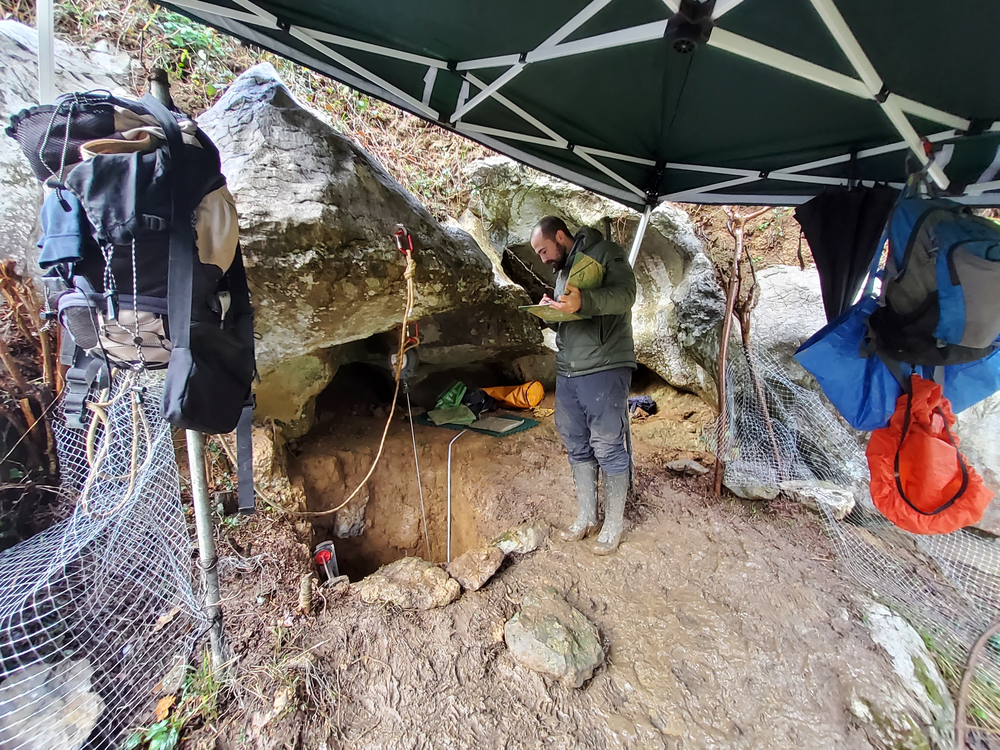
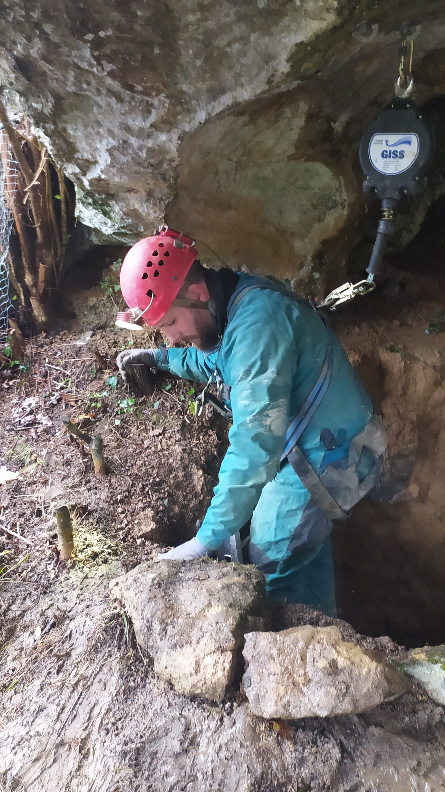
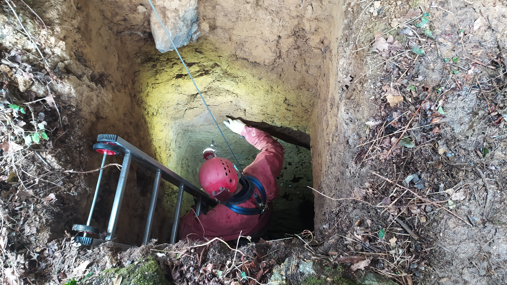
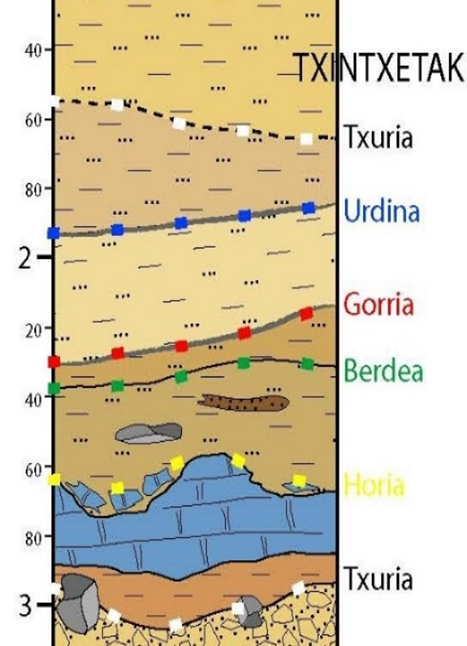
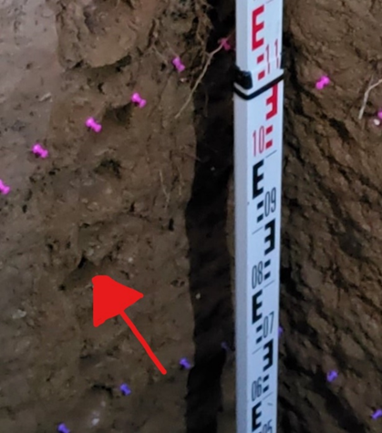
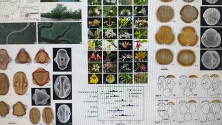
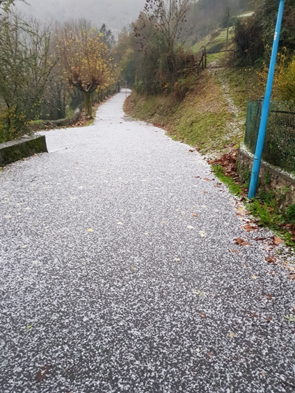

Joan zen larunbatean, EHUko ikertzaile eta proiektuaren zuzendari Asier Gomez-Olivenciak, proiektuaren geologia arduradun Martin Arriolabengoak eta palinologia arduradun Josu Aranbarrik Zestoako Baio kobazuloko ikerketarekin jo eta ke jarraitu zuten.

Antxietako kideok 1990ean egin genuen zundaketari esker, estratigrafia bikaina dago, palinologiako tekniken bidez, bertako paleo-polenen ikerketak egiteko. Hain zuzen ere, estratigrafia eta palinologia egiteko sekuentzia bikaina dago Baion.

Palinologiaren bidez, sedimentatutako lur azaletan dauden garai ezberdinetako polenaren laginketa eta laborategiko ikerketa egiten dira, bertan egon ziren landareak zeintzuk ziren, eta horien bidez, zer klima aldaketa izan ziren jakiteko.

Joan zen larunbatean, eguraldiaren petralkeria kontrolatzea izan zen Antxietako kideon ardura nagusia; izan ere, bota zituen galantan, eta trumoiak, kazkabarrak eta haizeak ez zuten etenik izan. Dena den, ez zuten lortu goiza zapuztea, nola edo hala lortu genuen gauza denak kontrolpean izatea.

