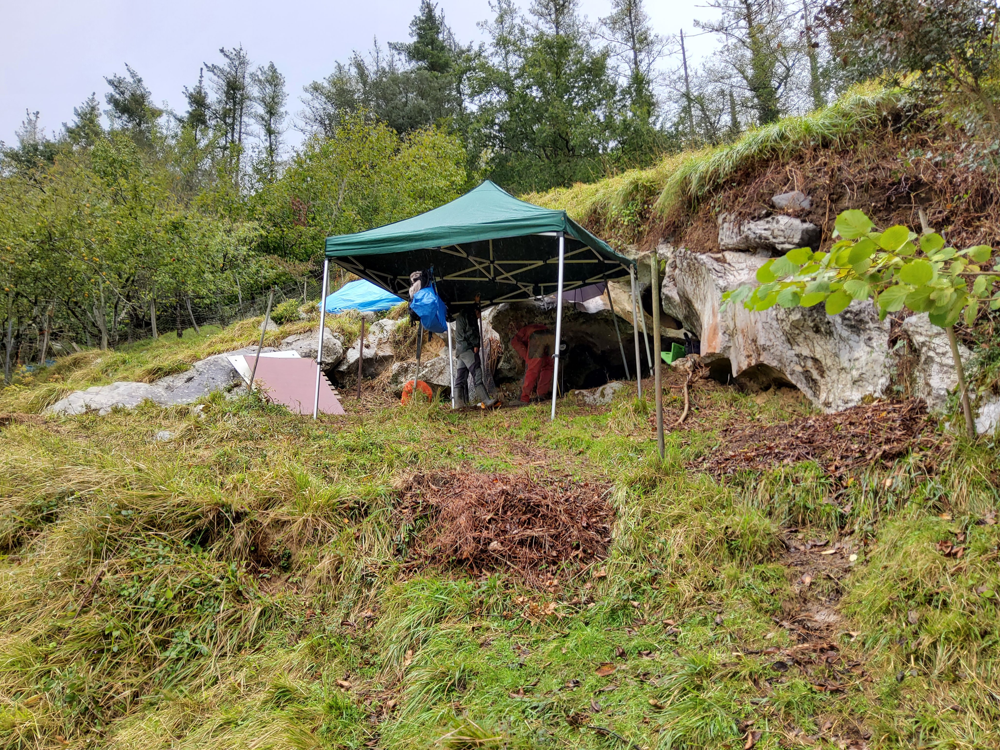
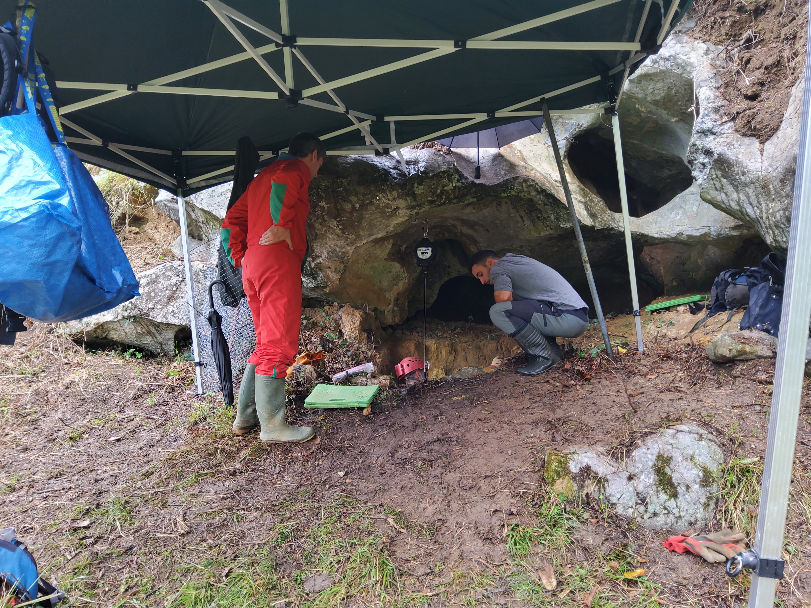
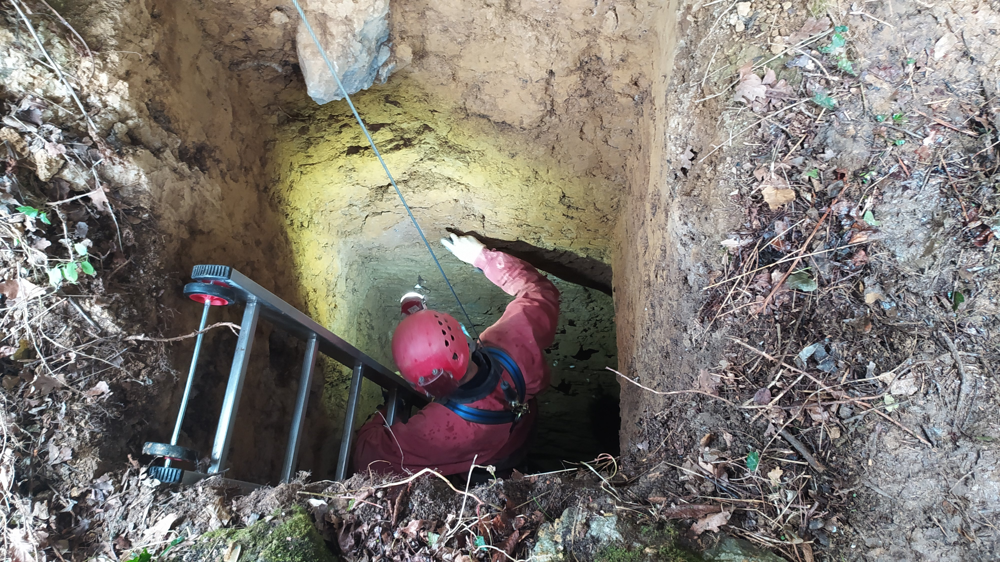
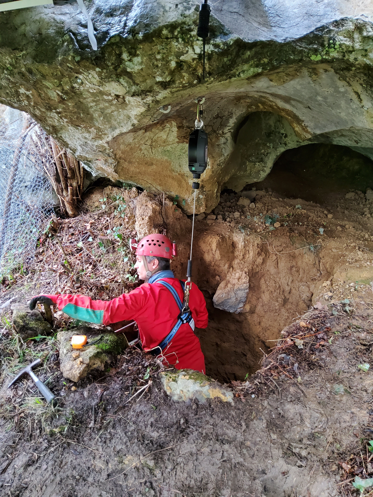
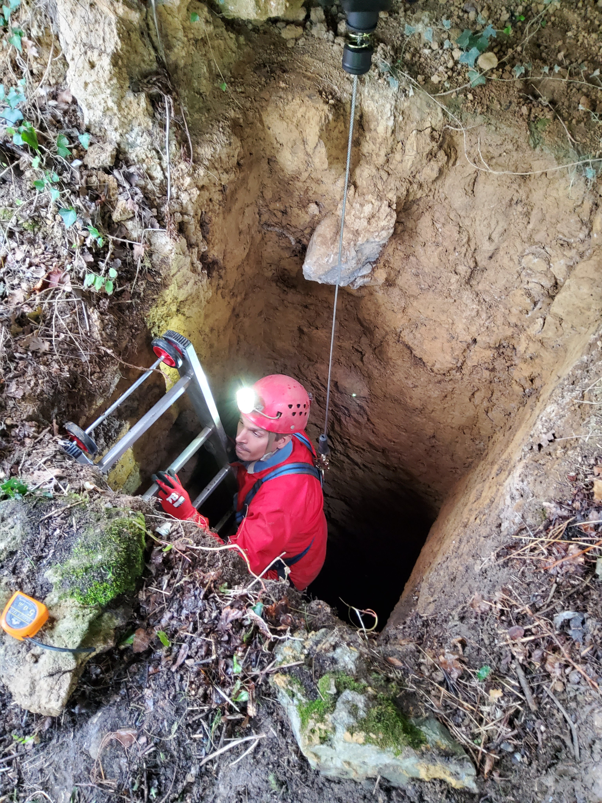
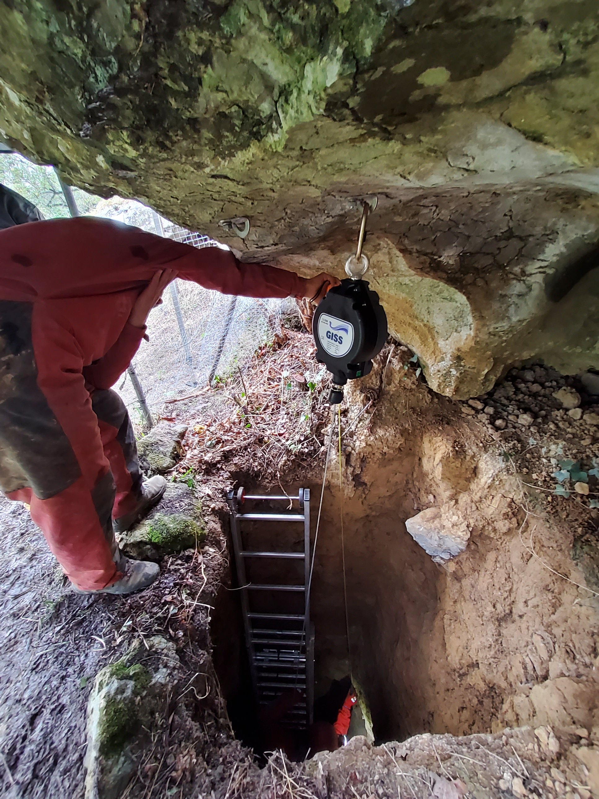
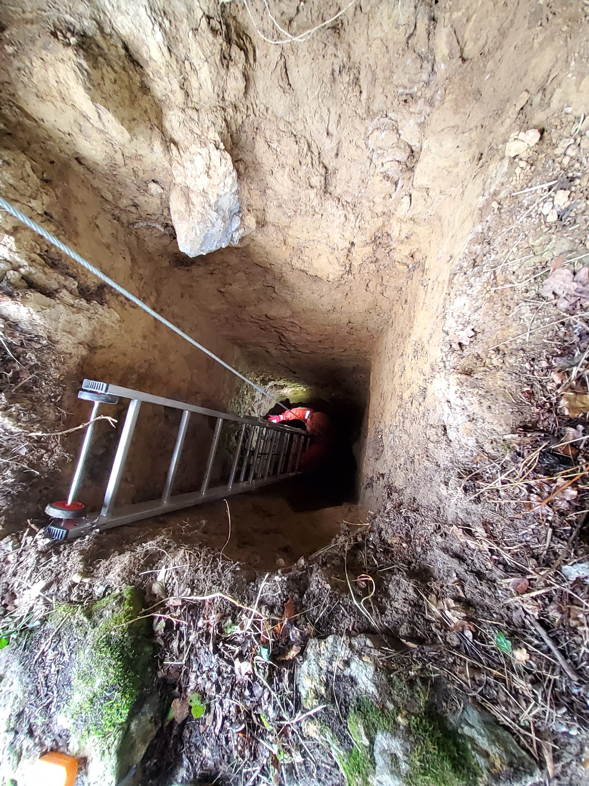

Orain pare bat aste joan ginen, EHUko ikertzaileak diren Asier Gomez-Olivencia, proiektuaren zuzendaria, Martin Arriolabengoa, geologia arduraduna eta Antxietako kideak logistika ardurarekin, BAIOko  estratigrafiaren ikerketari hasiera ematera.

Ion Uranga geologo Azpeitiarra eta Antxietako kidea ere bertan izan degu laguntzen.

Alde batetik euritik babesteko tramankulua eta bestaldetik segurtasun neurriak baloratzeko balio izan digu esperimentuak.

Bai batak eta bestean funtzionatu dute eta hobetzen joango gera.

1990ko zundaketa polita, ez?

