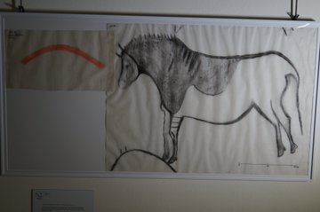
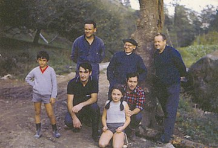

1969ko Ekainak 8an Andoni Albizuri "Katxo" eta Rafael Rezabal, Azpeitiko Antxieta taldeko kideak, Sastarrain bailaran arkeologia miaketak egiten zabiltzatela Ekaingo margoak aurkitu zituzten. Argazkiak 1969an J.M. Barandiaranek zuzenean egindako kalkoak dira.

Andoni Albizuri "Katxo" (Azpeitia 1935-1983) Antxieta taldearen sortzailea falta zaigu baina eskertu beharra daukagu bai bere lana eta bai berak zuen neurrigabeko prehistoria zaletasuna.
Joxe Mielek ere benetako estimazioa zuen Andonirentzat eta sekulako berriketak egiten zituen.

Rafael Rezabal (Azpeitia 1930) gaur egun Antxietako taldekidea jarraitzen du izaten eta 90 urterekin sasoi onenean dago. Oraindik beste aurkikuntza garrantzitsuren bat egin behar digu gure mendietako kobazulo batetan.


