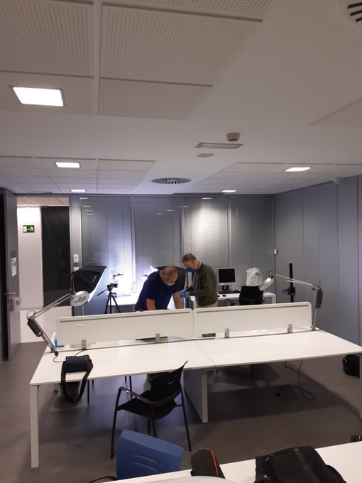
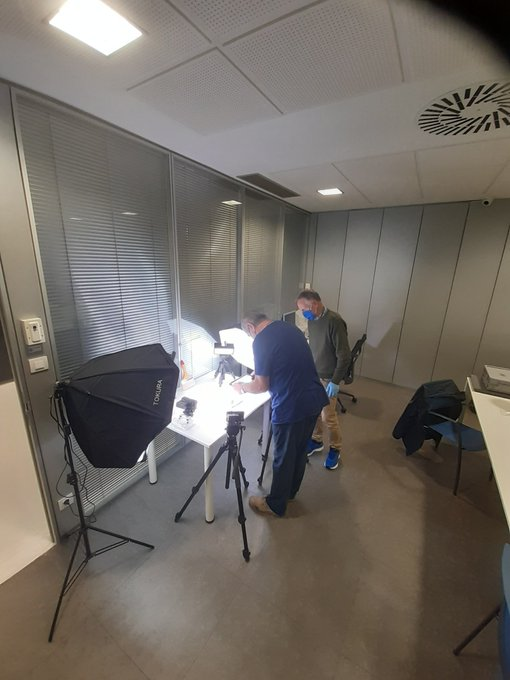
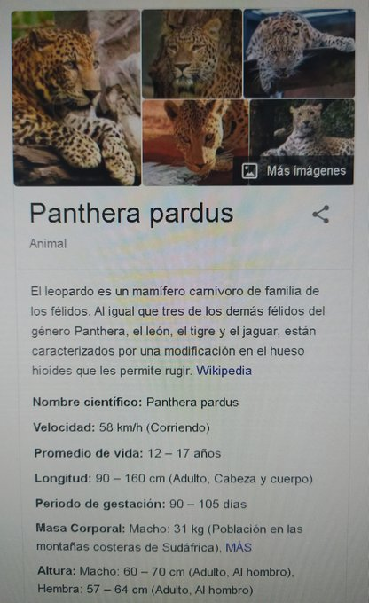
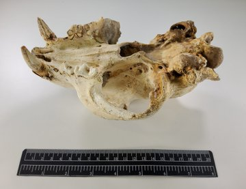
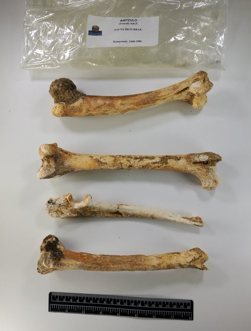

Antxieta arkeologia taldeko kideek Irunen dagoen Gordailua Gipuzkoako Foru Aldundiaren Ondare Bildumen Zentrora joan-etorri bat baino gehiago egin dituzte azken asteetan. Han gordetzen dute euren ikerketetan topatutako materiala, eta material horri argazkiak ateratzen ibili dira. Asteburuan, esaterako, Errezilgo Aintzulo kobazuloan 1969 eta 1980 bitartean topatutako zuten lehoinabarraren hezurdurari atera dizkiote argazkiak.

