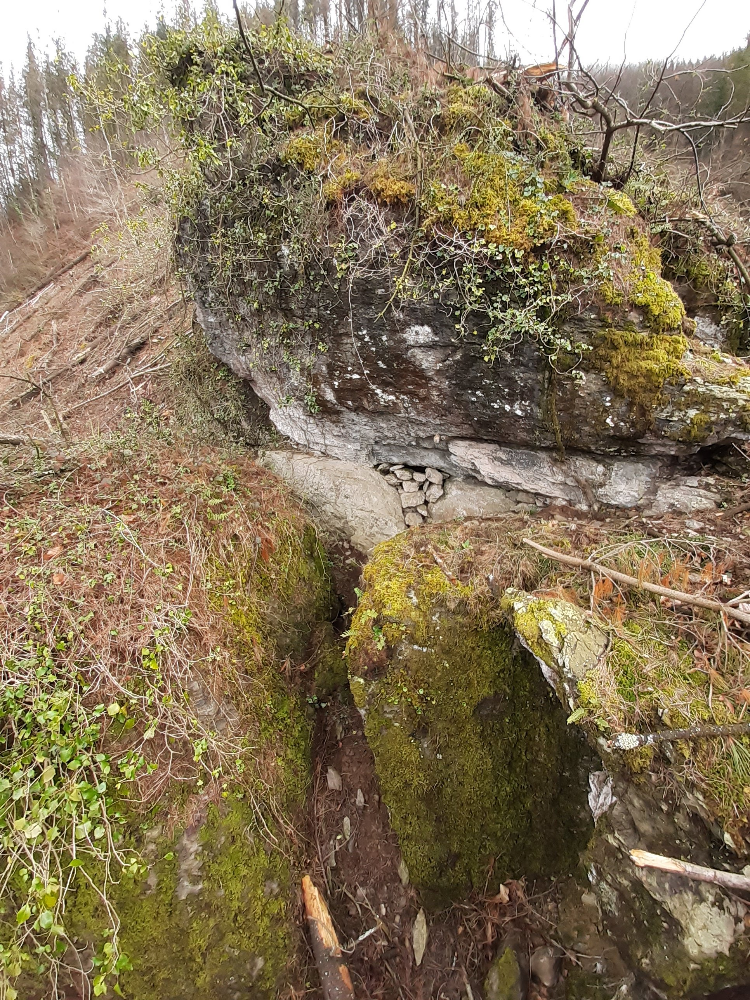
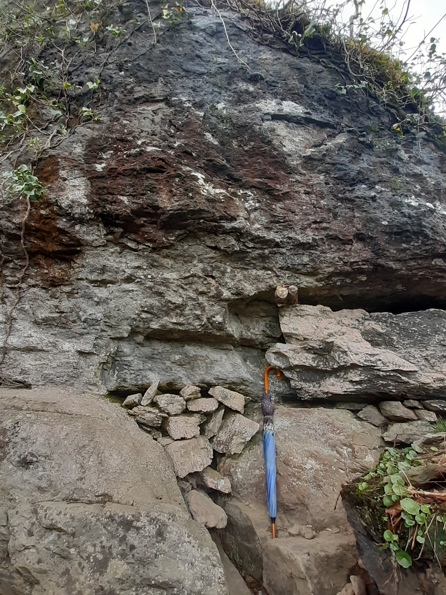
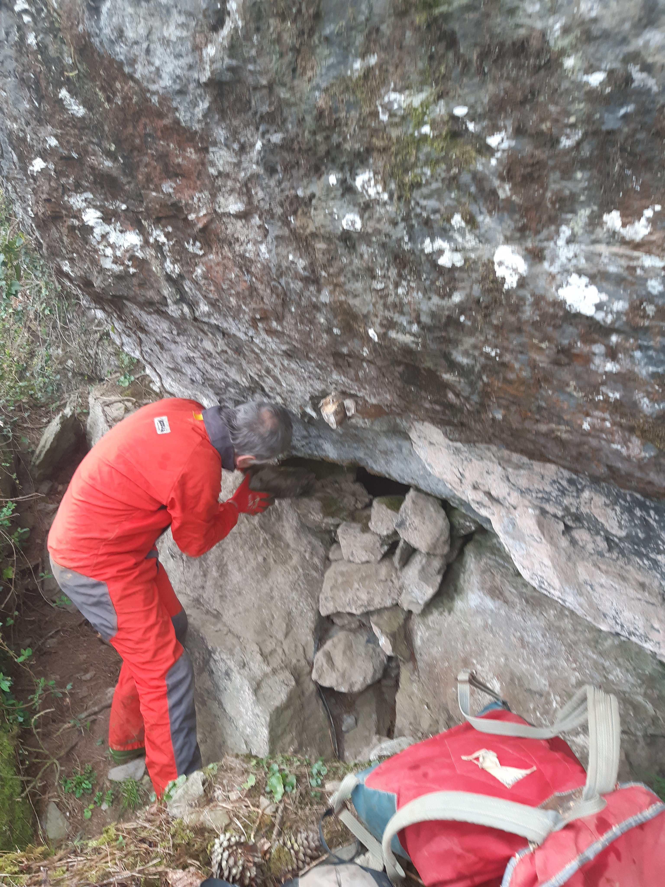

Nola bilatzen ditugu kobazuloak?

Modu bat baino gehiago erabiltzen dira eta hau da modu zaharretako bat:

1. Mendian gizaki prehistorikoa bizitzeko egokia izango litzatekeen bailaratxo bat aukeratu, ipar eta mendebal haizeetatik babestua, bere errekatxoarekin.

2. Inguruko baserritarrei galdetu; kasu honetan Igartza baserrikoei:
- Azeririk edo horrelakorik ezkutatzen al da zuloren batean zuen terrenoetan?
- Ba bai, Haitzalde izena ematen zaion lekuan umeak ateratzen ditu urtero!

3. Hor goaz berehala zuloa bilatzera!

4. Aurkitu dugu, estalita.

5. Argazkiak eta marrazkia egiten ditugu, nola dagoen jasotzeko.

6. Harriak kendu, justu-justukoa galeria begiratzeko arrastaka sartzeko.

7. Ahal den moduan barrura sartu eta galeria zer motatakoa den miatu.

8. Koba honetan Kalkolito/Brontze hilobi bat egon liteke!

9. Jarraitzeko, Gipuzkoako Foru Aldundiari baimena eskatu behar zaio.

10. Berriro etorriko gara, baimenarekin.
