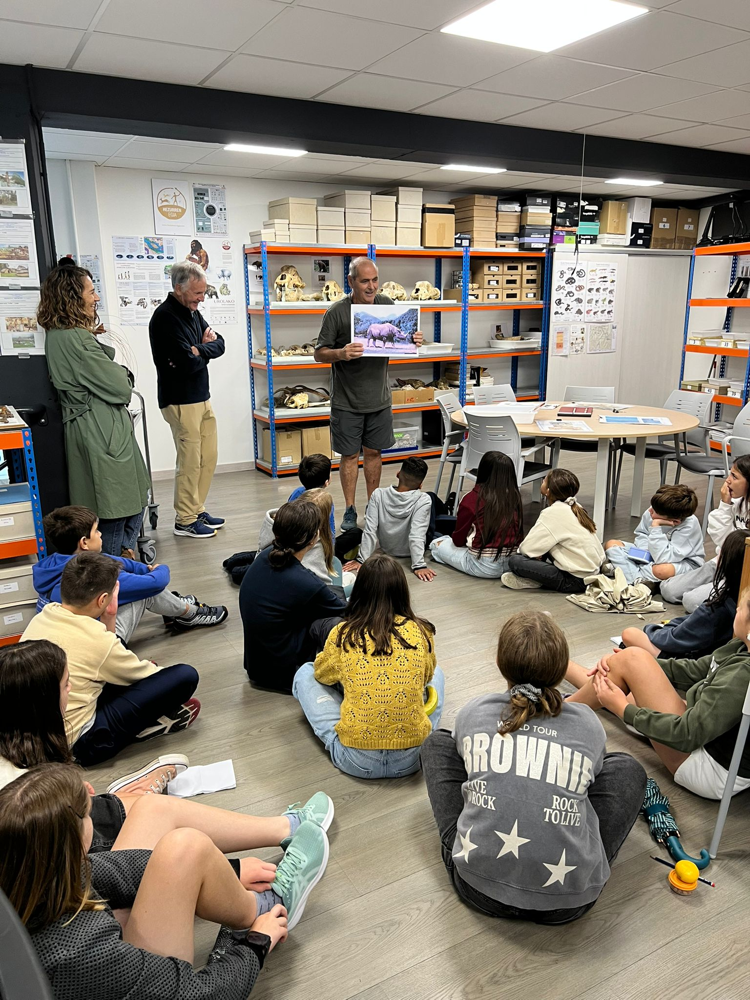

IZARRAITZ Ikastolako ikasleak – 5/6 garren mailak 11/12 urte.

Aste honetan, astelehenetik ostegunera 150 bat ikaste izan ditugu Antxietaren
gela/laborategian.

Oso harreman polita izan da, Giza Eboluzioa, Paleontologia, Arkeologia eta arkeologiaren
barruan Antxietaren lana zein izaten den azaldu diegu.

Galdera pila bat egin digute :
Nola denok Afrikatik gatozela, nola denok etorkinak garela,
nola lehenago gizaki guztion azaleko kolorea zuria ez zela, baizik oso iluna edo beltza,
nola Azpeitin errinozeroak-mamutak-lehoiak-hienak edo makakoak zabiltzatela gurekin batera
bizirik irauteko ahaleginak egiten.

Gaztetxo hauek izango dira gure lanaren etorkizuna.

Aurten 60 urte ospatzen ditugu Antxieta taldeak : 1965-2025

