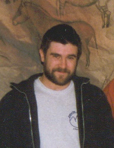
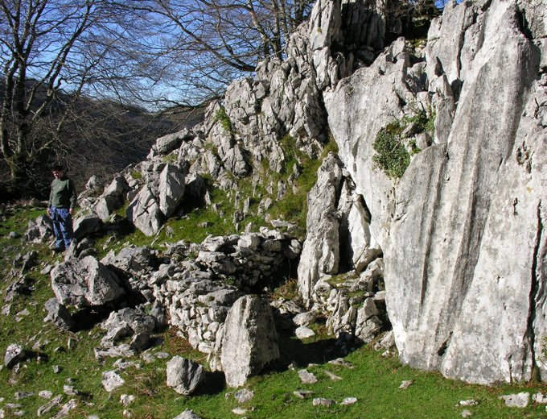
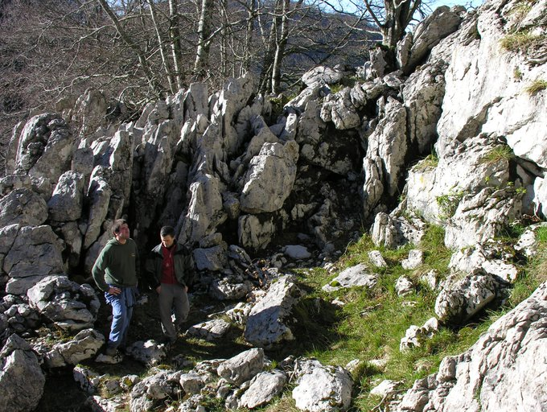
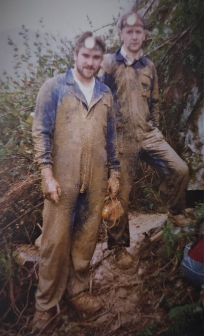
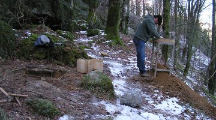
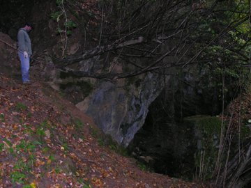
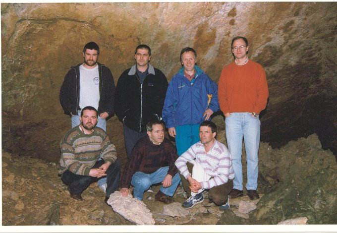
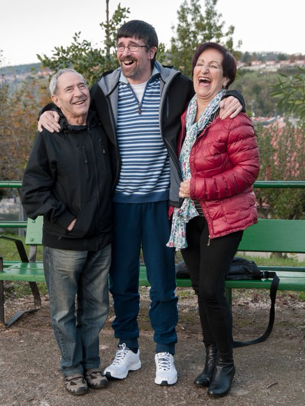
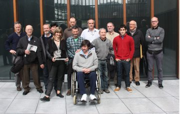

Asurtzu-Erlo proiektua Izarraitz eremuko dimentsioa hartzera doanean, ez da momentu txarra aztarnategi berezi hori aurkitu zuen gure taldekide Joseba Irureta Irureta (1967-2016) gogoratzeko.

2006an, Ikulluteko Gaina-Erlo aztarnategian zundaketak egiten ari ginela, bueltatxo bat egitera joan, eta han etorri zen esanez: "Topatu diat hortxe goian beste leku bat, hau baino hobea!".

Arkeologia eta natura guzia, orokorrean, maite zituen Josebak, eta urteetan elkarrekin miatu genituen hainbat eta hainbat kobazulo.

Makina bat lokatza eraman genuen etxera.

Urola, Deba eta Oria bailaretako kobazulo guztiak astindu genituen, aurkikuntza ugari lortuz.

2016ko martxoaren 24an laga gintuen Josebak, gaixotasun larri baten ondorioz.

Normalean, isil-isiilik hainbeste eman dutenei, bizi direnean ez zaie nahikoa eskertzen.

Eskerrik asko, Joseba, hainbat momentu onengatik.

