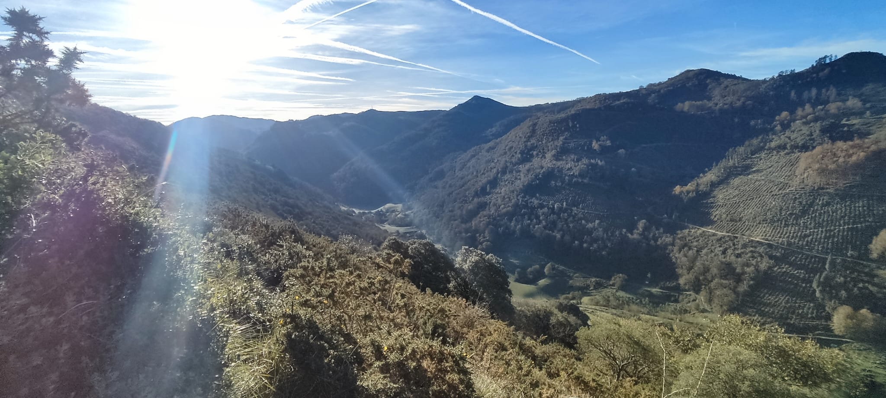
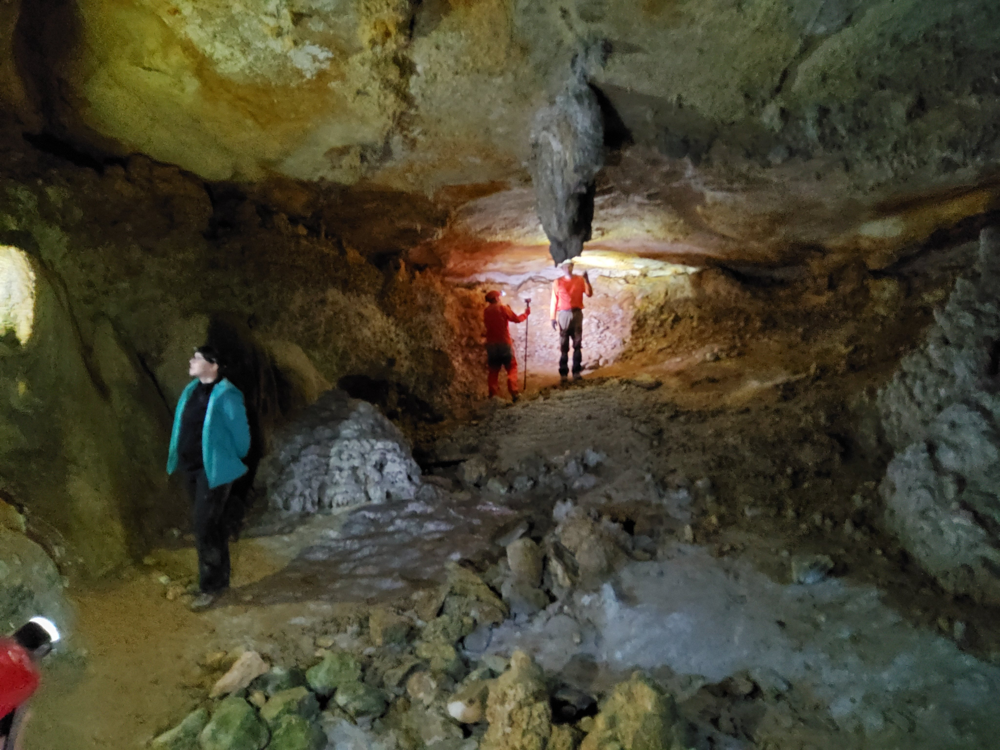

Bukatutzat eman ditugu 2023ko ikerketak Lasturko kobazulo berezi honetan.

2017an, paleolitoko Labar Artea aurkitu genuen Antxietakoek eta geroztik, Blanca Ochoa, UCM unibertsitateko ikerlaria lan bikaina ari da egiten koba honetako paleolitoko grabatuekin.

Datorren urtean jarraipena emango diogu ikerketei eta Antxietakoak gustura lagunduko diogu elkarlanean.

Lan ona Blanca !!

