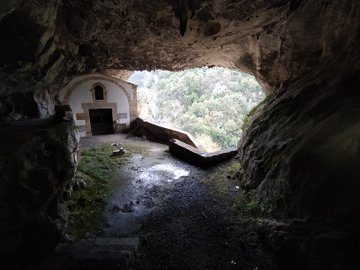
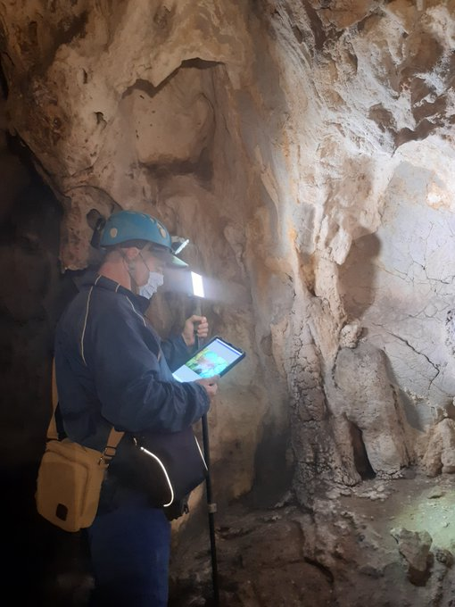

Joan den igandean Arantzazu inguruan ibili ginen, Araotzetik eta Arrikrutz kobatik gertu. Baseliza polit hau koba baten barruan dago; bertako urak ugalkortasuna lortzeko omen dira, eta guk zurrutada bat egiten genuen bitartean labar arteko miaketak egin genituen.

