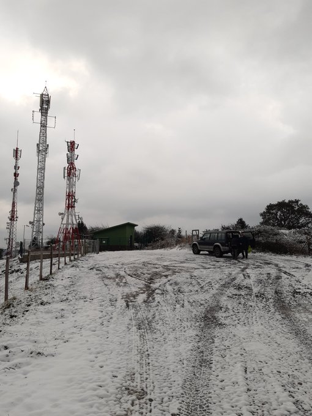
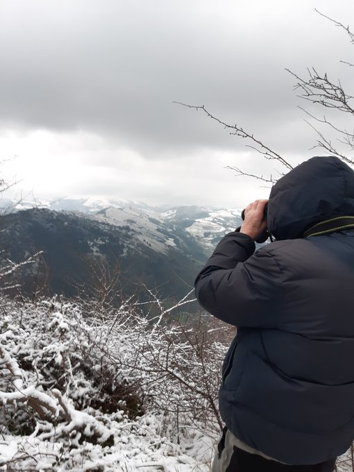
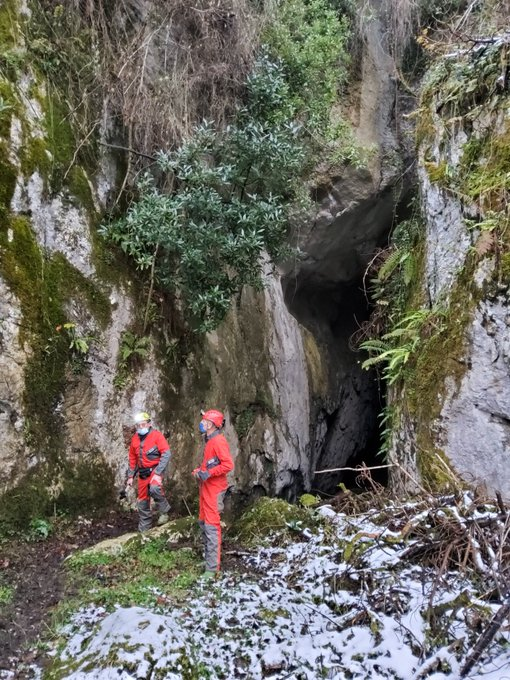

Azken egunotako eguraldia aproposa izan ohi da ezkutuko koba estaliak bilatzeko. Koba barruetan askoz haize epelagoa egon ohi da kanpoan baino, eta bertan garatzen diren presioengatik baporez kargatutako haize ufadak sortzen dira kanpo aldera, ketan dagoen tximinia bat balitz bezala. Hori horrela, urrunetik ikusten dira.

Normalean prismatikoekin urrutitik ikusten dira baporezko tximinia horiek, baina atzo ikusgarritasun gutxi zegoen eta kobazulo ezagun baten epelera joatea erabaki dugu. Lastur-Debako Ugarteberri kobako labar artean miaketa sakon bat egin dugu barruko epelean.

