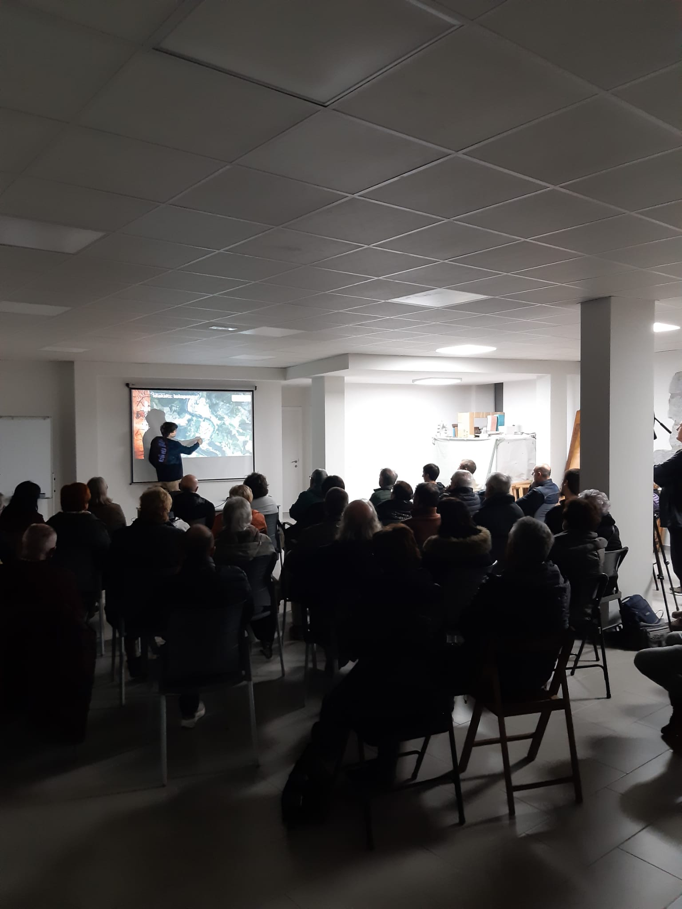

Atzo, azaroak 23 osteguna, Zestoako udalak eta Antxieta Arkeologi Taldeak antolatutako Arkeologia astearen barruan bigarrengo hitzaldia eduki genuen eta oraingo honetan Antxietako taldekidea dugun Iñigo Arizaga izan genuen hizlari lanetan.

Hitzaldi aparta !!

