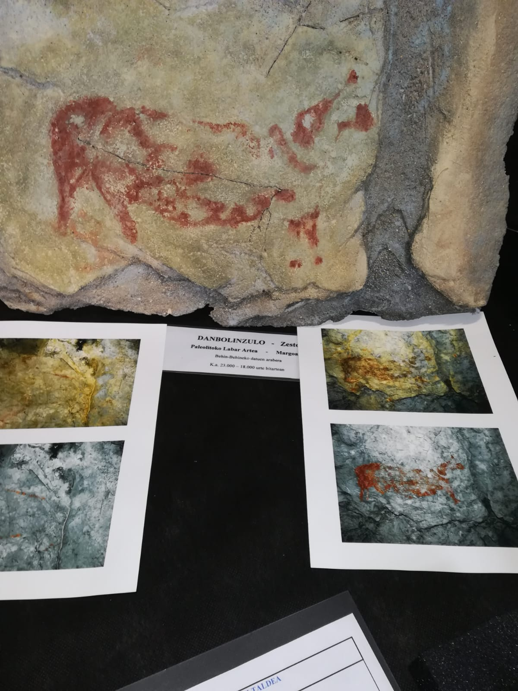
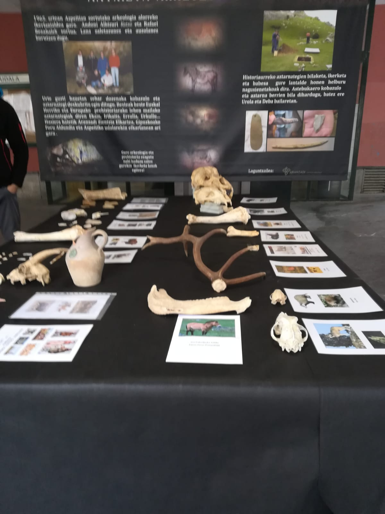
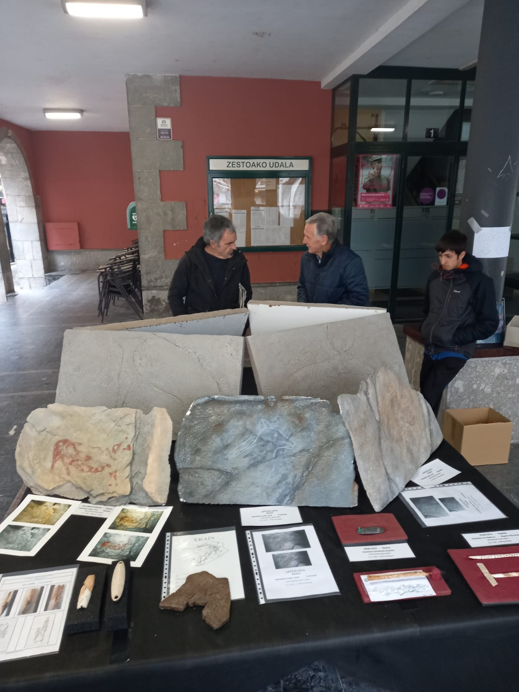

Etzi, azaroak 26 igandea, Arkeologia Asteari bukaera emateko Herri Azoka bat antolatu dugu.

Zestoa eta bere inguruetako ondare arkeologiko aberatsa eskuekin ukitzeko moduan ipiniko dugu erreplika ikusgarriekin.

Gonbidatuak zaudete Herri Azokara !!

