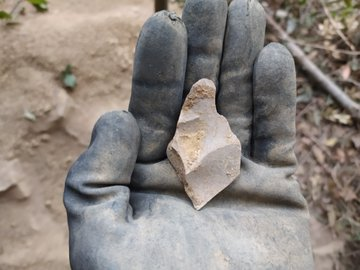

Antxieta arkeologia taldeko kideek lanean jarraitzen dute udako azken txanpa honetan. Asurtzun eta Erlaitzen ibili ostean, Amalda III kobazuloan gordetako antzinako altxorrak azalarazten dabiltza egunotan.

Zestoako Altzolarats bailaran dago Amalda III eta Antxietakoak izan ziren, hain zuzen ere, kobazulo hori aurkitu zutenak, 1983an. "1983. eta 1984. urteetan zundaketa arkeologikoa egin genuen, eta oso material interesgarriak aurkitu ondoren, aztarnategi bezala katalogatua izan zen", azaldu dute arkeologia taldekoak. Hala ere, eta kobazulo horren irisgarritasun zailtasunak tarteko, ia 40 urtez ez da indusketarik egin Amalda III-n. 2017an, ordea, Burgosko CENIEH ikerketa zentroko Joseba Rios arkeologoaren laguntza eskaera jaso zuten Antxietakoek, Amalda III-n indusketa lanak egiteko. Azpeitiarren baiezkoa jasota, Gipuzkoako Foru Aldundiaren baimena eta aldundiaren beraren eta Zestoako eta Azpeitiko udalen dirulaguntza jasota, iaz ekin zioten berriro Altzolarats bailarako koba ikertzeari Riosek eta haren lantaldeak, Antxietakoen laguntzarekin.

Aste honetan bertan hasi dituzte bigarren indusketa kanpainaren lanak Amalda III-n, eta iaz bezala, Antxieta arkeologia taldeko kideak ere han dabiltza lanean; irail hasieran, indusketak hasi aurreko lanak ere azpeitiarrek egin zituzten. Neanderthal aroko aztarnak topatu izan dituzte Amalda III-n, "oso material interesgarriak", eta aro eta ildo bereko aztarna gehiago pilatzea da arkeologoen esperantza.

