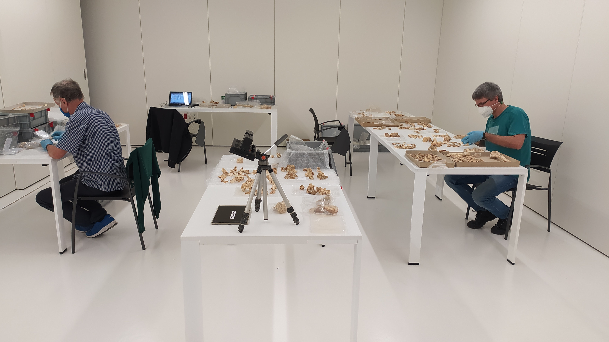
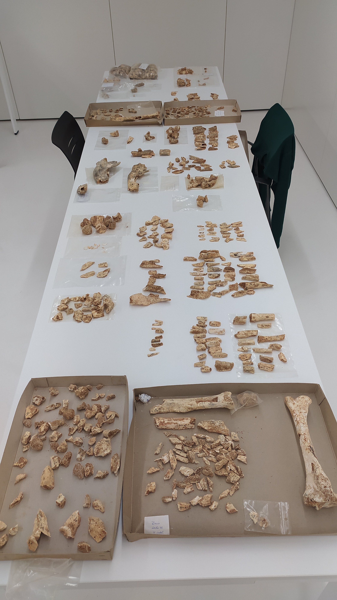
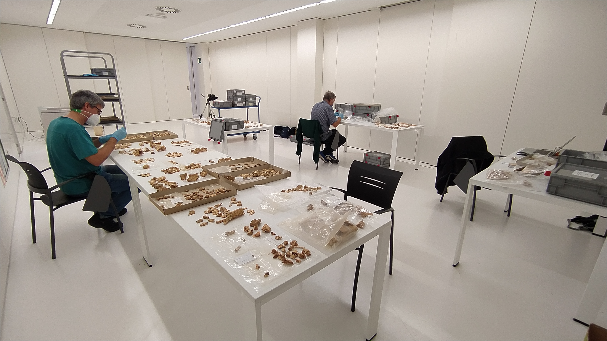
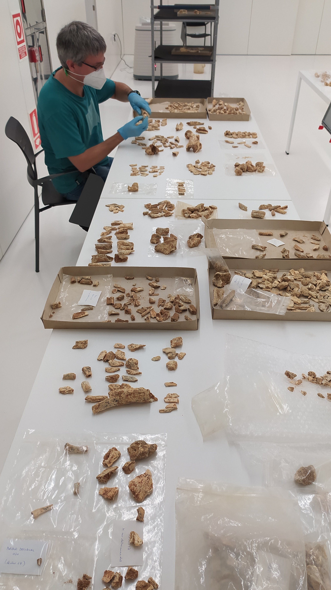

Asier Gomez-Olivencia EHUko ikertzailearekin Gordailuan egon gara berriro, elkarren artean juntatzen diren ehundaka hezur zatiak aurkitzen.

Pazientzia handiko lana da hezur zati hauek elkarren artean elkartzea, baina pixkanaka-pixkanaka lortzen da, eta opari bat da lortutakoan.

Juntatutakoan, neurketak egin, identifikatu, noski, eta inbentariatu egiten ditugu.

