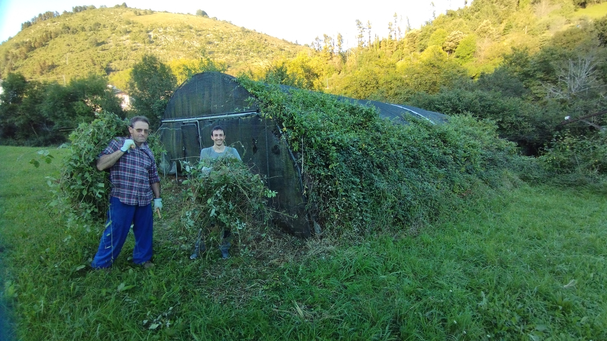
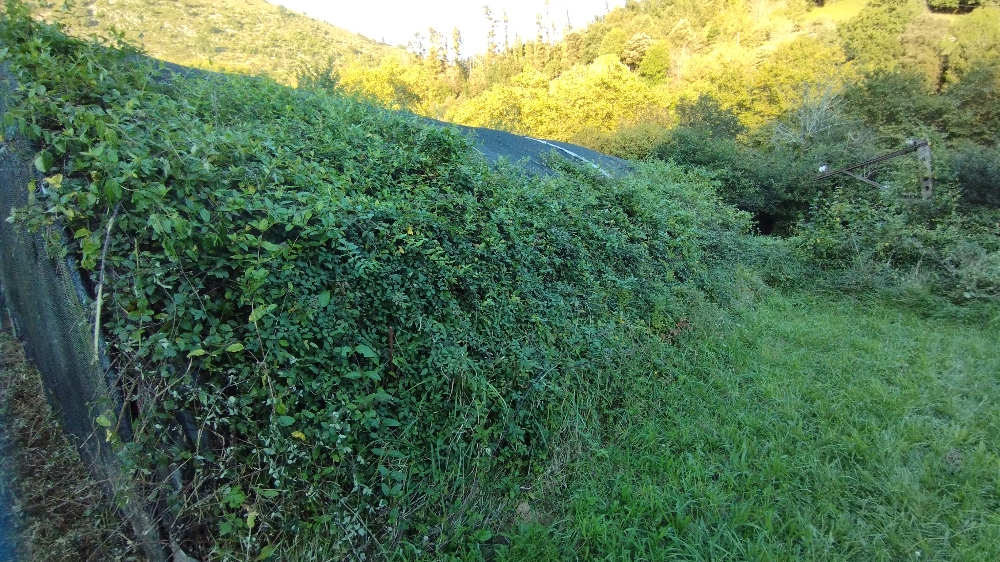
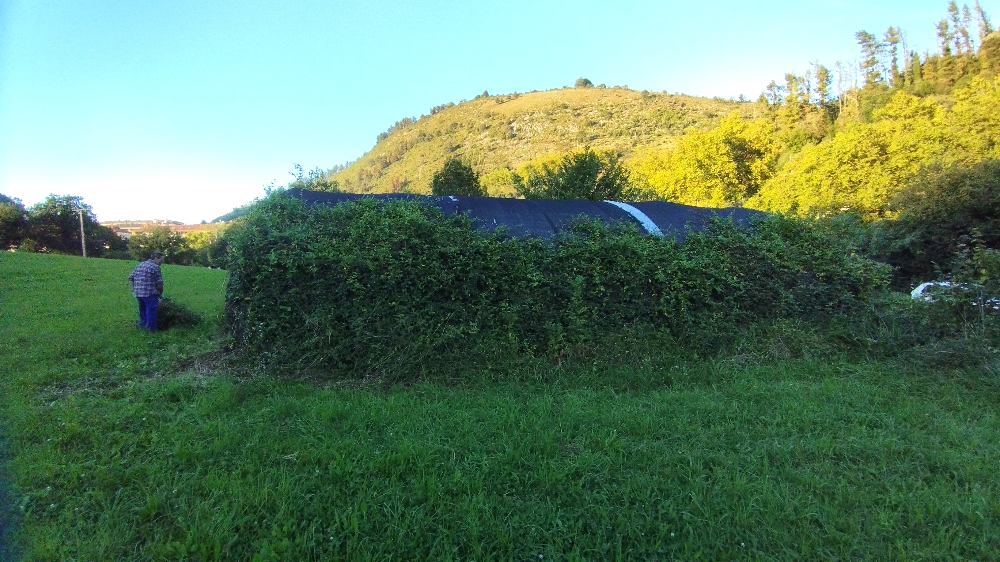
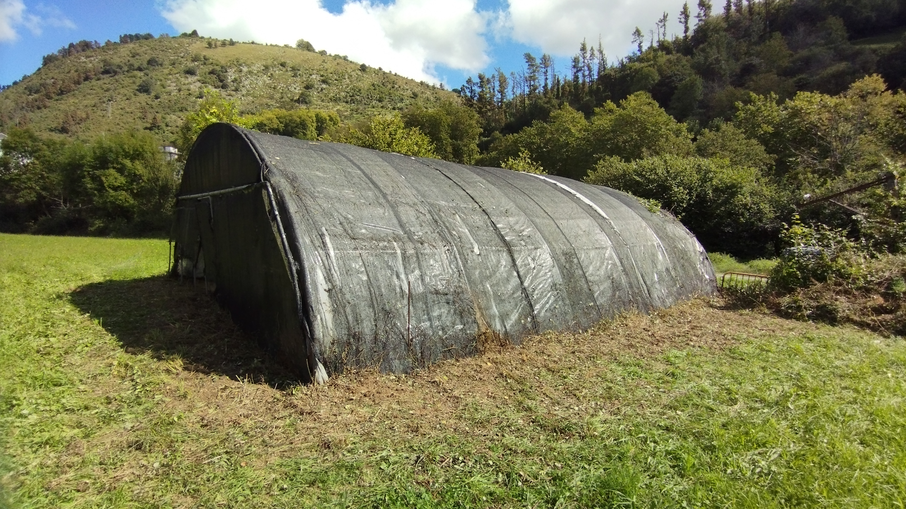
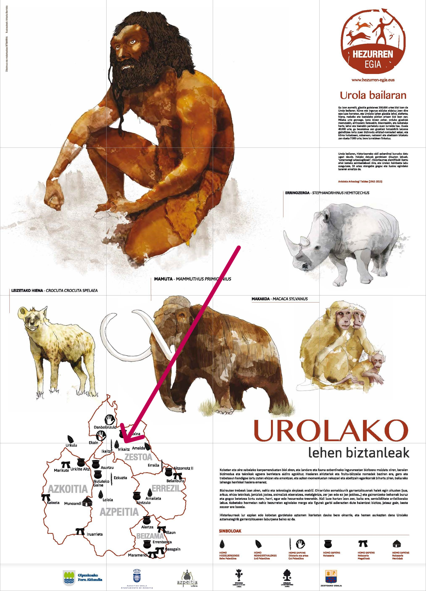
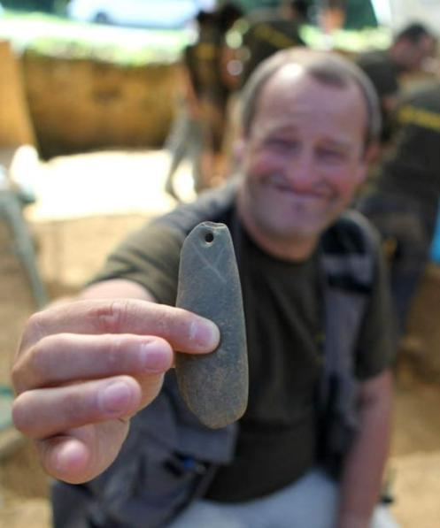
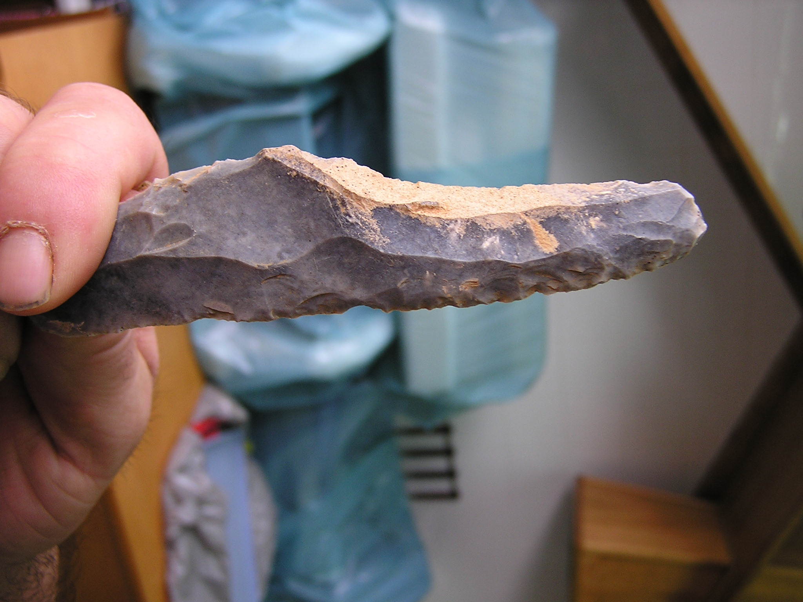

Azken asteburu honetan garbitu genuen indusketako zonaldea eta aztarnategia babesten duen estalpea.

Natura, urtero bezala, saiatzen da bereganatzen aztarnategia dagoen toki berezi hau eta sasia behin eta berriro ahalegintzen da dena estaltzen.

Aurten izugarrizko indarra zaukan.

Aztarnategi honek, bai Goi Paleolitoko, bai Behe Paleolitoko aztarna garrantzitsuak ditu:

240.000 urtetik hasi eta 22.000 urte bitartean.

Denon artean ahalegindu behar genuke, gure arbasoek laga zuten beraien bizimoduaren testigantza garrantzitsu hau etorriko diren belaunaldientzat gutxieneko bat zainduta mantentzen.

Aztarnategi honek garrantzi berezia du, aire zabalean dagoelako, eremu oso handia duelako (8 edo 10 hektarea) eta horrelako aztarnategiak oso gutxi direlako, bai Europan zehar, bai Iberiar penintsulan eta zer esanik ez Euskal Herrian.

Kontuan eduki behar dugu gizaki espezie ezberdinak bizi izan zirela aztarnategi honetan: Lehenago Pre-Neanderthalak, jarraian Neanderthalak eta geroago gure espeziea, Sapiens-ak.

Ondare berezi hau zaindu dezagun altxor bat bezala denon artean!!

