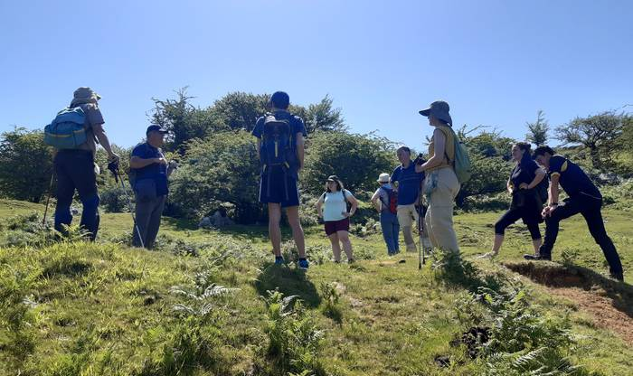
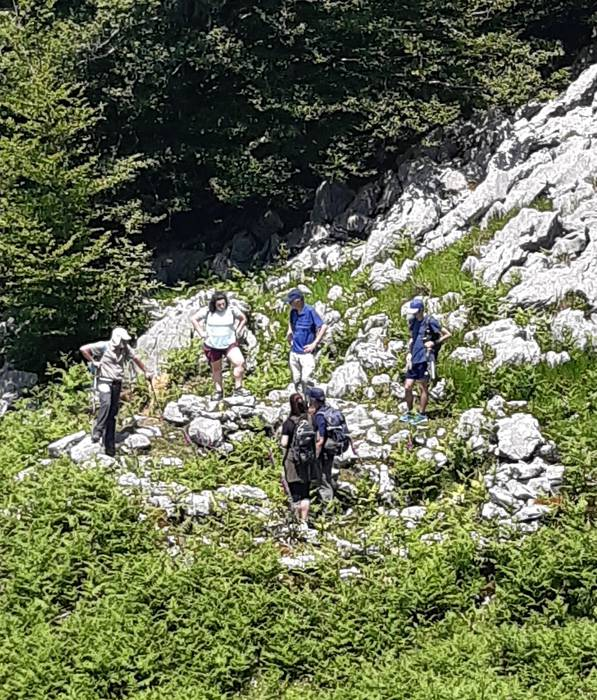

Zer altxor ezkutatzen du Izarraitzek? 2006-2007an Ikulluteko gaina aztertu genuen; 2013 eta 2020 artean Asurtzu eremua; eta 2021-2022 urteetan Izarraizko eremuan zabaltzen ari gara.

Igande honetan, Valladolideko Unibertsitateko ikerlariak etorri ziren Izarraizko aztarnategia ezagutzera, hala nola Manuel Rojo prehistorian katedraduna, Pilar Perez arkeologoa eta Izaro Quevedo doktoratua egiten ari den arkeologoa.

Izarraizko gure arbasoen altxor distiratsuak erakutsi genizkien, eta benetan atseginak egin zaizkie bertako aztarnategiak. Elkarlanerako prest gaude!

