Urtarrileko azken elurteak politak izan dira, baina Izarraizko eremu askotako zuhaitzetan kristoren kalteak eragin ditu. Gutxi falta izan da gu azpian harrapatu eta ikertzen ari garen gizakiak bezala seko gelditzeko.

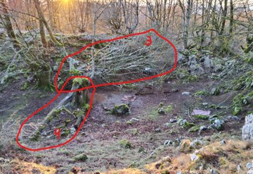
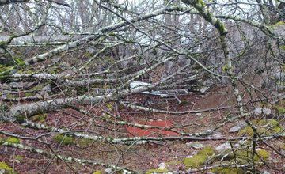
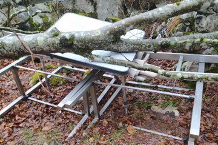

Elurrak, haizeak edo beste eraginek zuhaitz mota batzuk apurtzea geroz eta gehiago ikusiko dugu datozen urteetan. Adibidetzat Pagoa erabil daiteke: jatorrian, pagoak naturaren eboluzioz moldatuak daude elur edo haize traketsak gainditzeko, enbor zuzen eta luzearekin eta adar txikiekin.

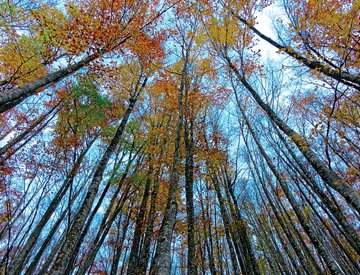
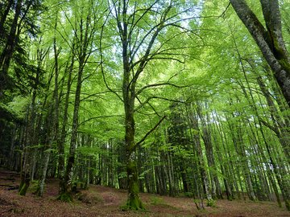
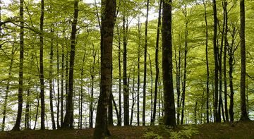
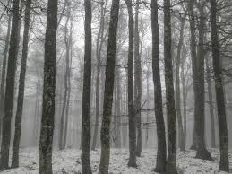

Baina, zuhaitza hobeto ustiatzeko, altuera motz batera (+/- 2,5 m) erdiko adarra moztu eta pago motza deritzon mutazioa sortu genuen antzina. Gizakiak eragindako aldaketa honekin hamar edo hamabi urtean hazten zitzaizkien alboetakoo adarrak moztu, eta gehien bat ikatza egiteko erabiltzen hasi ginen.

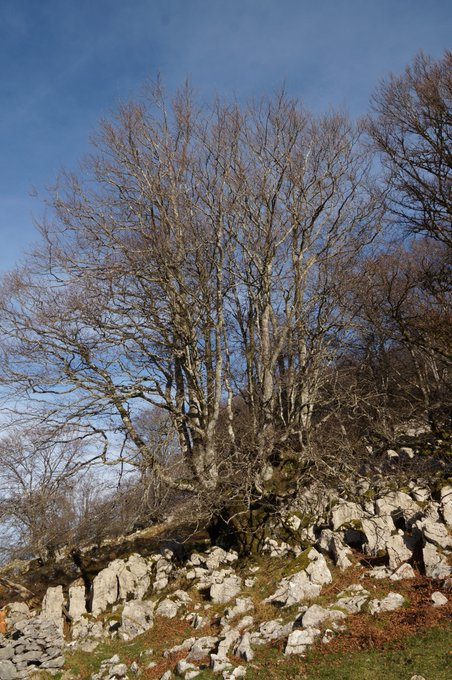
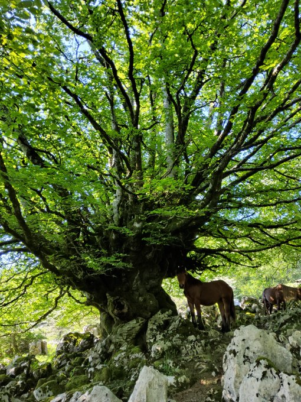
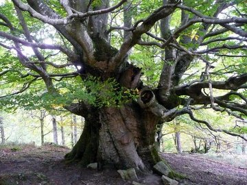

Baina orain dela 50-100 urte, pixkanaka podaketak egiteari utzi genion, eta orain, adar horiek enbor lodi batzuk bezalakoak dira, eta geroz eta gehiagora doaz. Naturak ez du barkatzen eta azken urteetan elurra, haizea edo bestelakoak zuhaitz dotore horiek denak apurtzen eta hiltzen ari dira.

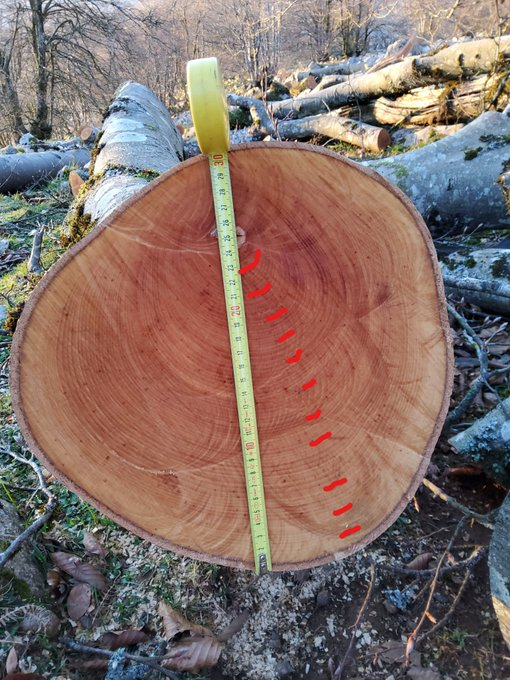
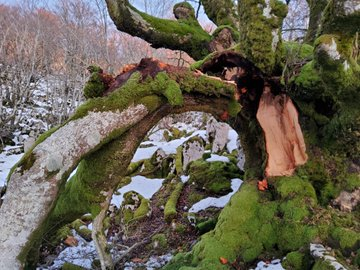
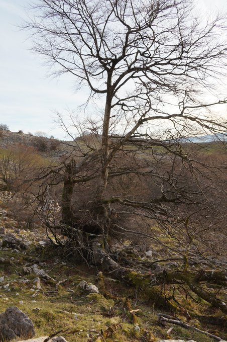
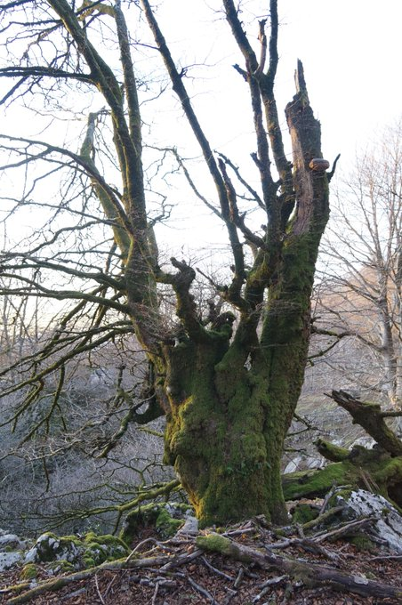

Beste gauza askok bezala, horrek erremediorik ba ote dauka?

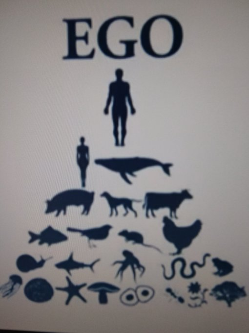
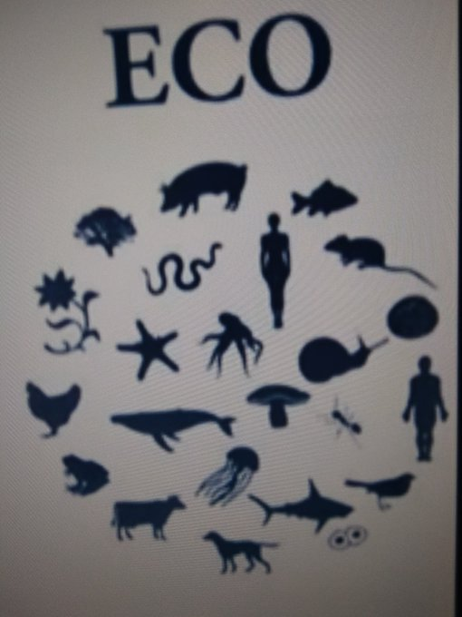
