Igandea, urtarrilak 30. Eguraldi aparta dago 500 metrotik gora.

Azpeitiko herrian, behean laga ditugu behe lainoa, hezetasuna eta hotza.

Bagoaz Izarraizko antzinako arbasoen bizimodua ezagutzera.

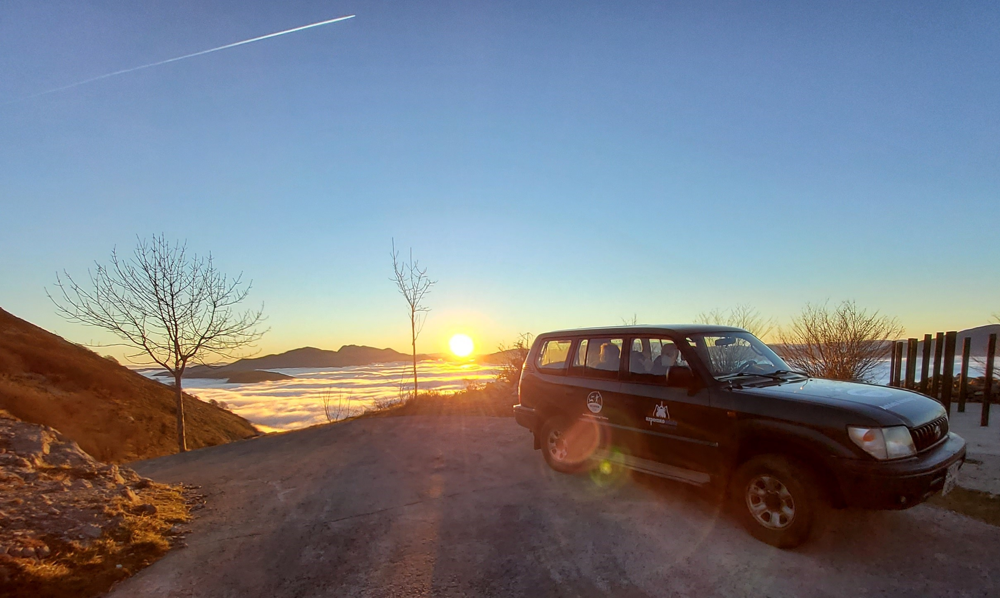
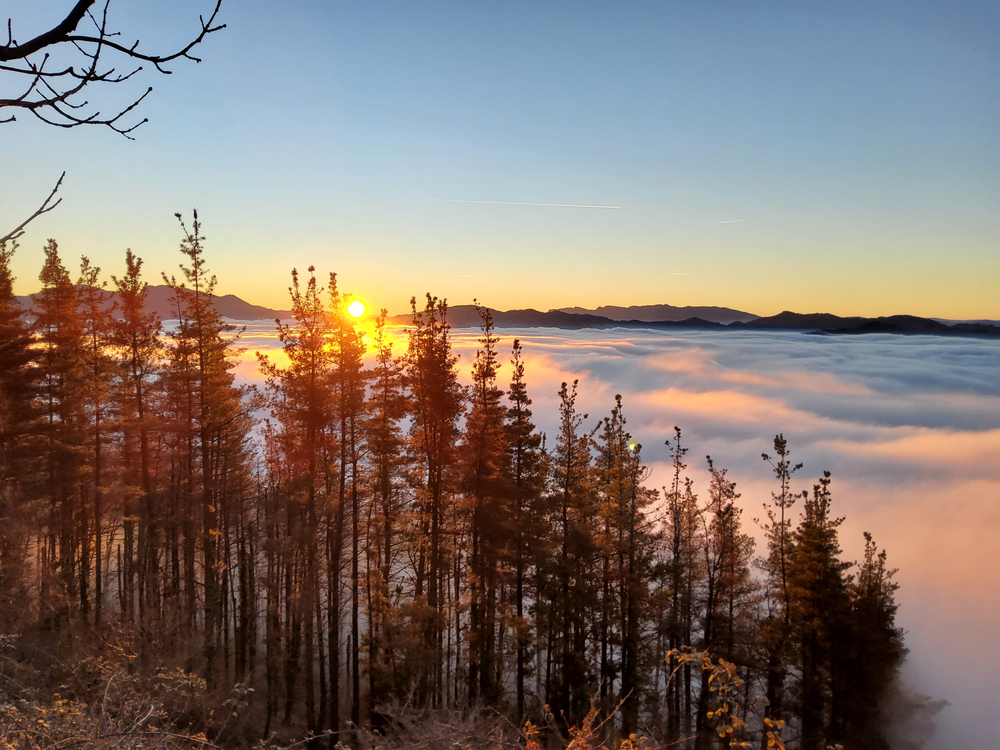
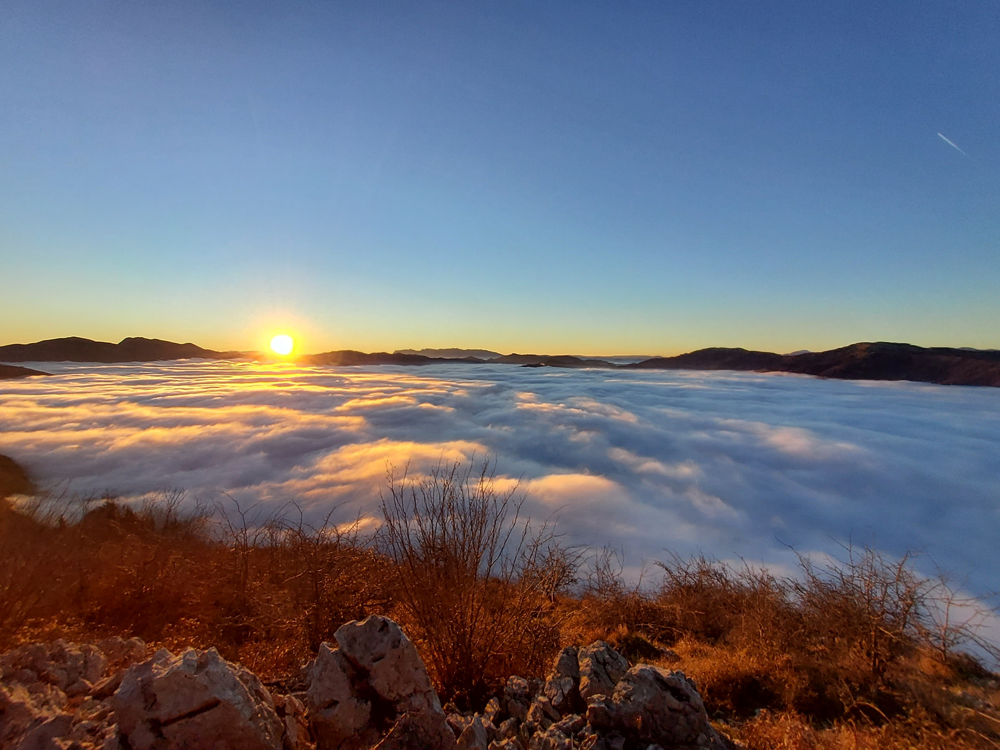
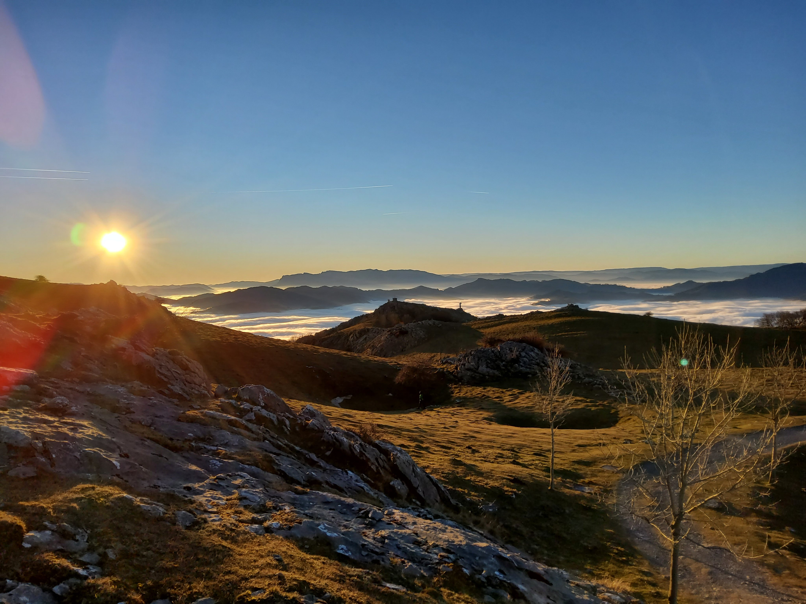

2013tik Asurtzuko eremua ikertu ondoren, eta ikerketa ildo berari jarraituz, zonalde berri bat aukeratu dugu.

Arrasate Goena toponimoa dauka zonalde berriak.

Oso egokia da bizitzeko eta nabarmena da garai historiko desberdinetan zenbat txabola egon ziren eremu babes honetan.

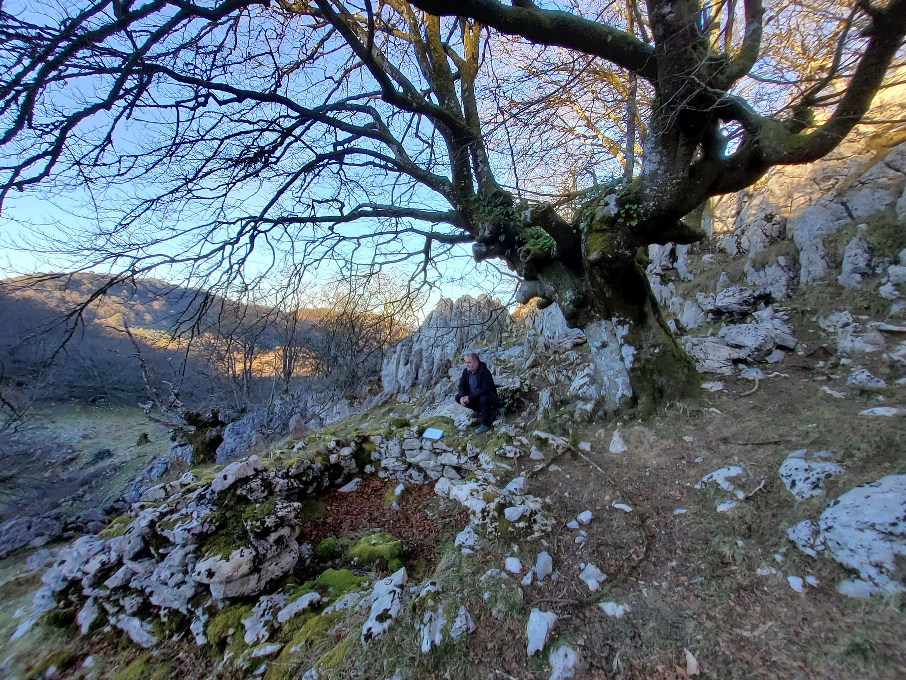
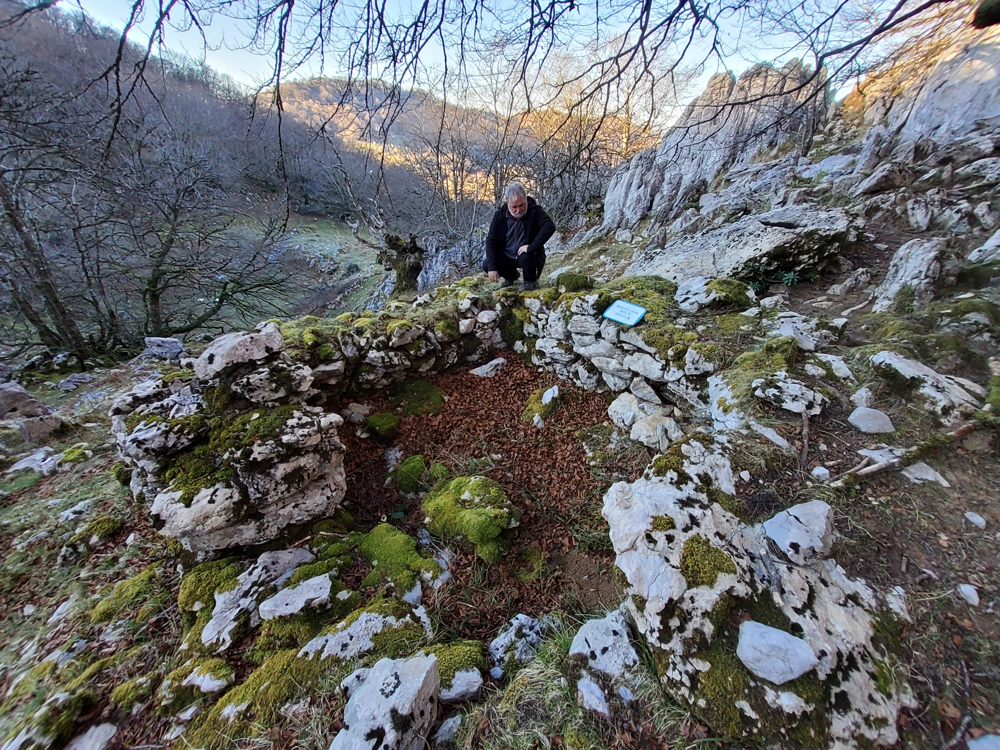
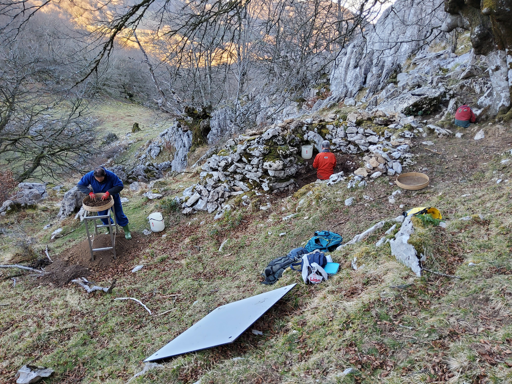
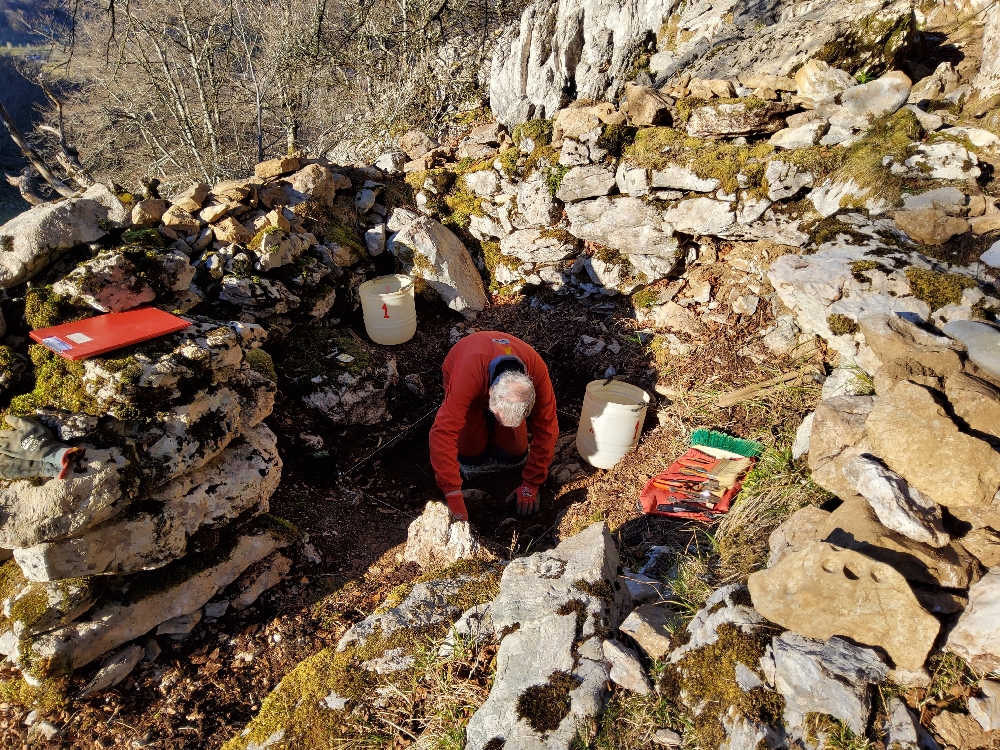

Txabola barrua garbitu, laukia markatu, laserrarekin nibelak hartu, eta ekin diogu liburuaren lehenengo orrialdea irakurtzeari.

Lehenengo azaleran, txabolan bizi zen artzainaren gauzatxo batzuk.

Bigarrengoan, bikain landutako suharri polit eta interesgarri bat.

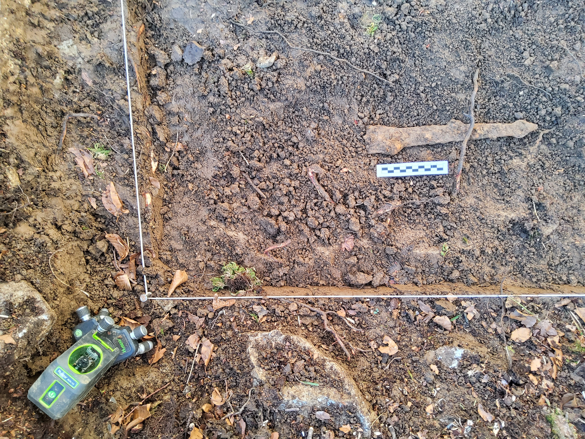
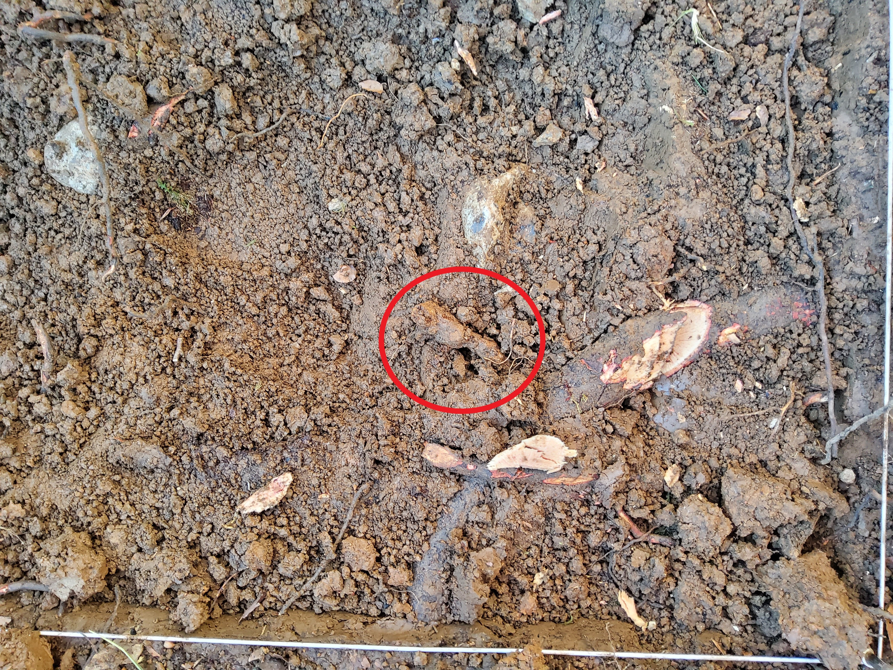
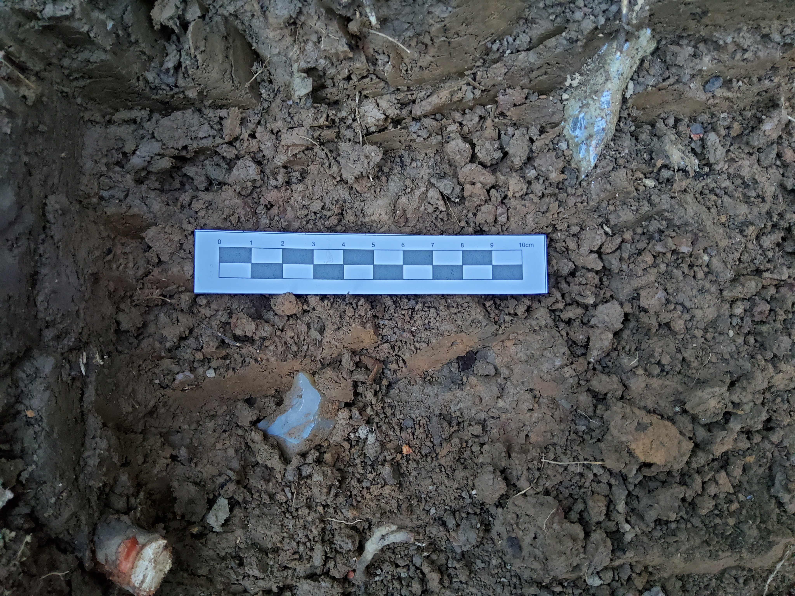
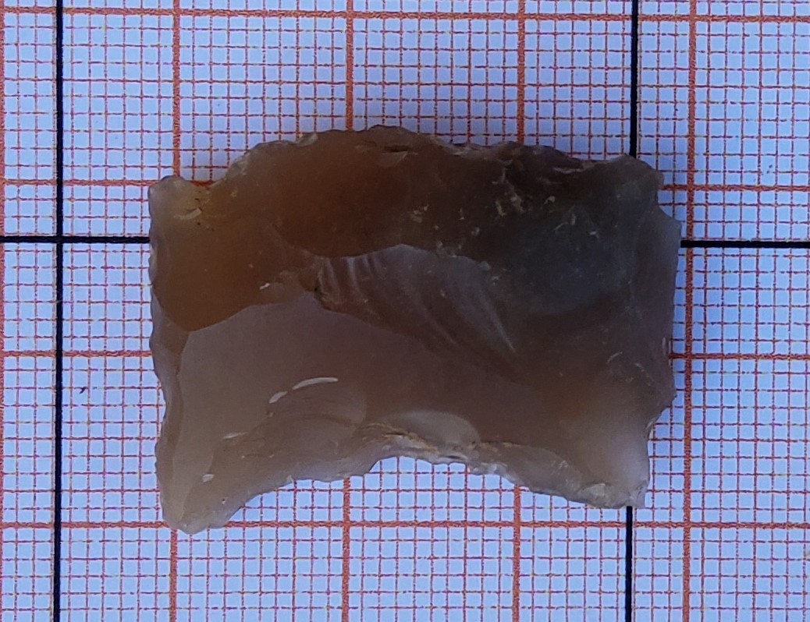
