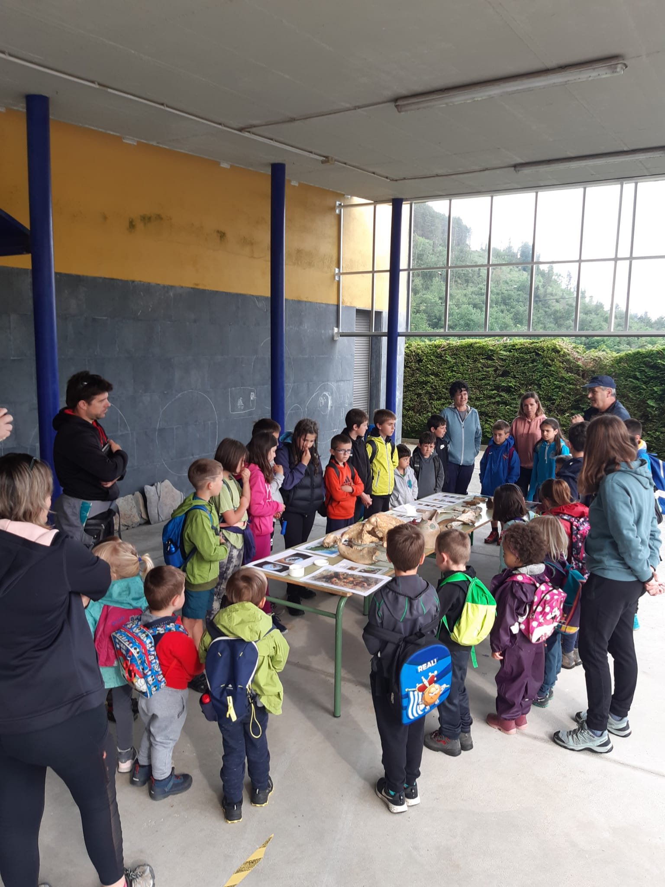
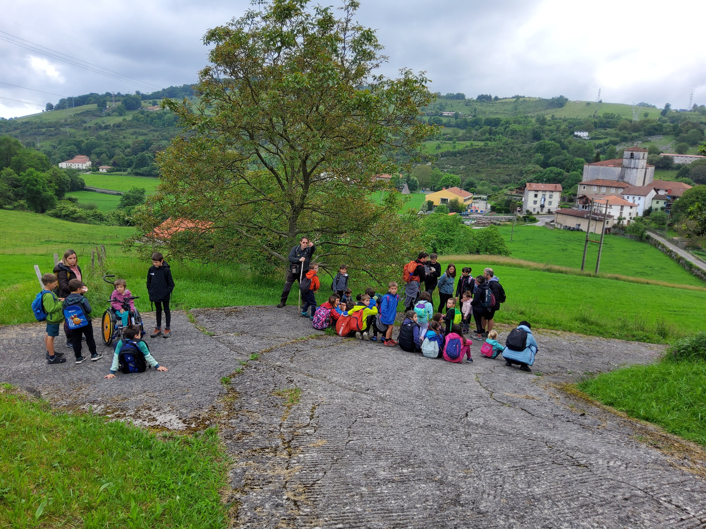
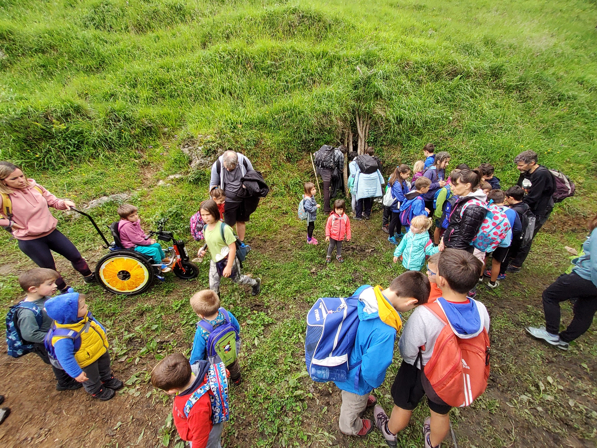

Hauek dira etorkizuneko arkeologo, geologo, biologo edo naturzale sutsuak.

Maiatzak 25 izan gara Aizarnako Haur Hezkuntza eta Lehen Hezkuntza-ko ikasleekin arkeologia edo orokorrean naturzale formakuntza apur bat irakatsi nahian.

Ikasle trebeak aurkitu ditugu eta zientzialari bikainak irtengo dute Aizarnako txoko honetatik.

Etorkizuna bizi-bizi.

Aupa Aizarna!!

