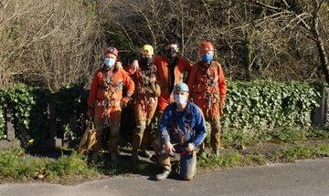
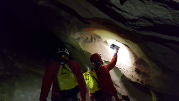
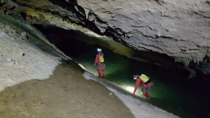
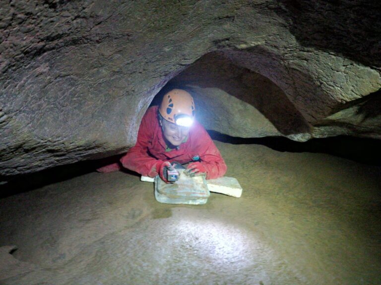
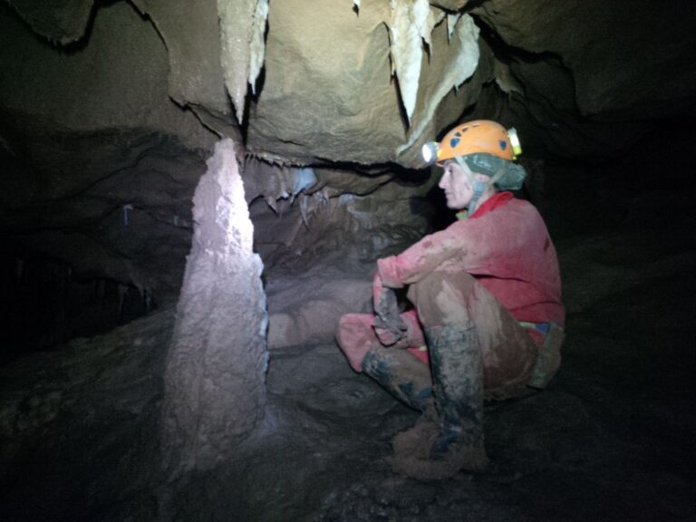
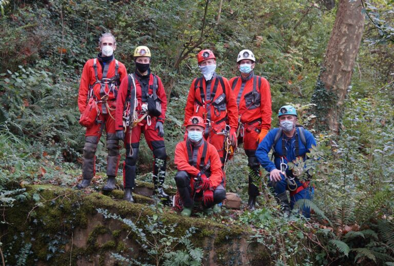

Aste bukaera honetan arkeologia lan finak egiten ibili gera.
Zestoako lokatza guztiak astindu ditugu koba honetako miaketak burutzeko.
25 urte edukitzea hobe lantegi hauetako, baina sorpresa ugari ekarriko dizkigu Urola bailarako koba bikain honek.

