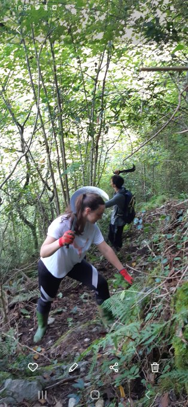
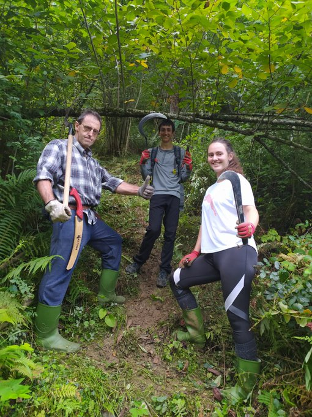
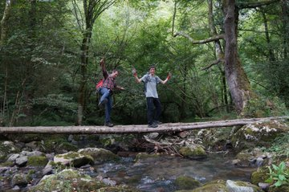
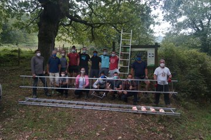
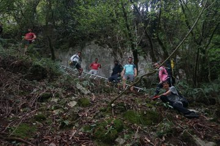
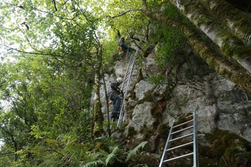
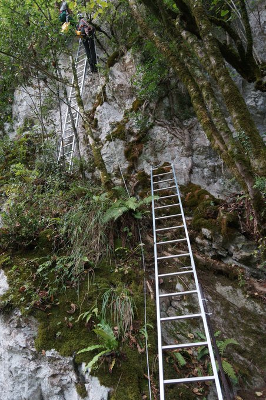
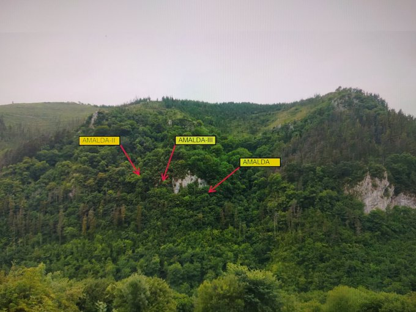

CENIEHko Joseba Rios arkeologoa eta bere lankideek Iraileko hirugarren astean indusketak hasten dituzte.
Antxietakoak lehenago hasi gera lanean eta Altzolaraz bailarako sasi guztiak moztu ditugu koba dagoen harkaitzera iristeko.

Zestoako Neanderthalak goi mailako eskalatzaileak ziren.
AMALDA-III kobazuloa, mendiko malda gogor bat lau hankatan igo ondoren, 20m ko horma bertikal bat eskalatu behar da bizi ziren lekura iristeko.  
2020ko indusketak egiteko aluminiozko eskailerekin ekipatzen ari gera.

Nola igotze ote ziran Zestoar gizaki trebe haiek.

AMALDA-III aztarnategiak sekreturen bat gordeta edukiko du horrelako bizilekua aukeratu izateko erdi paleolito garai latz haietan.

Ikerketek argituko digute.

