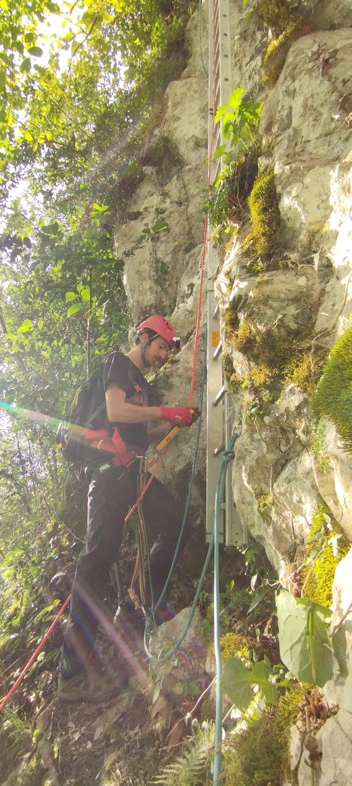
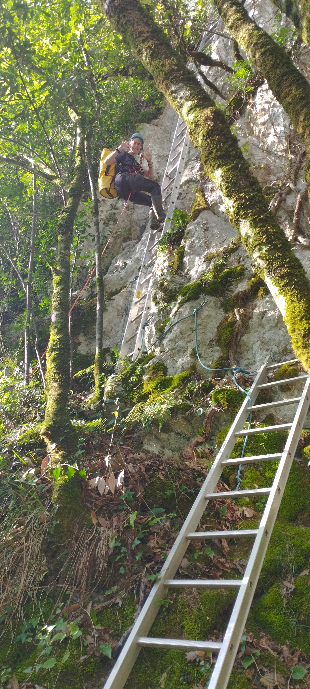
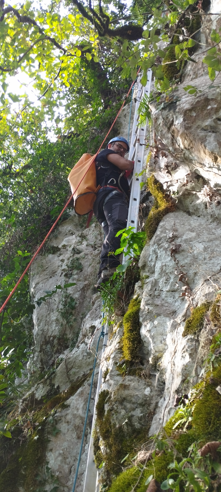
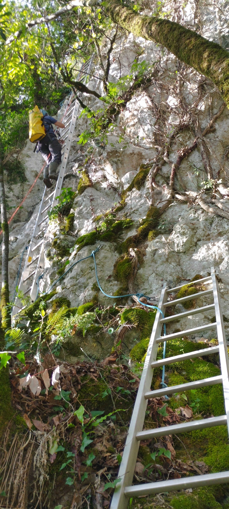
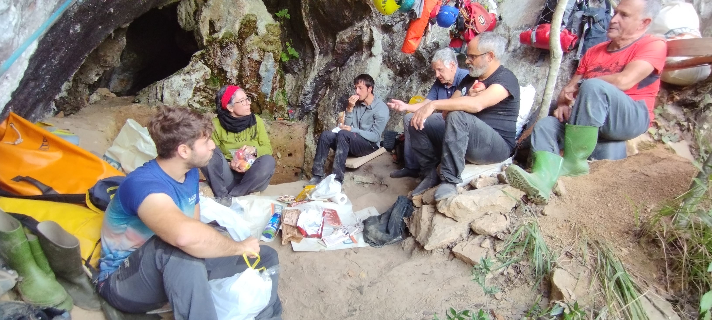
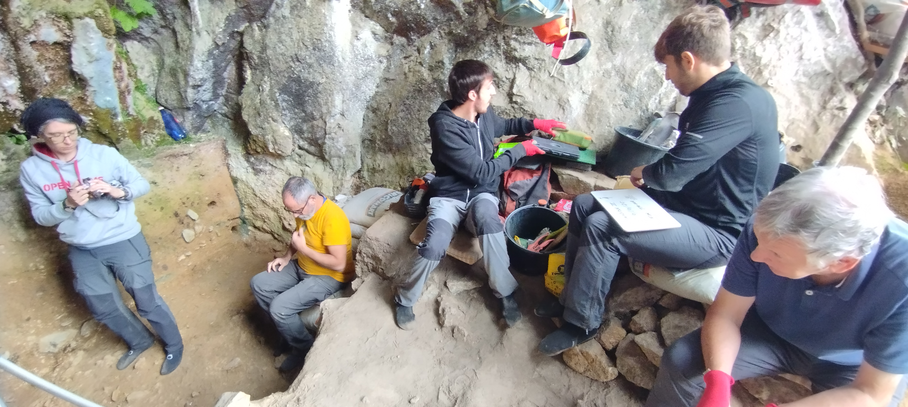
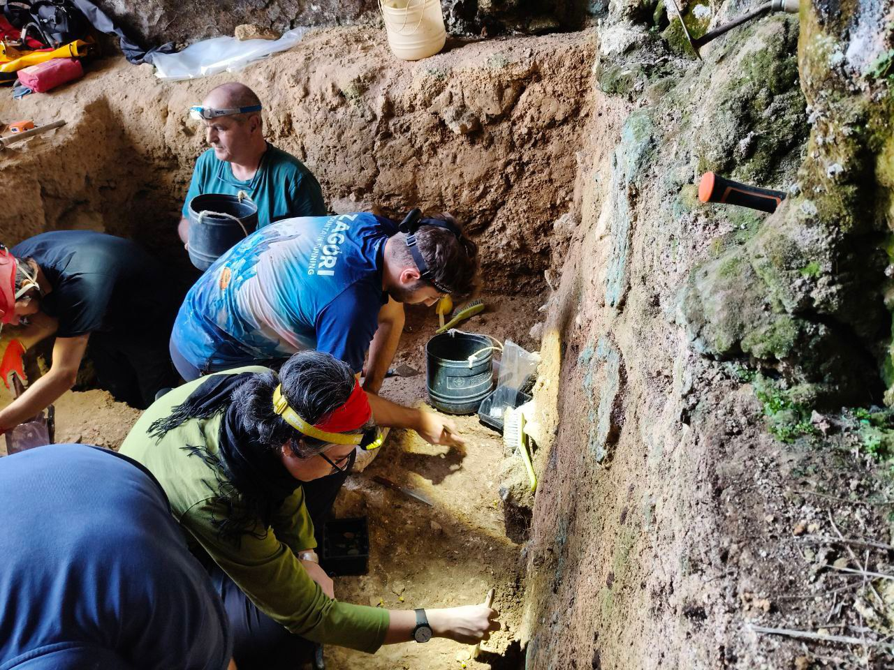
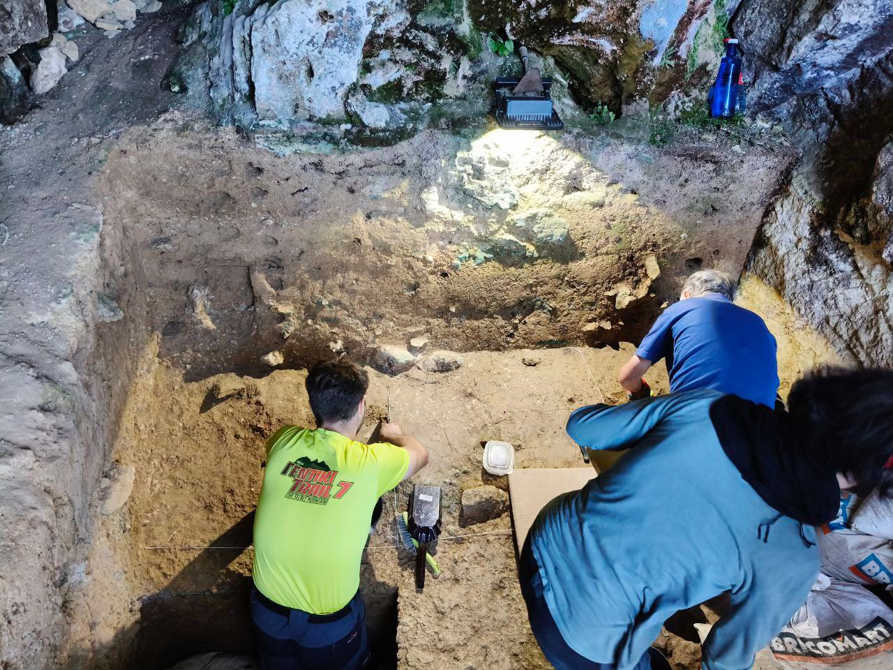

Lehengo astean aurreratu genuen bezala, Zestoako Altzolaratz bailarako Neandertaletaz gehiago jakin nahian, pasa den urriko lehen aste honetan indusketa lanak egiten ibili gera AMALDA-III koba berezi honetan.

Aurrekoan esan bezala, Joseba Rios eta Laura Sanchez, arkeologoek gidatu dituzte aurtengo lanak ere eta benetan lan zehatza ta ikerketa bikaina egiten ari dira.

Koba honen kokapena ezagutzen duzuenak, ba dakizue bertara iristeko 30 m. ko kareharrizko horma bertikal bat eskalatu behar dela.

Gaur egun aluminiozko eskailera sendoak ipiniak ditugu eta horrela ere nahiko kontuz ibili beharra dago. Ez dakigu Neandertalak nola moldatzen ziran.

Disziplina anitzeko taldea elkartu gera: Arkeologoak, ingeniariak, geologoak eta Antxieta taldeko kideak ere ahalegindu gera gure esperientziarekin indusketa lanetan lagunduaz.

2025 eko jardunaldiaren helburua 4. nibel estratigrafiko aberatsa bukatzea zen eta material arkeologiko dentsitate gutxiagoa dagoen 5. nibelera iristea zen.

Larunbatean lortu genuen helburua eta naiz pentsatzen genuen baina material arkeologiko ugariagoa azaldu, 4. nibelaren bukaera honetan, poliki-poliki eta kontu handiarekin, iritsi gera 5. nibelaren hasiera ukitzera. OSL datazioengatik 50.000 eta 80.000 bitartean gabiltzala dakigu.

Ez zegoen azkar joaterik, alderantziz, xehetasun handiarekin induste beharra zegoen azaltzen ziren materialak kalitate ezin hobea zutelako eta kontatzeko gauza asko daukatelako.

Aurreko urtean aipatzen genuen koba honetan Pirinioen bai ipar aldera eta baita hego aldera ere, tekno-kultura nahiko berezia azaltzen ari zela, “ Vasconiense “ deitzen diotena, harriaren lanketan edo tipologian adituak diren arkeologoak.

Tekno-kultura hau 1958 deskribatu zuen lehen aldiz, Georges Laplace Frantziako arkeologo adituak.

Aurreko urteetan teknologia hau nagusitzen zen nahiko garbi AMALDA-III ko lehen azaleratan, Joseba Rios eta Laura Sanchez arkeologo adituen esanera, baina aurtengo kanpaina honetan 4. nibel arkeologikoaren bukaeran tekno-kultura hau aldatzen joan da eta nabaritzen da trantsizioa beste tipologia mota batzuetara.

Nibel estratigrafikoaren aldaketa nabarmena da industerakoan.

Lurraren kolorea ta testura aldatzen dira, ilunagoa eta bigunagoa alde batetik eta konkrezio estalagmitikoaren zatiak nabarmen gutxitzen dira.

1983 urtean Antxietakoak zundaketa arkeologikoa egin genuen eta dagoen informazioaren  arabera ba dakigu 5. nibel estratigrafikoa +/- 25 bat zentimetrokoa dela eta material arkeologikoen dentsitatea printzipioz behintzat aurrekoetan baina txikiagoa dela.

Dena den, ziur gaude 5. Nibelak ere informazio garrantzitsuak eman litekeela eta zergatik ez, sorpresaren bat ere.

Material litikoen tipologia ere aldatzen joan doa : Alde batetik lantzeko teknikak aldatzen doaz eta bestaldetik egiten dituzten tresnen erabilera ere ezberdina dela nabaritzen da.

Orain artean, lantzen dituzten tresnaren arabera, ematen du koba honetara lan zehatz batzuk egitera etortzen zirela, adibidez, egurra bezalako materialak lantzera, baina orain, egiten dituzten tresnak ehizerako behar dituzten erramintetara gehiago apuntatzen dute.

Tresna hauen ekoizpenerako erabiltzen dituzten materialen mota eta jatorria ere aldatzen doa: Lehenago, inguruko errekak, ibaiak edo itsasoak garraiatzen dituzten arrokak erabiltzen dituzte gehien bat, Bulkanitak, Lutitak, Ofitak, edo beste arroka bolkaniko batzuk eta gutxiagotan Suharriak, Kuartzitak, Are-harriak edo beste arroka sedimentario batzuk.

Laugarren nibelaren aldaketara hurbiltzen goazen bezala Suharriaren portzentaiak gorakada nabarmena egin dute eta gainera nahiko urrunetik datozen materialak dira, adibidez “ Chalosse “, Frantziako ekialdean, 150 bat kilometrora.

Eskerrik asko Joseba Rios eta Laura Sanchez arkeologoei, pazientzia handiarekin eman dizkiguten azalpen guztiengatik, lagunarte mundialean gozatu dugun elkarlaneko aste honetan.

Aupa AMALDA eta datorren urtera arte!!

