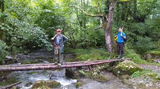
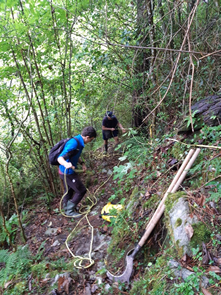
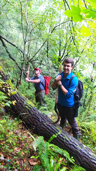
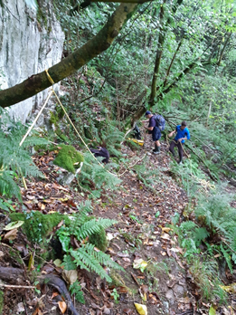
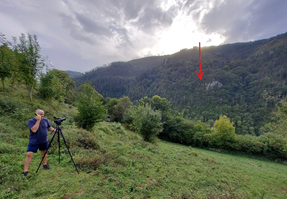
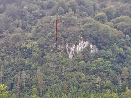
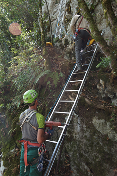
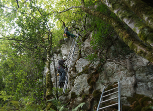

Iritsi dira urte guztian zain egoten garen amets egiteko egunak.

Urriaren 9an, Joseba Rios, Laura Sanchez eta beraien taldekideak indusketa lanekin hasiko dira Zestoako Amalda III kobazuloan, Erdi Paleolitoko Neanderthalen arrastoak ikertzen, Antxietakoen laguntzarekin.

Joan den aste bukaeran bideko sasiak moztu eta sokarekin esku laguntza ipini dugu.

  

  
  

  

  
  

  

  
  

  

  
  

Altsolarats bailararen bestaldetik, 'talkiarekin' gidatu genituen Iñigo eta Aitor taldekideak, haiek Aizarna aldetik kobara 100 metroko 'rapel' zuzen bat egiteko.

Praka bete lan eduki genuen, eta pentsaera ausarta zen baina bikain irten zitzaigun erronka.

Indusketarako dena prest!   

  

  
  

  

  
  

  

  
  

  

  
  

