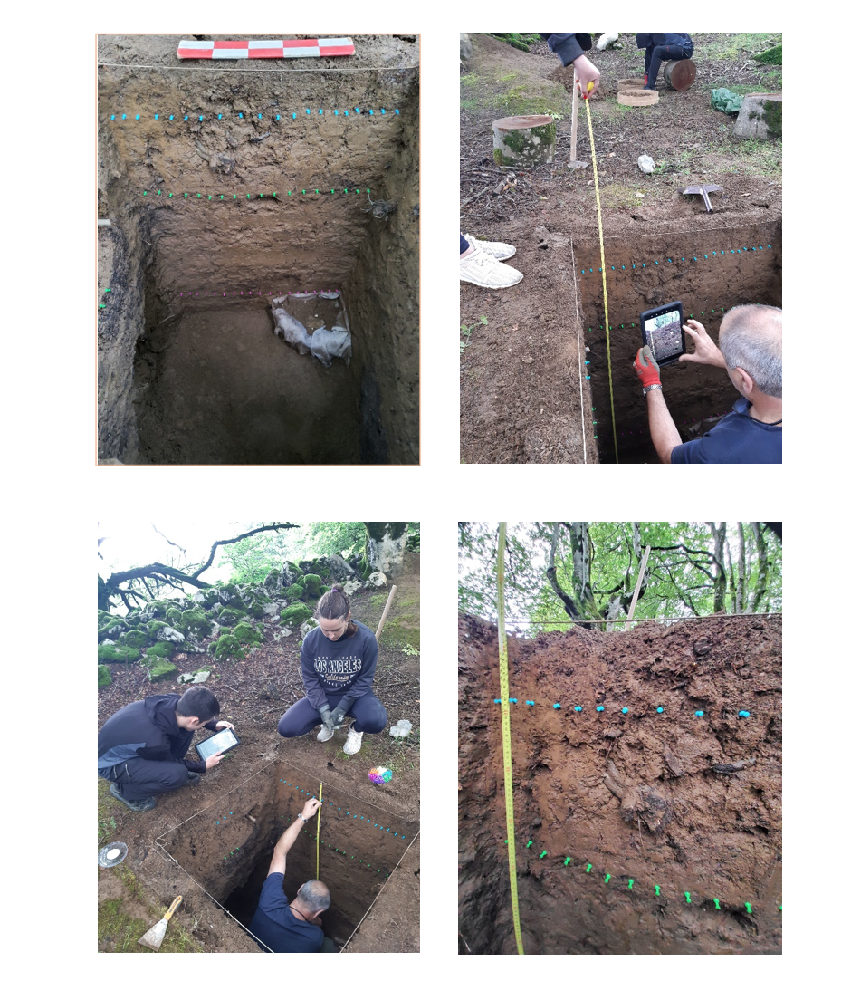
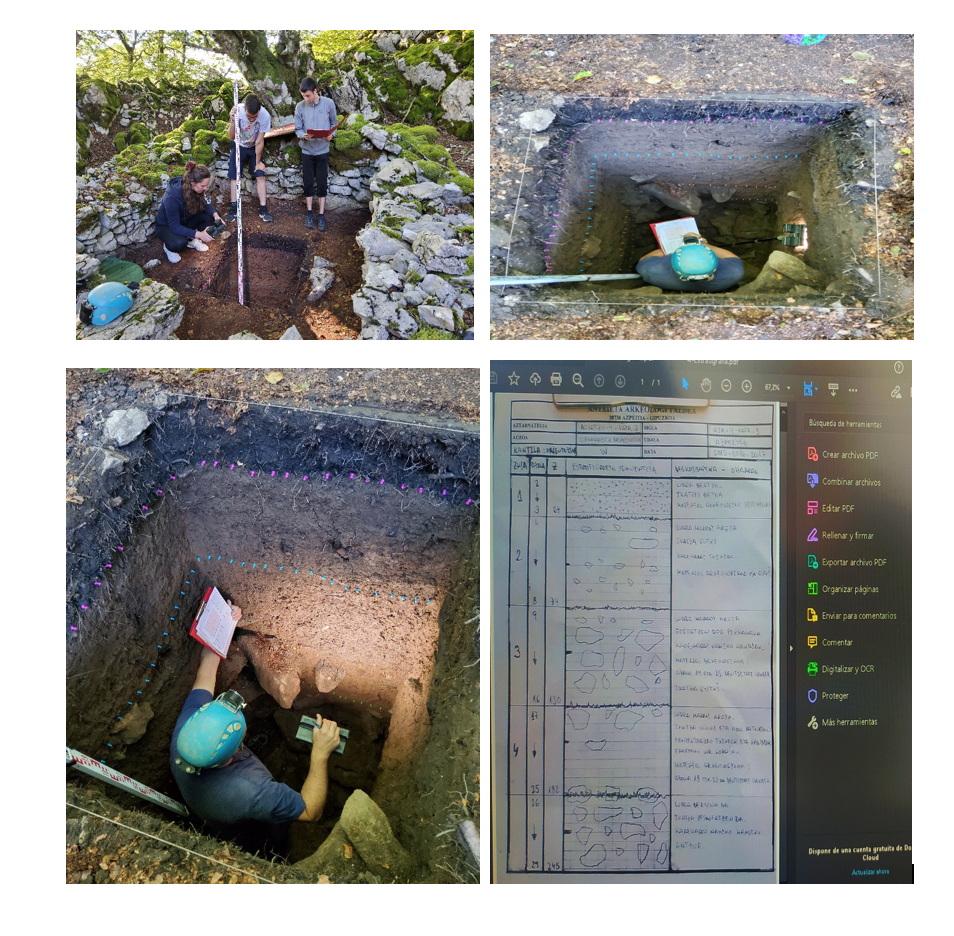

Gipuzkoako Foru Aldundiaren lanerako baimenak iritsi dira, eta orain gauzak ondo prestatzea tokatzen zaigu, irailean lanari gogor ekiteko. Lehenengo, Asurtzu-4 zonaldean egindako zundaketen estratigrafia bat berbegiratzen ari gara; izan ere, estratigrafiaren sekuentzia oso garrantzitsua da aztarnategia ulertzeko.

Estratigrafiak erakusten du aztarnategian milaka urteetan egon den sedimentazioa nolakoa izan den, bai geologikoa, baita antropikoa ere. Estratigrafia horien garapena oso ezberdina izan daiteke zundaketa bakoitzean, eta garrantzitsua da desberdintasun horiek ikertzea. Zonalde honetako zundaketetan, gizakiaren eragina dagoen azalerak +/- 1,8 metro sakonera dute, eta Mesolitoan, Neolitikoan, metalen aroan eta gure aitonen garaian metatu da.

