Abuztuaren 23tik 27ra, Valladolideko (Gaztela eta Leon, Espainia) unibertsitateko kideekin ikerketak hasi ditugu. Horiek irailean jarraituko dute lanekin Antxieta taldearen laguntza osoarekin.

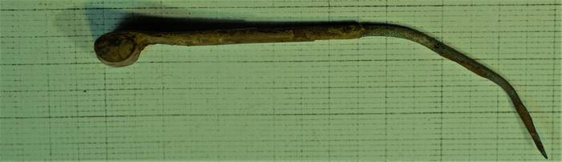
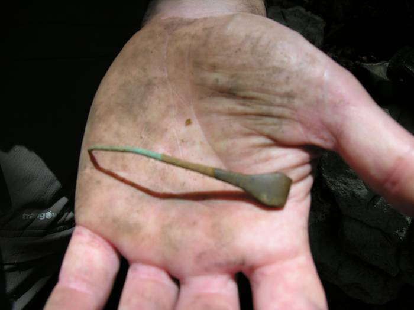
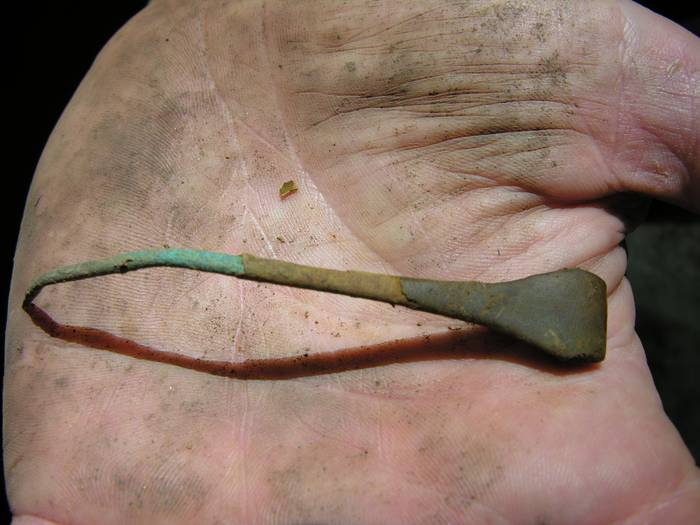

Abuztuko azken aste honetan, Valladolideko (Gaztela eta Leon, Espainia) unibertsitateko arkeologo talde bikain bat izan dugu, Erlo mendiko aztarnategi ezin hobe honetan. Ohore bat izan da beraiekin lan egitea!

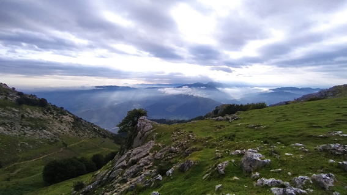

  

  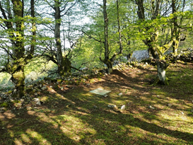
  

  

  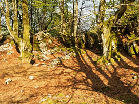
  

Izaro Quevedo arkeologoa zuzendaritzan eta Manuel Rojo arkeologian katedraduna bere hainbat urteko jakinduria irakasten izan ditugu, 2021/2022ko proiektu ausart honi hasiera ematen. Ikasketa benetan magikoa izan da!

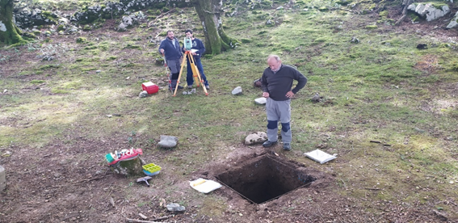

  

  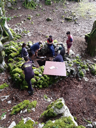
  

  

  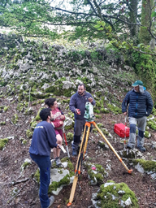
  

  

  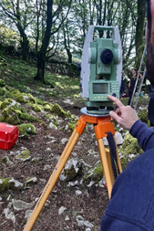
  

Valladolidetik etorri den lantaldean benetan teknikari bikainak direla baieztatu digute, lau egunetan irakatsiz, aztarnategian egin dituzten lan espezializatuekin. Gaur egungo teknika aurreratuenak erabili dituzte!

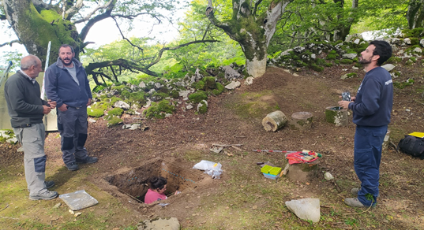

  

  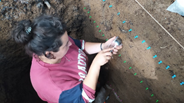
  

  

  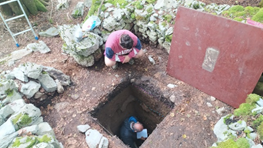
  

Dronearekin, fotogrametria eta erresoluzio handiko topografia edo sedimentologia eta palinologia lagin bilketak eta abar luze bat erakutsi dizkigute. Txapela kentzeko moduko metodologia eta teknologia erabili dute. Irailean jarraituko dute lanekin Antxieta taldearen laguntza osoarekin.

  

  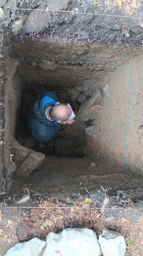
  

  

  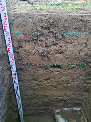
  

  

  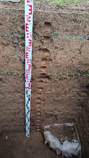
  

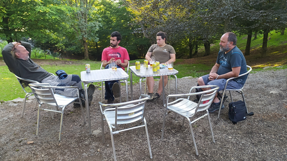
