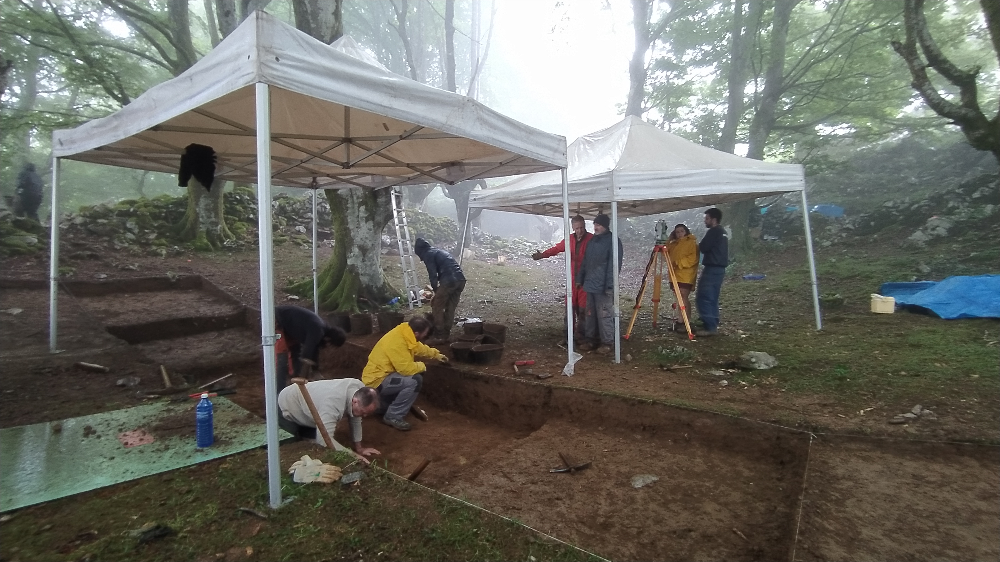
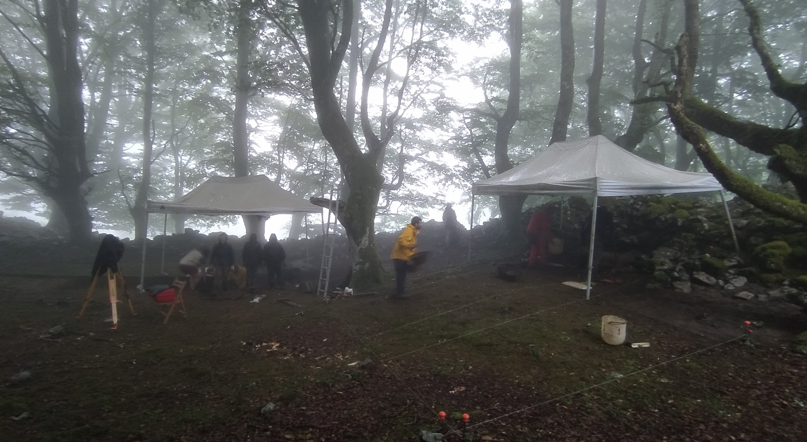
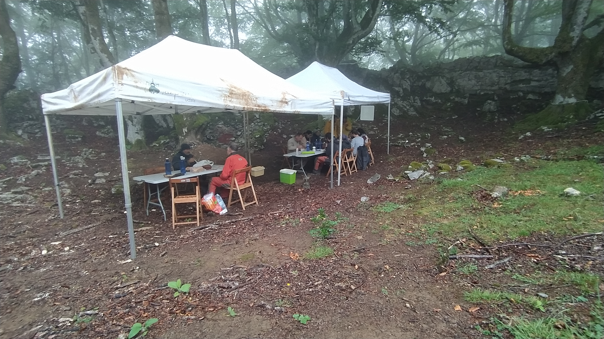
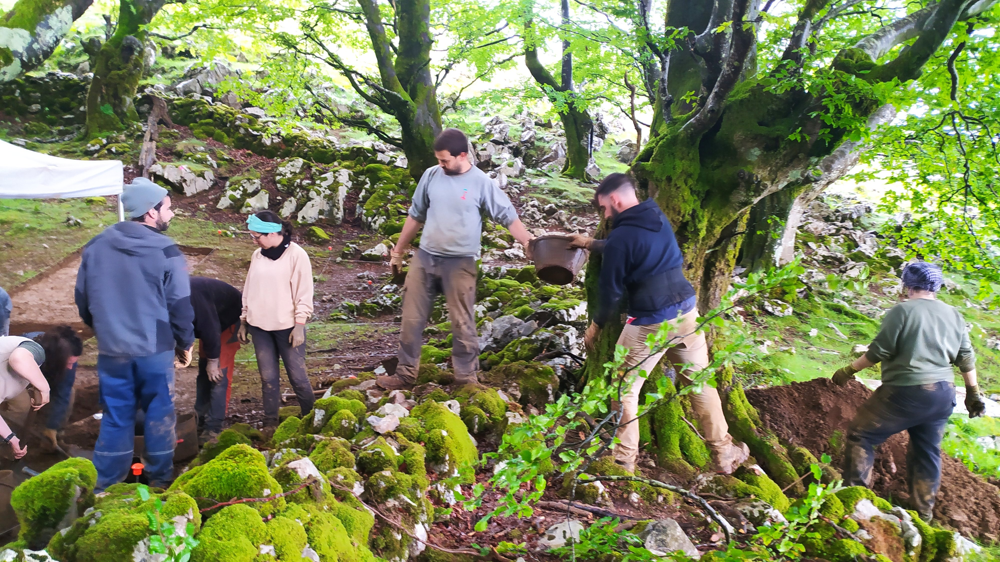
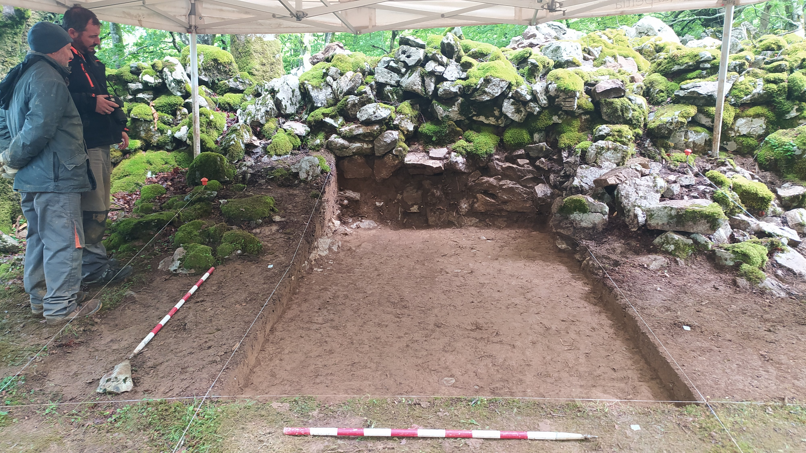
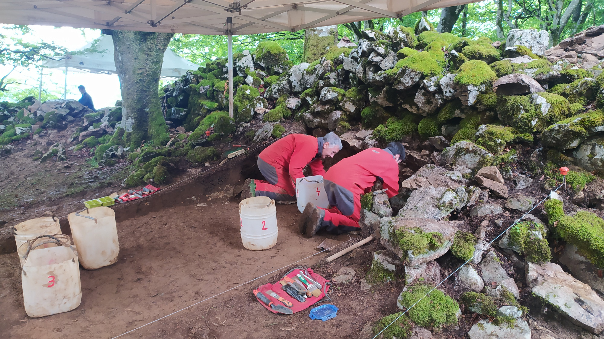

Euskal Herriko eguraldi petralak ongietorria eman die arkeologo gazteei. Euriak eta haizeak astindu gaitu baina lanak ondo doaz aurrera.

Garai historikoak azaltzen diren azalerak altxatzen goaz eta historiaurrera berehala iritsiko gara.

Lan bikaina egiten ari dira arkeologo gazte hauek eta ordainak laister etorriko dira.

Azalduko dizuegu datozen egunetan.

