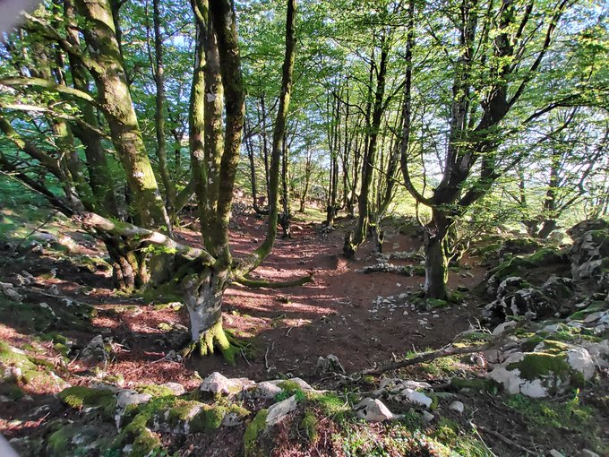
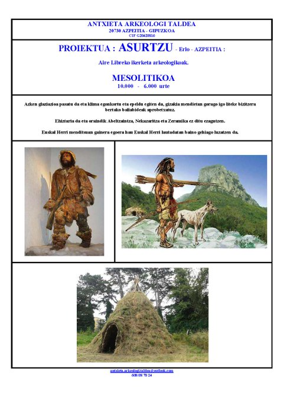
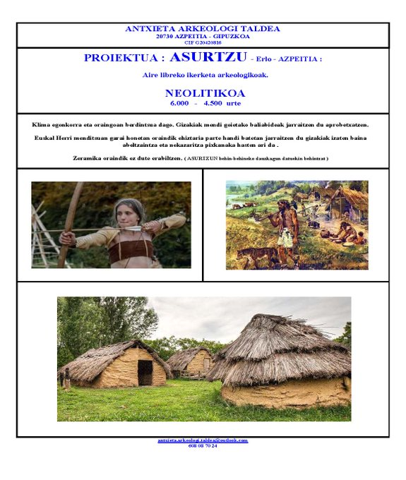
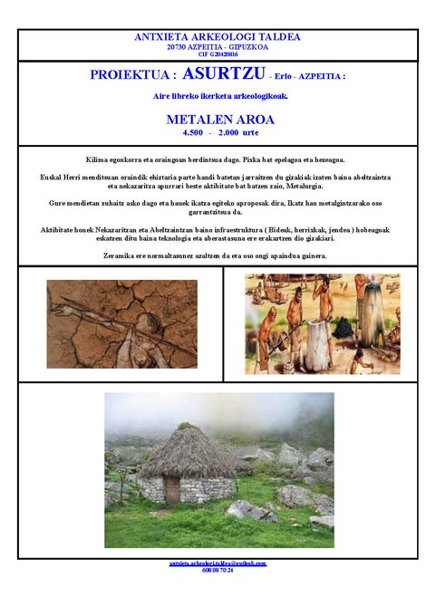

Asurtzu zonaldeko ikerketa berria du eskuartean Azpeitiko Antxieta Arkeologia Taldeak, eta dagoeneko hasi dira proiektua gauzatzen. Erloko puntatik oso gertu dagoen aztarnategia da Asurtzu, eta Antxietako kideen arabera, baliteke Azpeitiko lehen herrixka bertan izatea. Urte honen hasieran epe luzerako proiektu bat aurkeztu zioten Azpeitiko Udalari, eta udalak proiektua onartu ondoren, Gipuzkoako Foru Aldundiaren baimenak lortu eta proiektua martxan jarri zuten. Hain zuzen ere, joan zen igandean hasi ziren indusketekin. Besteak beste, leku horretan nor bizi zen, han zergatik bizi ziren eta beraien bizimodua nolakoa zen jakin nahi dute.

2006 urtean hasi ziren Antxietako kideak Ikulluteko gaina izeneko zonaldean indusketak egiten, eta haien arabera, "oso material interesgarriak" aurkitu zituzten zonalde hartan. Urte batzuk beranduago — 2013. urtean—, berriro ekin zieten zundaketei, Asurtzu zonaldean. Azpeitiarrak orduan konturatu ziren material interesgarriz beteta zegoela Asurtzu, eta iaz erabaki zuten proiektuari dimentsio handiagoa eskaintzea.

Antxietako kideek azaldu dutenez, proiektua zabalik dago indusketetan parte hartu nahi duten herritarrentzat. Ikerketan interesa dutenek, antxieta.arkeologi.taldea@outlook.com helbidera idatz dezakete.
