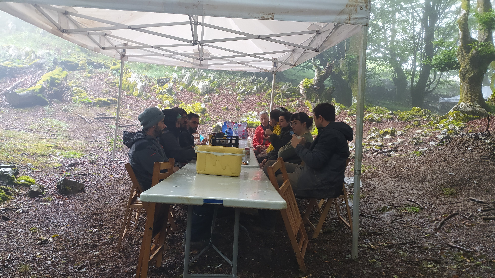
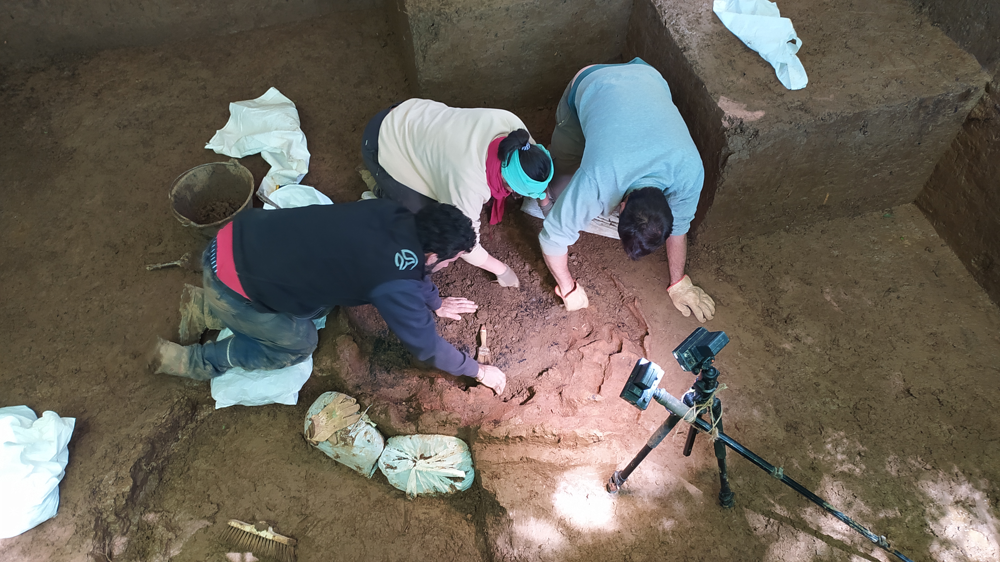

Aste honetan bukatu ditugu Asurtzu eremuko 2022ko aire zabaleko indusketa lanak. Lan gogorra izan da benetan, batez ere eguraldiak indusketa uraren azpian hartzeko egin duen ahaleginagatik. Valladolideko unibertsitateko gazteek, baina, nahiko ondo heldu diote eguraldi traketsari.

Oraindik goiz da aurkikuntzen gaineko azalpen zehatzak emateko, baina behin-behineko aurrerapen batzuk aurkez ditzakegu:

Adibidez, *estructura de combustion* edo bero handiko erreketarako eraikin bikain bat azaleratu dugu indusketan, eta benetan interesgarria da estruktura konplexu hori. Orain, zertarako erabiltzen zen ikertu beharko da. 

Bestalde, gutxi gorabehera bi urte dituen bobido bat azaleratu dugu; gorputz osoz zegoen lurperatuta, gizakiak intentzioz lurperatua izan zen. Hain zuzen, zulo borobil luzeska bat egin zuten, ezkerreko aldera ongi etzanda ipini zuten, eta harri handiekin eta lurrarekin estali. Lurperatze hori ere laborategian ikertu beharko da indusketako datu guztiekin batera.

2022ko indusketa bukatu dugu, eta orain laborategiko ikerketa lan ugari dauzkate egiteko askotariko gaietan aritzen diren adituek; izan ere, aztarnategi berezi honetako datu guztiak elkartu eta hausnarketak egin ondoren, hipotesi zehatzenak aurkeztuko dituzte. Datozen urteetan Asurtzuko aztarnategiko ikerketekin jarraitzeko modua edukitzea espero dugu.

