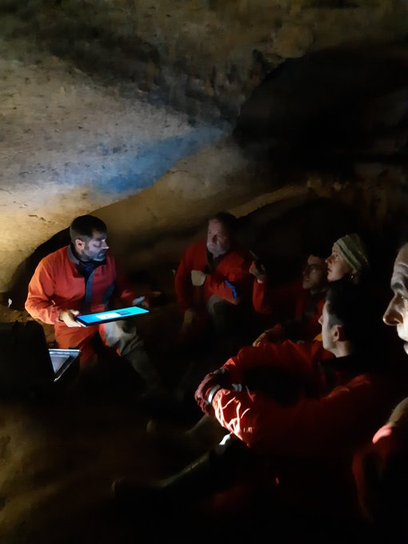
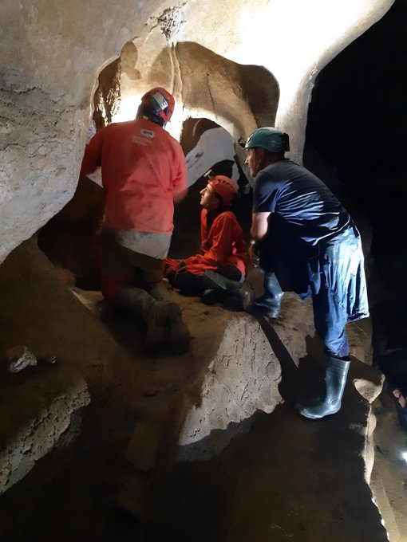
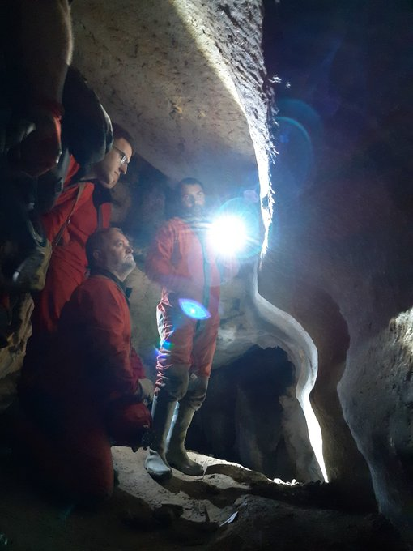
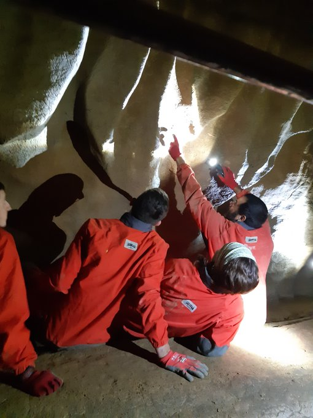
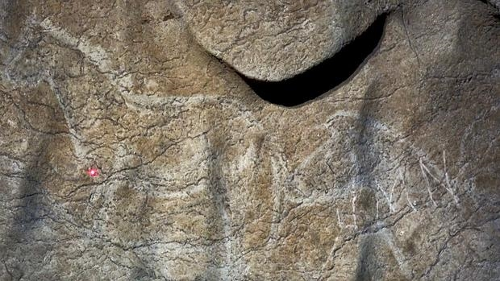
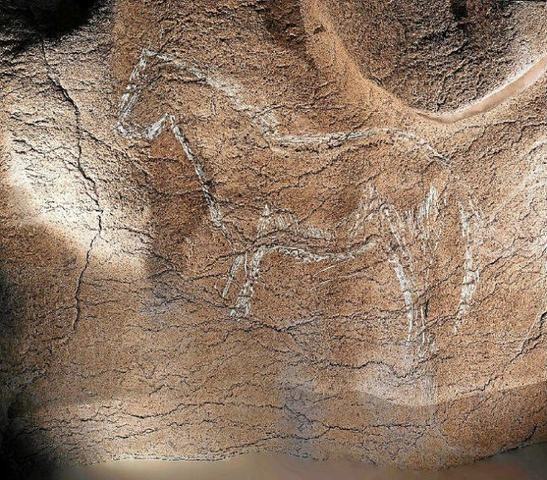
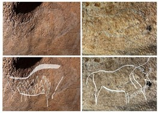

Uztailak 16 Ostirala: Atxurra Berriatua – Bizkaia.

Diego Garate eta Olivia Riverok erakutsi dizkigute Atxurra kobazuloko altxorrak.

Bizkaiako Berriatua "Berritxu"ko herrialdean daude kokatuak, Euskal Herriko Labar Artearen hain ezaugarriak diren grabatu eta margo hauek.

Harrigarriak dira, mundialak!!

Mila esker bi arkeologo eta labar artean adituak diren jende jator honei.

ZORIONAK, Diego Garate, Olivia Rivero eta proiektu honetan lana egiten duten taldekide guztiei.
 
Benetan lan bikaina!!!!

Erabiltzen dituzten punta puntako teknologia berrieken egiten ari diren lana txapela kentzekoa da, meritu handiko lana.

Laister argitaratuko dituzte ikerketaren xehetasun guztiak.

