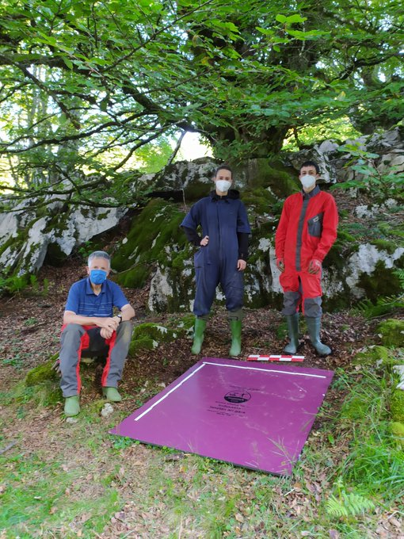
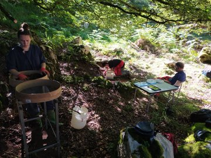

Denok galdetu izan diogu geure buruari okasioren batean nondik gatozen, zein garen, noiz eta nola sortu ginen edo zertarako gauden hemen. Gizakiak berezkoa du bere buruari erantzunik ez duten galderak egiteko ohitura, eta gehienetan oso zaila izan ohi da halako galderei erantzuna topatzea. Arkeologoek, historialariek eta bestelako adituek, ordea, lehen gizakia nola bizi zen eta haien ohiturak eta egunerokotasuna nolakoak ziren jakiteko baliabideak dituzte; horren erakusle da, besteak beste, Azpeitiko Antxieta Arkeologia Taldeak egiten duen lana.

Azpeitiarrek Asurtzu izeneko ikerketa proiektua dute eskuartean. Erloko puntatik oso gertu dagoen zonaldea da Asurtzu, eta Antxietakoen ustez oso posible da bertan izatea Azpeitiko lehen herrixka. Azpeitiko Udalaren laguntzarekin eta proiektua gauzatzeko erakundeen baimen guztiak lortu ostean, joan zen uztailaren 12an ekin zioten gune horretan zundaketak egiteari, eta orain, gune hartan indusketak egiteko asmoa dute profesionalen laguntzarekin.

Jabier Lazkano Antxietako kideak adierazi duenez, satorrari esker izan zuten Asurtzuko gunearen berri: "Satorrak baserritarrentzat etsai handiak dira, baina guretzat oso lagun onak. Izan ere, satorrek zuloetatik gauzak ateratzen dituzte, eta orduan ikusi genuen Asurtzun suharriak zeudela". Suharria garai bateko gizakiek lanabes moduan erabiltzen zuten tresna da, eta egurra lantzeko nahiz gainontzeko tresnak zorrozteko erabiltzen zuten, besteak beste.

Asurtzuko zundaketekin hasi aurretik, Antxietako kideak beste gune batean ibili ziren zundaketak egiten, Ikulluteko gaina izeneko lekuan, hain zuzen ere; Lazkanoren arabera, "material oso interesgarriak" topatu zituzten bertan. Gaur egun arte, han topatu zituzten dataziorik zaharrenak eman zizkioten materialak, baina gero konturatu ziren Asurtzuko gunea are interesgarriagoa izan zitekeela ikertzen jarraitzeko. Antxietako kideek zundaketetan topatzen dituzten materialak Miamira (AEB) bidaltzen dituzte ikertzeko, eta datu horien arabera, orain arte topatu dituzten materialak Mesolitiko amaierakoak (ia 7.000 urte lehenagokoak), Neolitikokoak edo Metalen arokoak izan daitezke.

Suharriez gain beste hainbat material ere topatu dituzte Antxietako kideek Asurtzu eta inguruetan, hala nola burdinezko moduluak, zeramikak eta ikatzak. Hezurrik, ordea, ez dute topatu: "Garbi dugu hezurrik ez dugula topatuko leku hartan; izan ere, hezurrak kobazuloetan kontserbatu egiten dira, baina aire librean desegin", azaldu du Lazkanok.

Hala eta guztiz ere, han topatzen dituzten materialak interesgarriak direla nabarmendu du azpeitiarrak, eta gizakia nola bizi zen jakiteko balio dietela: "Guk uste genuen artzaintzako bizimodua zutela inguru hartan, eta ikusi dugu artzaintzaa ere bazegoela, baina helburua beste bat zela". Izan ere, topatu dituzten materialengatik gizaki haiek meatzaritzan aritzen zirela uste dute, baina gremio askok elkar hartuta lan egiten zutela ere bai: "meatzaritzan aritzeko jatea behar duzu, eta jateko artzainak behar dituzu", gaineratu du.

Lazkanok dio orain arteko zundaketak ondo joan direla, eta itxaropena dutela datozen hilabeteetan beste material esanguratsu batzuk topatzeko ere. Hori dela eta, uda ostean zundaketekin jarraituko dute, material berrien bila usnaka. Halaber, proiektuan interesa duen oro zundaketetan parte hartzera gonbidatu dute Antxietako kideek.
