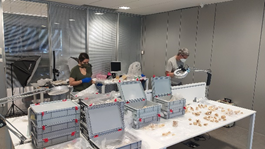
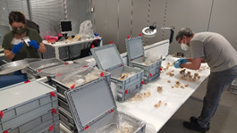
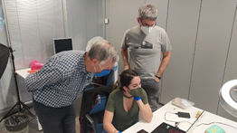
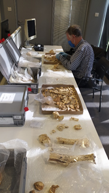
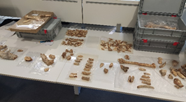
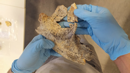
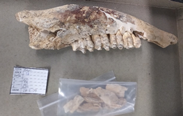
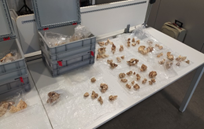

1990eko eta 1998 zein 1999 urteetan Antxieta taldeak Zestoako Baio kobazuloan egindako zundaketetan aurkitutako materialen ikerketa egiten ari dira Gordailuan.

Asier Gomez-Olivencia EHUko adituak eta Monica Villalba de Alvarado UCMko adituak ikuskizun aparta eman digute; hain zuzen ere, aztarnategi bateko hezurrak nola aukeratu, osatu, identifikatu eta orokorrean ikertu azaldu digute.

  

  
  

  

  
  

  

  
  

  

  
  

Izugarria izan da ehunka hezur zatirekin nola joaten diren identifikatu, neurtu eta ikertu daitezkeen hezurdura ezberdinak osatzen ikustea.Puzzle konplikatu bat egitea bezalakoa da. Benetan lan bikaina egiten ari dira, eta gu, lagunduz, gustura ari gara ikasten.

  

  
  

  

  
  

  
  

  
  

  

  
  

