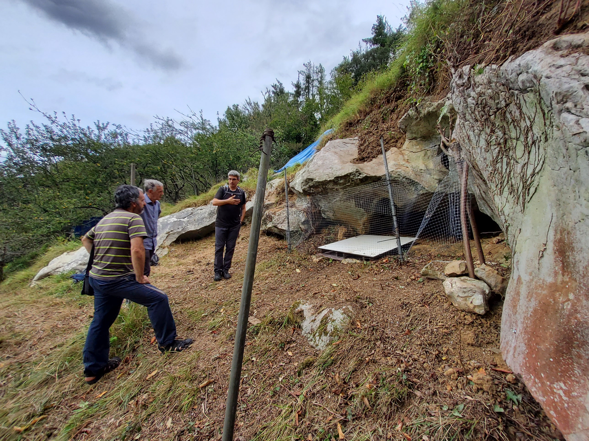
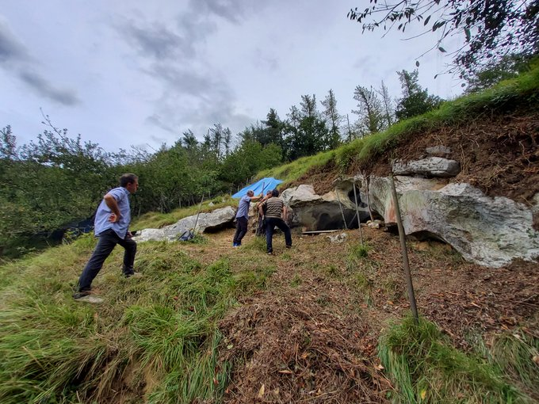
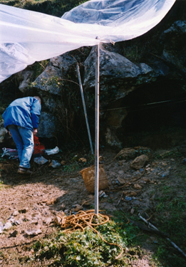
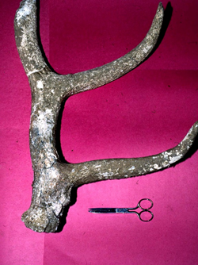
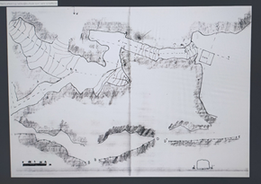
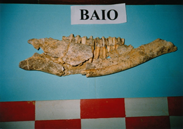

Asteartea, Irailak 14 aurkeztu genion Mikel Arregi Zestoako alkateari, BAIO kobazuloan datozen bi urteetan burutuko diren ikerketa lanak.

Asier Gomez EHUko Ramon y Cajal ikertzailea degu proiektuaren zuzendaritzan eta berak argitu ditu ikerketa honetan aurreikusten diren fase guztiak.

Zientzialari talde bikainarekin dator Asier Zestoako aztarnategi honetara ikertzera eta pixkanaka aurkezten joango gera bakoitza.

Antxieta taldekoek 1990 eta 1998-1999 zundaketa bat eginez katalogatu genuen Zestoako aztarnategi berezi hau.

Printzipioz, dakiguna, Gipuzkoako faunarik zaharrena dagoela koba honetan eta beste ezuztekoren bat azaltzeko ere aukera handiak dauzkagu.

  

  
  

  

  
  

  

  
  

  

  
  

