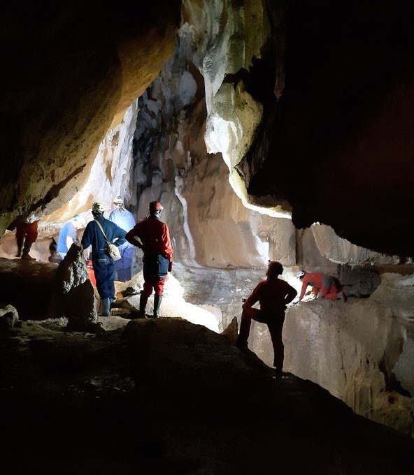
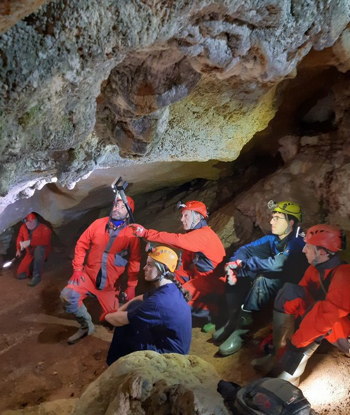
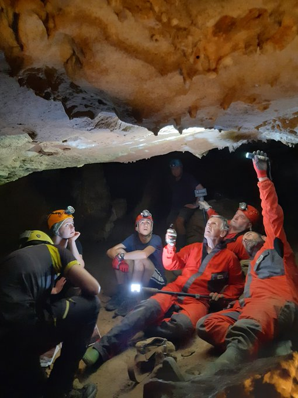

Labar artean gaur egungo punta-puntako adituen artean dagoen Diego Garate plentziarraren bisita jaso genuen joan den igandean, eta berarekin miaketa saio bikain bat egiteko ohorea izan genuen.

Guk ere ez genizkion gauzak erraz-erraz ipini. Izerdi ederrak atera zituen gurekin egun guztian. Gurekin ez zen gelditu lurrean etzan gabe!

Plazer bat izan zen.

