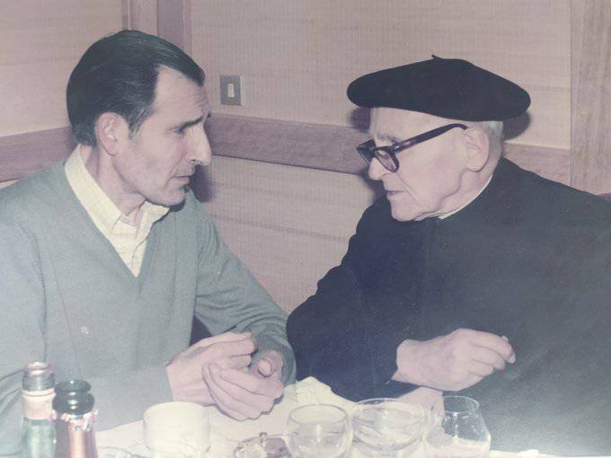
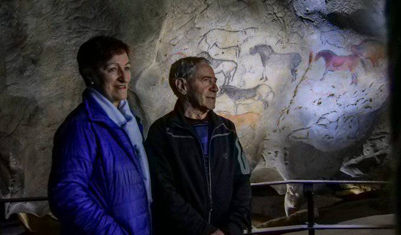
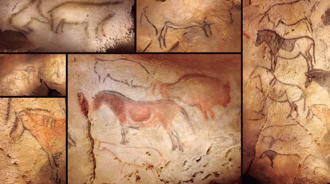

1969ko ekainaren 8an, Azpeitiko Antxieta taldeko Andoni Albizuri Katxo-k eta Rafael Rezabalek sari bikaina lortu zuten, Sastarrain bailaran arkeologia miaketak egiten zebiltzala: Ekaingo margoak aurkitu zituzten. Labar arte paregabea eta aztarnategi ikusgarria. Oraindik gauza bera egiten jarraitzen dugu Antxietako kideok.

