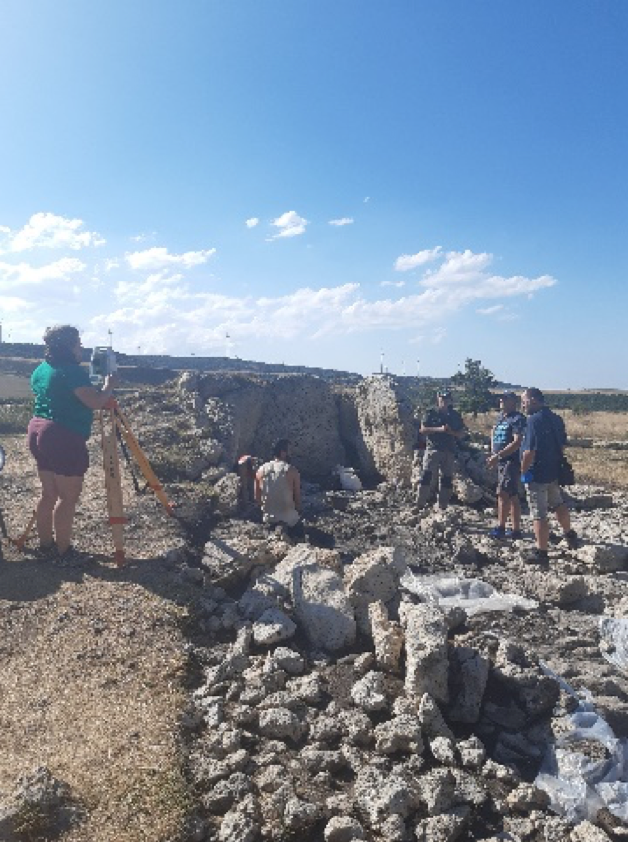
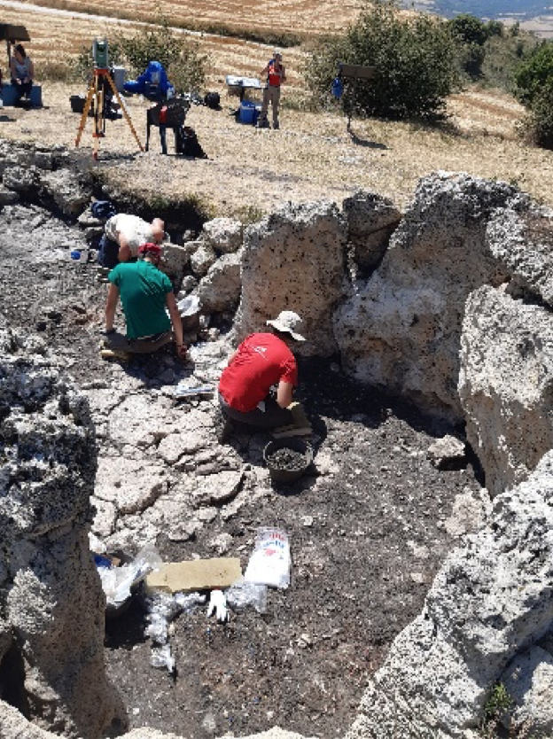
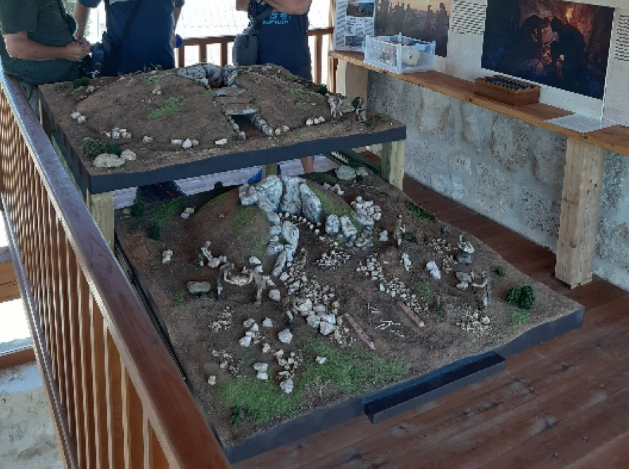

Uztailaren azken egunetan, Manuel Rojo arkeologoaren eta Valladolideko unibertsitateko lantaldearen indusketa lanak ikustera joan ginen Antxieta taldeko kideok. Reionosoko (Burgos) El Pendon trikuharrian izan ginen; izan ere, indusketa lan bikaina eta interpretazio sakonak egiten ari dira han.

Ikerketetan aurreikusten dituzten hilobiratze erritoak benetan harrigarriak dira, eta bilatu dituzten aztarnak ikusgarriak. Zorionak, lantaldeari!

Merezi du ikustera joateak, bai Trikuharria, baita herriko erakusketa ere. Edozein joan daiteke ikustera, urte guztian irekia dago.

