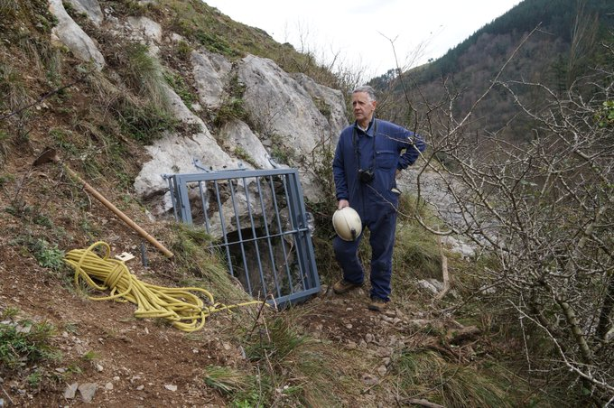
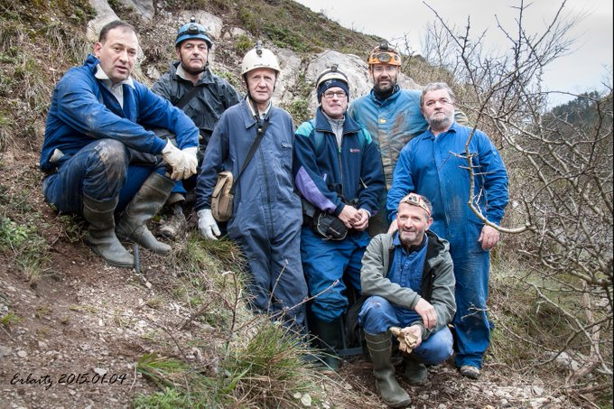
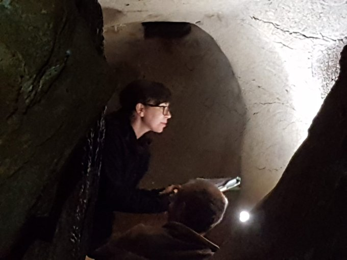
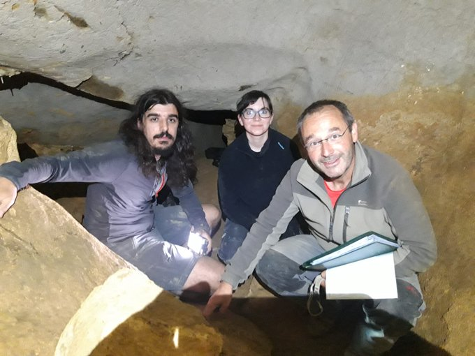
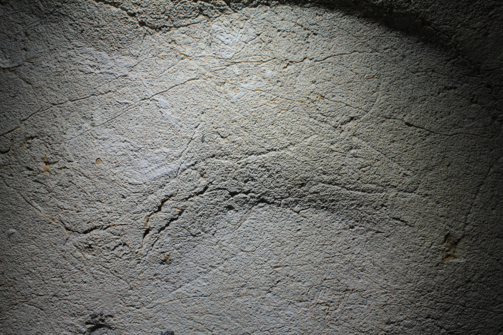

Antxieta arkeologia taldeak Zestoa eta Deba artean dagoen Erlaitz izeneko koban material arkeologiko esanguratsu batzuk aurkitu zituen 1978an. Goi Paleolitoko material horiek eta Brontze Aroko gizakien aztarnek balio izan zuten koba aztarnategi gisa katalogatzeko.

2015ean, labar arte miaketako proiektu baten barruan, Zestoako Danbolinzuloko labar artea aurkitu zuten arkeologia taldekoek; ondoren, Zestoa inguruan jarraitu zuten lanean, eta Erlaitzko labar artea aurkitu zuten. Han, grabatu batzuk aurkitu zituzten, baita goiko galeria bat ere, baina "oso-oso zaila" da galeria horretara iristea, Jose Ignazio Arrieta Antxieta taldeko kideak azaldu duenez. "Horregatik, sasoi hartan ikerketa sinple bat egin zuten, bakar-bakarrik baieztatzeko margo horiek paleolitikoak zirela".

Bost urte igaro dira ordutik, ikerketa sakonagorik egin gabe, baina duela gutxi, EHUko talde batek Antxieta taldeari jakinarazi zion Erlaitzen ikerketa sakonagoa egiteko baimenak eskatzera zihoala. Blanca Ochoa EHUko arkeologoa izan da ikerketa hori bultzatu duena, Marcos Garcia Madrilgo Unibertsitate Konplutentseko ikerlariarekin batera. Haiek kolaborazioa eskatu zieten Antxieta arkeologia taldekoei, eta baiezkoa eman zuen Azpeitiko taldeak. Gipuzkoa Kulturak diruz lagundu du proiektua.

Duela astebete ekin zioten ikerketari, eta joan den larunbatean amaitu zuten lehen kanpaina. Prozesu horretan, hainbat animaliaren irudikapenak aurkitu dituzte: hain zuzen ere, zaldienak, bobidoenak eta zerbidoenak. Grabatu horiek suharri batekin eginda daude, kobako harri naturalaren gainean. Koronologiari dagokionez, duela 22.000 eta 15.000 urteren artean egindako grabatuak direla uste dute.

Dena dela, ikerketa hasi baino ez da egin oraindik; Arrietaren arabera, "agian, bi urteko iraupena" izan dezake prozesuak. "Koban lanean aritu ziren astean beharrezko informazioa bildu genuen, baina gero irudi horiek denak eta haien formak aztertu egin behar izaten dira, eta prozesua oso luzea izaten da". Gainera, Arrietak uste du urtea amaitzerako berriro joan beharko dutela kobara aztarna gehiagoren bila.
