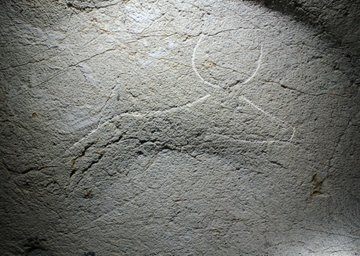

Blanca Otxoa EHU zuzendaritzan, Marcos Garcia eta Alvaro Ibero UCMko lankidetza eta Antxieta taldearen elkarlanarekin, Ekain kobazulotik hain gertu dagoen aztarnategi berezi honek daukan Labar Arte bikainaren ikerketarekin jarraitzen dugu.

Lan zorrotza ari dira egiten ikerlari trebe hauek eta baliabideak lortzen badituzte argitalpen bikainak aterako dituzte.

