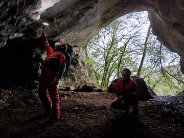
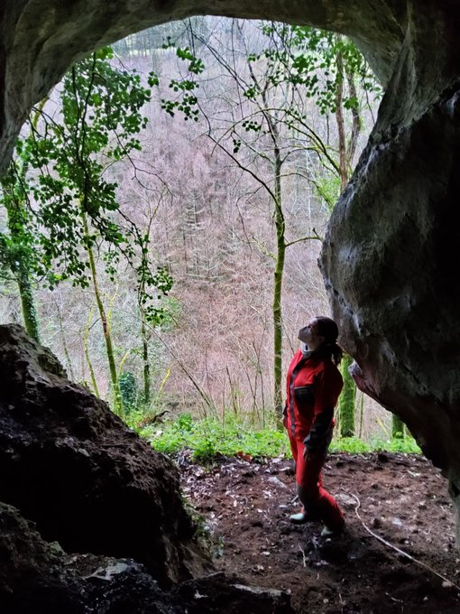
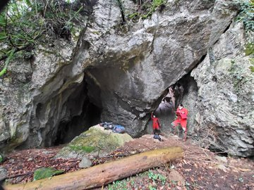
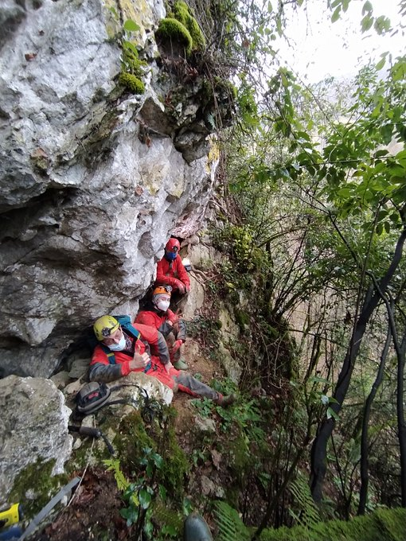
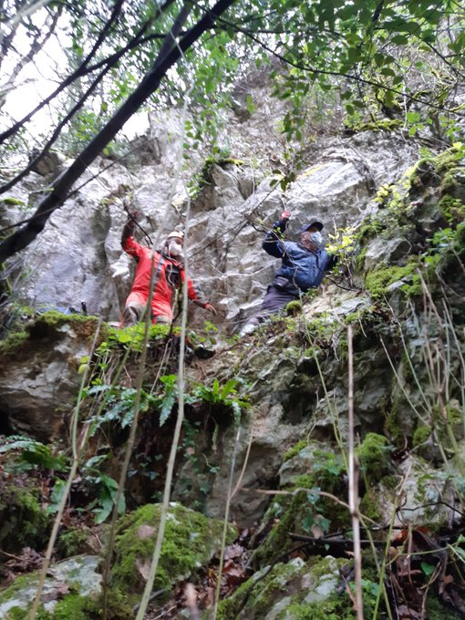
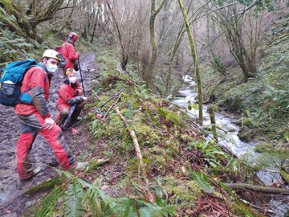
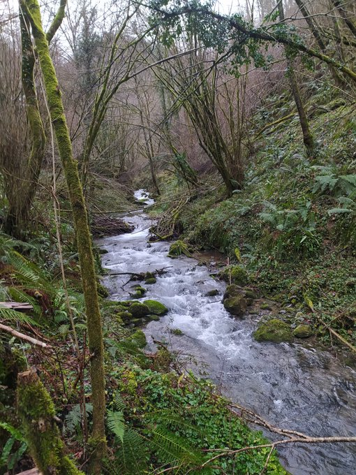

Orain dela aste batzuk, Altzolarats bailarako Aizarnako partean dagoen kobazulo maite bat bisitatu genuen Antxieta arkeologia taldeko kideok: Erralla. 1976 urtean Andoni Albizuri Katxo eta Rafael Rezabal taldekideek aurkitu eta katalogatu zuten. Altzolarats bailarak beti bezain eder jarraitzen du. 1977. eta 1978. urteetan indusketa egin zuten Jesus Altunak eta haren ikerlari taldeak. 1985ean argitaratu zuten ikerketa hori; benetan bikaina.

