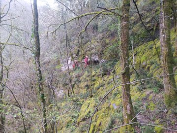
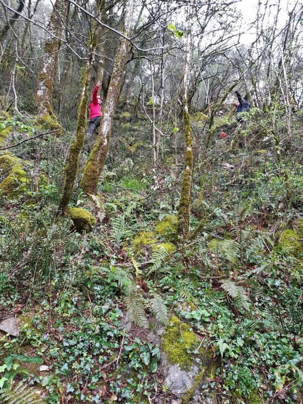
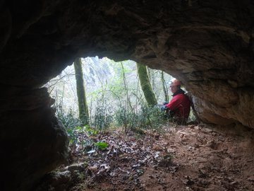
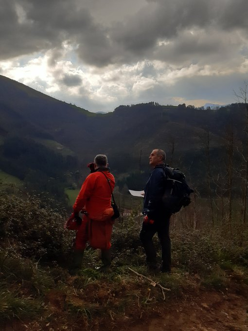
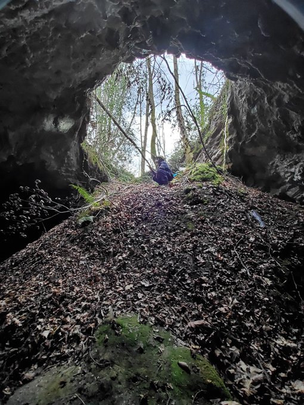
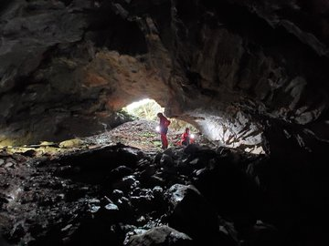
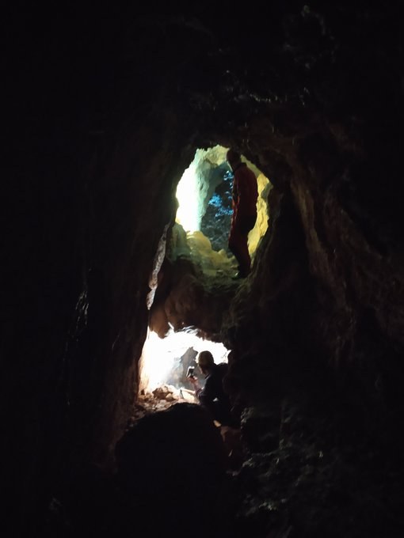

Errentxorta (Beizama). 1980an giza hezurrak aurkitu genituen han, eta Kalkolitiko/Brontze aroko hilobi bezala katalogatu genuen. 40 urte pasatu ondoren, kostatu zaigu aurkitzea, baina izerdia bota ondoren topatu eta berriro miatu dugu lekua. Koba honetan azken 40 urteetan azkonarrak bakarrik ibili dira.

Kobalotx (Nuarbe, Azpeitia). Koba honetan ere 1980an giza hezurrak aurkitu genituen, eta hau ere Kalkolitiko/Brontze aroko hilobi bezala katalogatu genuen. Ez dakigu zer gertatu den 40 urte hauetan, baina iruditu zaigu bertara iristeko askoz aldapa handiagoak daudela orain. Prozesu geologikoak izango dira.

