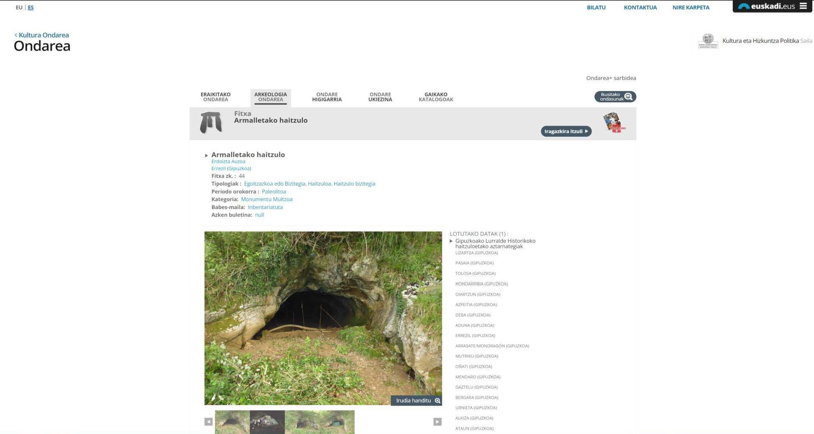
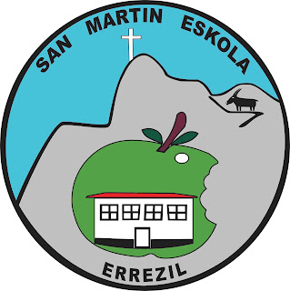

Errezilgo San Martin herri eskolako Haur Hezkuntzako eta Lehen Hezkuntzako ikasleekin Arzalluz auzoko Armalleta kobazuloa bisitatu genuen Antxieta arkeologia taldekook, historiaurreko arkeologiaz eta paleontogiaz irakatsiz. Gurekin irteeran parte hartu zutenak dira Errezil bailarako etorkizuneko ingeniariak, mekanikoak, biologoak, abokatuak edota suhiltzaile trebeak.

Ikasle trebeak eta mendizale apartak direla garbi utzi ziguten.

Aupa San Martin herri eskola!

