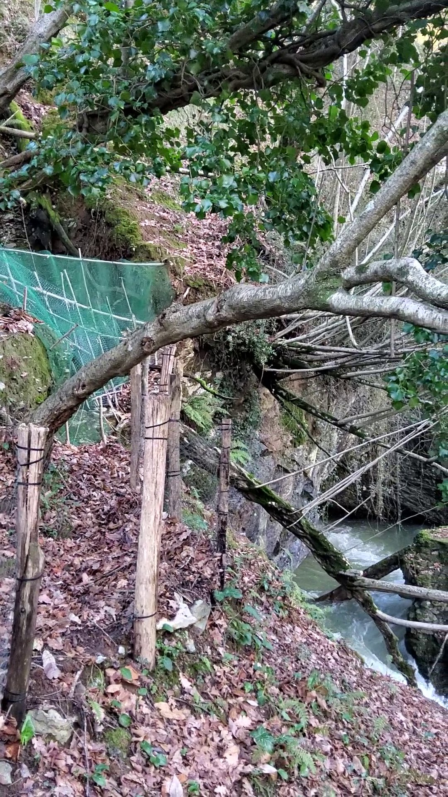
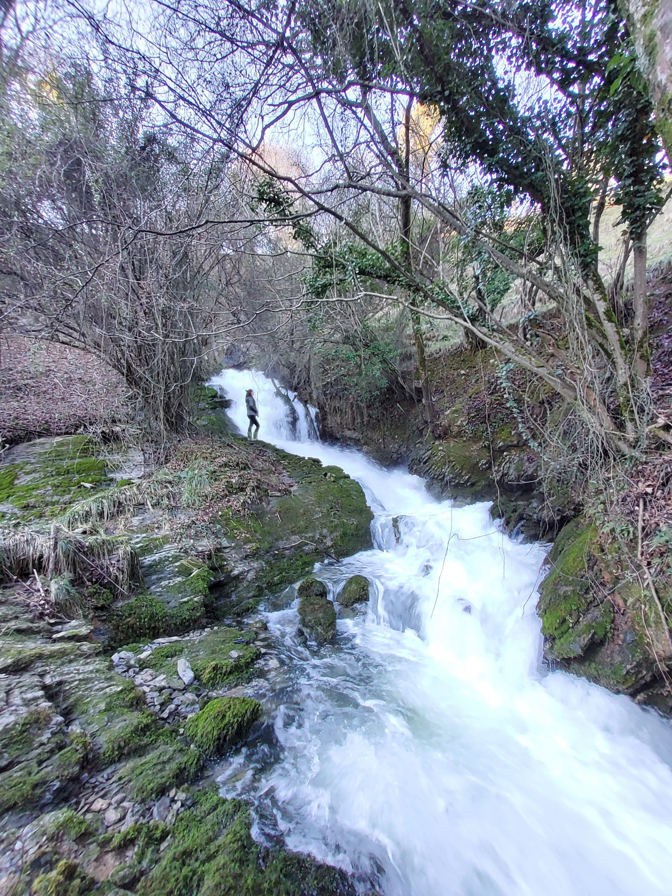
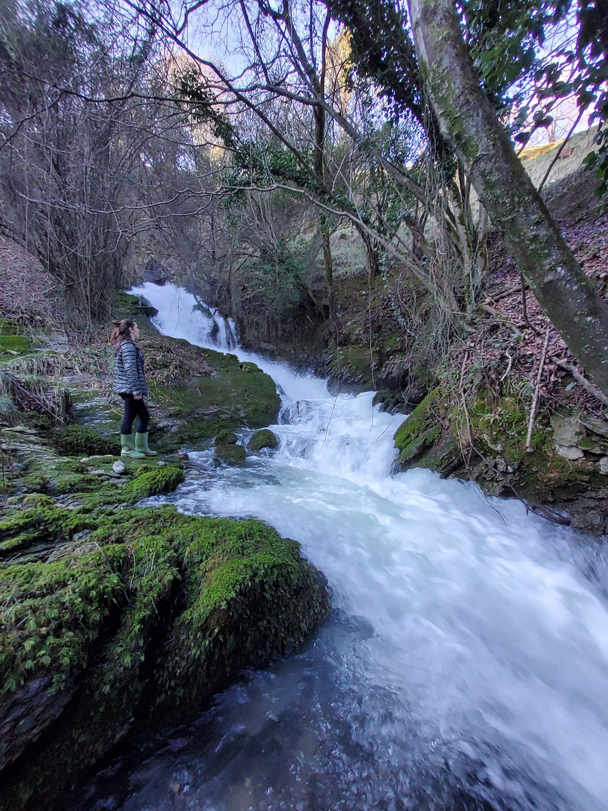
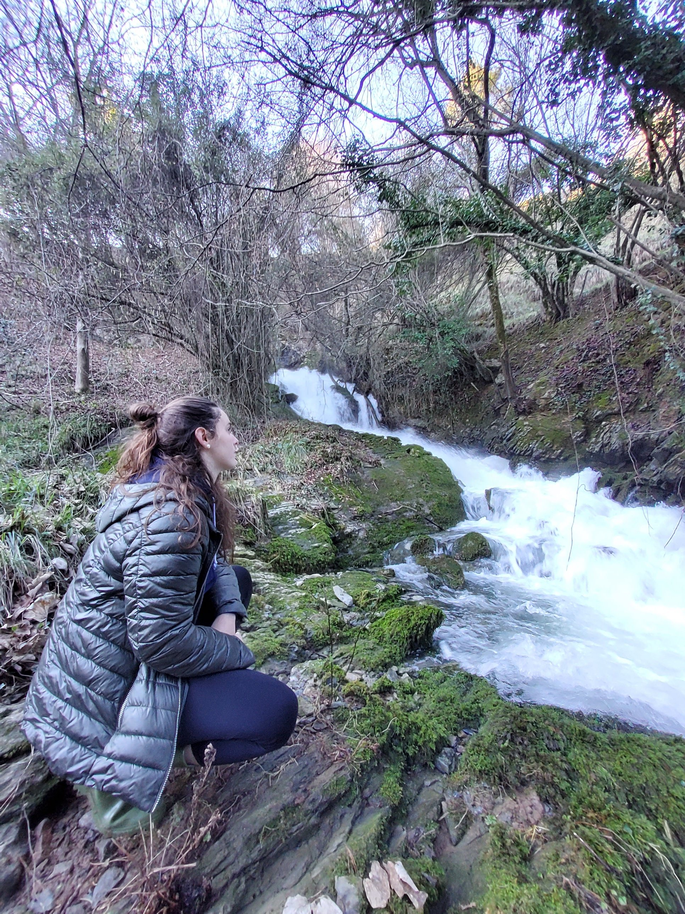

Goi paleolitoko aztarnategi bikaina daukan koba honetatik, ur jauzi edo surgentzia indartsua irteten du, euriak gelditu eta astebete igaro ta gero ere.
Izarraitzeko sistema karstikoak ur poltsa handiak dauzka bere barnean.

Koba barru barrutik irteten du urak izugarrizko indarrarekin.



Ura indarrarekin lehertuta apar zuri bihurtzen da.



Kobatik irten eta berehala abiatzen da haitzetatik behera Urola ibaiaren bila.



Urari begiratu ezkero Murumendiko Marik sorginduta bezala gelditzen zara.


